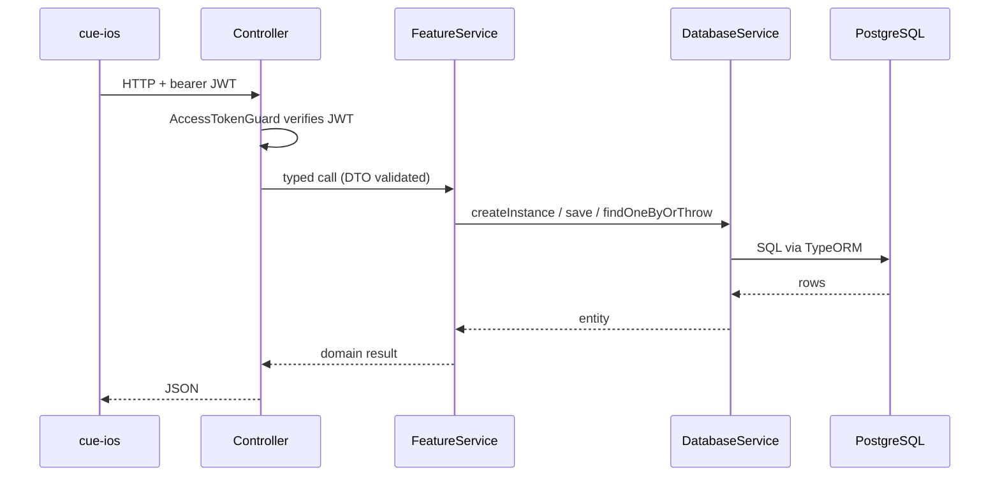

# Cue API — Architecture

One-page system overview. For decisions, see [adr/](adr/). For per-feature designs, see [specs/](specs/).

## What this service is

The HTTP backend for [Cue](../../cue-ios/), an iOS calendar/TODO app. Owns the canonical task, calendar, and notification data; exposes a REST API consumed by the iOS client; delivers reminders via APNs and Telegram (planned). A Telegram **AI assistant** (Claude-backed) lets users manage their calendar in natural language — see [specs/telegram-ai-assistant.md](specs/telegram-ai-assistant.md).

## Tech stack

| Concern | Choice |
|---|---|
| Runtime | Node.js 20 + TypeScript |
| Framework | NestJS 11 |
| Database | PostgreSQL 15 + TypeORM 0.3 (migrations only — never `synchronize: true`) |
| Transactions | `typeorm-transactional` (request-scoped) |
| Cache/queue | Redis 7 (provisioned; not yet consumed) |
| Scheduling | `@nestjs/schedule` (provisioned; not yet used) |
| Date/time | `luxon` (DST-correct for recurring tasks) |
| Validation | `class-validator` + `class-transformer` for DTOs; Zod for env schema |
| Auth | Apple Sign-In → JWT (see [specs/auth-apple-signin.md](specs/auth-apple-signin.md)) |
| Package manager | pnpm 10 |
| Testing | not set up yet |

## Domain model

```
User ─1─* Device                   (cascade)
User ─1─1 TelegramLink             (cascade)
User ─1─1 Conversation             (cascade)
User ─1─* UserMemoryFact           (cascade)
User ─1─* Calendar                 (cascade)

Calendar ─1─* TaskGroup            (cascade)
Calendar ─1─* Task                 (cascade)
Calendar ─1─* NotificationStrategy (cascade)

TaskGroup *─1 NotificationStrategy (default, nullable, SET NULL)
TaskGroup 1─* Task                 (Task.groupId, nullable, SET NULL)

Task *─1 RecurrenceRule            (nullable, SET NULL)
Task *─1 NotificationStrategy      (override, nullable, SET NULL)
Task 1─* TaskOccurrenceException   (cascade)
Task 1─* ScheduledNotification     (cascade)

NotificationStrategy 1─* NotificationRule (cascade)

Conversation ─1─* ConversationMessage  (cascade)
Conversation ─1─* ConversationSummary  (cascade)
```

Effective notification strategy for a task = `task.notificationStrategyId ?? task.group.defaultNotificationStrategyId`.

Calendar is the org unit. Users own multiple Calendars; tasks/groups/strategies belong to a Calendar, not directly to the user. Sharing (a `CalendarMember` join) is a future additive migration — see [ADR 0003](adr/) if/when it lands.

## Module layout

```
src/modules/
  ai                       ← provider-agnostic LLM connector — base + factory; Anthropic impl (planned)
  assistant                ← Telegram AI assistant: webhook, orchestrator, context builder, tools (planned)
  auth                     ← Apple Sign-In token exchange + JWT issuance
  calendar                 ← Calendar CRUD (org unit)
  database                 ← single aggregator — entities, repositories, services
  device                   ← APNs device tokens (per User)
  external-vendor          ← provider-agnostic messaging connector — base + factory; Telegram webhooks impl (planned)
  notification-rule        ← one reminder: offsetMinutes + channel
  notification-strategy    ← named set of NotificationRules (per Calendar)
  recurrence-rule          ← RRULE (frequency, interval, by-*, endType)
  scheduled-notification   ← outbox table — status, fireAt, channel, attemptCount
  stt                      ← provider-agnostic speech-to-text — base + factory; OpenAI impl (planned)
  task                     ← unified event+task — startAt/endAt/isAllDay, completedAt
  task-group               ← collection of Tasks in a Calendar
  task-occurrence-exception← per-instance override for a recurring Task
  telegram-link            ← 1:1 with User
  user                     ← appleUserId, email, displayName, timezone
```

## Data-access pattern (strict)

```
Entity → BaseRepository<T> → BaseDatabaseService<T> → FeatureService → (future) Controller
```

Rules enforced repo-wide:

- **Direct use of entities or TypeORM repositories outside `database` is forbidden.**
- Feature services inject only their corresponding `*DatabaseService`.
- `database` module registers every entity, repository, and DatabaseService — exports **only** the DatabaseServices.
- All creates and updates go through `.save()`. Build with `createInstance(partial)` for creates; mutate fields then `save(entity)` for updates. Never `create(partial)`, `update(entity, partial)`, or `updateById(id, partial)` in feature services.
- On update paths, short-circuit if no field actually changed.

See [ADR 0001](adr/0001-postgres-uuid-pks.md) for the UUID-PK rationale.

## Key schema decisions

- UUID PKs everywhere — see [ADR 0001](adr/0001-postgres-uuid-pks.md).
- `Task.completedAt` timestamp (not `isDone` bool) — historical reporting for free.
- Per-task `timezone` (IANA) — correctness for recurring tasks across DST.
- All time columns are `timestamptz`.
- Soft delete (`@DeleteDateColumn`) on `Task` only — supports tombstone-based iOS sync.
- Recurrence = RRULE + exception rows — see [ADR 0002](adr/0002-rrule-not-materialized.md).
- `ScheduledNotification.userId` is the *delivery target*. Calendar context is derivable via `task.calendarId`. Do not denormalize calendar onto scheduled notifications.

## Path aliases (`tsconfig.json`)

```
@/*              → src/*
@/config/*       → src/config/*
@/modules/*      → src/modules/*
@/services/*     → src/common/services/*
@/exceptions/*   → src/common/exceptions/*
@/constants/*    → src/common/constants/*
@/decorators/*   → src/common/decorators/*
@/guards/*       → src/common/guards/*
@/interceptors/* → src/common/interceptors/*
@/utils/*        → src/common/utils/*
```

## Request lifecycle



## What's not built yet

- Most feature services are empty skeletons (no CRUD methods, no endpoints, no DTOs).
- No notification delivery — see [specs/notification-delivery.md](specs/notification-delivery.md).
- Telegram AI assistant — implemented in `src/modules/assistant/` (webhook ingress → BullMQ queue → consumer → tool-use loop → reply), backed by the `ai` + `external-vendor` + `stt` connector modules and the `Conversation`/`ConversationMessage`/`ConversationSummary`/`UserMemoryFact` entities. Redis is now consumed (BullMQ webhook queue, dedupe, link nonces, held-conflict writes). Design: [specs/telegram-ai-assistant.md](specs/telegram-ai-assistant.md). Deferred within it: post-turn jobs on the durable queue (run in-process for v1), the query-aware Haiku date fallback, `set_reminder` delivery (owned by [specs/notification-delivery.md](specs/notification-delivery.md)), and `TelegramLink.isActive`.
- Recurrence expansion is implemented (`RecurrenceRuleService.expandOccurrences` + occurrence-aware `TaskService.findOccurrencesInRange`, RRULE-not-materialized per [ADR 0002](adr/0002-rrule-not-materialized.md)) — see [specs/recurrence-expansion.md](specs/recurrence-expansion.md). **Both** the Telegram assistant and the REST `GET /tasks` path are occurrence-aware: `GET /tasks` returns `OccurrenceDTO[]` (one per expanded instance) with per-occurrence completion (`PATCH /tasks/:id/completion`) and skip (`POST /tasks/:id/skip`) — see [specs/tasks-rest-occurrence-read.md](specs/tasks-rest-occurrence-read.md). Task groups may carry a `defaultRecurrenceRuleId` their tasks inherit.
- No tests; no Swagger; no Sentry; no Winston.
- No `CalendarMember` sharing — additive migration when sharing ships.
- Redis env vars are now in the Zod schema (added when the assistant began consuming Redis).
