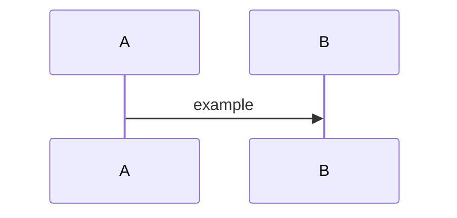

# <Feature / system name>

- **Status**: Draft | Approved | Implemented | Superseded
- **Last updated**: YYYY-MM-DD
- **Owner**: <name>
- **Related ADRs**: [NNNN](../adr/NNNN-...md)

## Context

What problem does this solve? Who feels the pain today? What constraints exist (deadlines, dependencies, prior decisions)?

## Goals

What does success look like? Bullet 3–5 outcomes. Each should be observable — "users can X", "system handles Y", not "code is clean".

- Goal 1
- Goal 2

## Non-goals

What we explicitly are **not** solving here. This is half the value of the spec — it prevents scope creep and clarifies what a reader should *not* expect.

- Non-goal 1
- Non-goal 2

## Proposed design

The chosen approach. Lead with a diagram if there's flow or hierarchy worth showing. Then prose: components, data model changes, API surface, sequence of operations.

### Data model

Tables / entities added or changed. Field-level rationale only where non-obvious.

### API

New endpoints — link to OpenAPI definitions in `../api/openapi.yaml` once added. Inline shapes here only as illustration.

### Error handling

How does each failure mode surface? What's retryable, what's terminal, what's the user-facing message?

## Alternatives considered

For each rejected alternative: what it was, what made it attractive, and the specific reason it lost. Spend more time here than on the chosen design.

### <alternative 1>

### <alternative 2>

## Rollout

How does this ship? Migrations needed? Feature-flagged? Backfill required? Reversible?

## Open questions

Unresolved questions that need answering before — or shortly after — implementation. Move to the body or delete once resolved.

- [ ] Question 1
- [ ] Question 2

## References

- Related specs, ADRs, external standards, prior art.
