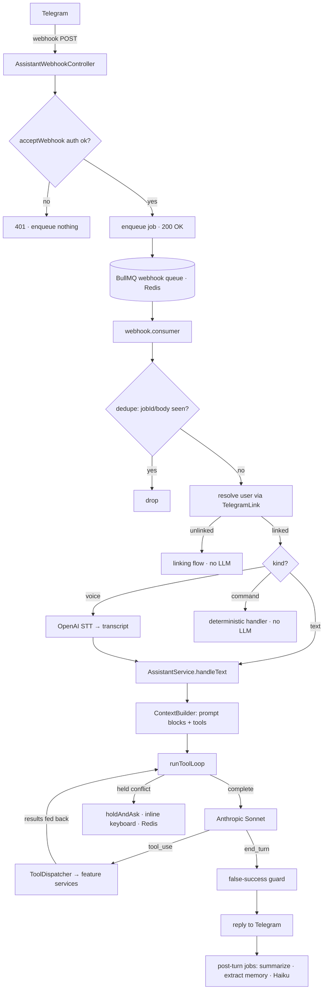

# AI workflow — current state (canonical)

- **Status**: Living reference — describes **what ships today**. Code is the source of truth; this tracks it. Keep it current on every assistant change.
- **Last updated**: 2026-06-20
- **Owner**: @danil
- **Related ADRs**: [0003 — LLM provider](../adr/0003-assistant-llm-provider-anthropic.md) · [0004 — prompt composition & caching](../adr/0004-assistant-prompt-composition-and-caching.md) · [0005 — conversation memory model](../adr/0005-assistant-conversation-memory-model.md) · [0006 — schedule context & conflicts](../adr/0006-assistant-schedule-context-and-conflicts.md) · [0007 — provider connector abstraction](../adr/0007-provider-connector-abstraction.md) · [0010 — stateful `ask_user` resume](../adr/0010-assistant-ask-user-stateful-resume.md) · [0021 — real-request e2e harness](../adr/0021-assistant-e2e-real-request-harness.md)
- **The forward plan that evolves this**: **[ai-workflow-v2-plan](ai-workflow-v2-plan.md)** — the v2 (Stories 10–18) execution plan. The v1 enhancements (re-drive, `ask_user`, batch tools, layered refactor) are all **shipped** and described as-built below.
- **Supersedes**: `assistant-ai-communication-flow.md` (folded in here) and the *shipped* half of `assistant-task-tools.md`.

## Purpose

This is the single, current **map of how a Telegram message becomes calendar mutations and a reply** — every technique, cap, retry, tool, and guard the assistant uses **today**. It is descriptive. The original [telegram-ai-assistant](telegram-ai-assistant.md) spec is the *design intent*; this is the *as-built behaviour*, which has since diverged in places (notably the tool names — the original spec says `create_event`, the code ships `create_task`).

> **§13 documents the historical failure mode** — the model narrated *"Создаю все семь…"* and saved nothing. The fix (narration re-drive, Story 1) **shipped** ([ADR 0009](../adr/0009-assistant-narration-redrive.md)); §13 is retained as the rationale for the re-drive loop.

Primary code: `src/modules/assistant/` — orchestration now lives in the Story 8 layer files (commit ebd5ae3): `ingress/inbound-router.ts`, `session/turn-runner.service.ts`, `orchestration/tool-loop.service.ts` (+ `terminal-classifier.ts`, `correction-driver.ts`, `write-ledger.ts`), `reply/reply-presenter.service.ts`, `conflict/conflict-resolver.service.ts`. `assistant.service.ts` is now a **134-line thin facade** — only `handleCommand` + `handleCallback`, delegating into those layers. Also `src/modules/ai/` (connector), `src/modules/stt/` (voice); provider-neutral types in `src/modules/ai/ai.types.ts`.

---

## 1. End-to-end flow



The pipeline is **two-phase on purpose**: the HTTP request only authenticates and enqueues (returns `200` fast — Telegram will not redeliver once it gets a `200`); all real work runs in the BullMQ consumer off the request path.

---

## 2. Inbound pipeline

| Stage | Where | What happens |
|---|---|---|
| **Accept** | `assistant-webhook.controller.ts` | `acceptWebhook` (secret-token auth, **not** JWT). On success: mint `correlationId`, `jobId = sha256(body)`, enqueue `inbound` job, return `200`. On failure: `401`, enqueue nothing. |
| **Dedupe** | `webhook.consumer.ts` | `jobId` collapses duplicate deliveries at the queue; a Redis SET-NX semantic guard (`ASSISTANT_DEDUPE_TTL_SECONDS`) is acquired per update and **released on throw** so a genuine retry re-acquires. |
| **Resolve** | `webhook.consumer.ts` | `telegramChatId → TelegramLink → User`. Unlinked → linking flow, stop (no LLM). |
| **Normalise** | `webhook.consumer.ts` | text → as-is · voice → download OGG/Opus → STT → `voice_transcript` · slash command → deterministic handler (no LLM). |
| **Orchestrate** | `session/turn-runner.service.ts` `handleText` (→ `orchestration/tool-loop.service.ts` `run`) | persist the USER turn → tool loop → reply / hold / error → persist ASSISTANT turn → fire background jobs. |

`correlationId` is threaded controller → queue → consumer → loop → connector `traceId` (logged, never sent to the provider).

> **Router + turn-runner convergence (Story 6, in progress — [ADR 0030](../adr/0030-assistant-inbound-flow-router-turn-runner.md)).** The hand-rolled fan-out in *Resolve* / *Orchestrate* is being promoted to a single `classifyFlow(normalized, user)` that returns exactly one of four flows — `CommandFlow` (no LLM) · `ConflictConfirmFlow` (`confirm:` / `cancel:` callback → the ADR-0006 deterministic resolver, **no model**) · `AnswerFlow` (a `ask:` callback **or** free text while a question is pending, via a cheap Redis `EXISTS`) · `SimpleMessageFlow` (else) — after which a fresh message and an answer-to-a-question **both** seed a `TurnState`, call the **identical** turn-runner (`ToolLoopService.run`), and reconverge at one `ReplyPresenter`. The `ask:` vs `confirm:` prefixes keep the two suspend/resume paths disjoint at the wire level. This wave is **behaviour-preserving**: the `AnswerFlow` branch is wired but **inert** until Story 5's `ask_user` store ([ADR 0010](../adr/0010-assistant-ask-user-stateful-resume.md)) lands — the structural seam Story 5 plugs into. Deep design: [assistant-layered-architecture §taxonomy / Flow A/B](assistant-layered-architecture.md#the-inbound-flow-taxonomy-4-flows-one-gate).

---

## 3. Prompt architecture & caching (ADR 0004)

Blocks are ordered **most-stable / most-shared first → most-volatile last**, so the cached prefix is byte-identical as often as possible and shareable across users. Assembled in `context-builder.service.ts`.

| # | Block | Source | Cached | Cache breakpoint |
|---|---|---|---|---|
| 1 | **System prompt** (J.A.R.V.I.S. persona + tool-use / ask-don't-guess / safety policy, **no timestamp**) | `assistant.prompts.ts` | ✅ shared across all users | **#1** (also covers the tool defs in the provider prefix) |
| 2 | **Tool definitions** | `tools/tool-schemas.ts` | ✅ shared | (closed by #1) |
| 3 | **User profile** | `UserMemoryFact` rows | ✅ per-user | |
| 4 | **Groups line** (`Groups: Work, English…`, **by name only**) | `TaskGroup` names | ✅ per-user | |
| 5 | **Rolling summary** | `ConversationSummary` | ✅ per-user | **#2** |
| 6 | **Recent window** (last `ASSISTANT_RECENT_WINDOW_SIZE` messages, verbatim) | `ConversationMessage` | ❌ volatile | |
| 7 | **Now-context + agenda + new message** (current datetime + tz; preloaded `today + ASSISTANT_PRELOAD_HORIZON_DAYS`; query-aware slices; `New message:`) | `ScheduleReader` + the turn text | ❌ volatile | |

**Trick:** the timestamp and agenda live *below both breakpoints* deliberately — putting them in the prefix would bust every cache hit. The connector applies the two breakpoints; features `{ promptCaching: true, contextEditing: true }` are passed on every `complete()`.

> **Accepted hardening (ai-comms audit, [ADR 0016](../adr/0016-assistant-ai-comms-audit-hardening.md)):** the **tool definitions are already cached by breakpoint #1**. Anthropic's prefix order is `tools → system → messages`, so the tool block (#2) **precedes** the system block that carries breakpoint #1 and is swept into the same cached prefix. The earlier worry that "tool defs are billed at full price every turn" was a **misdiagnosis** — there is no separate tools breakpoint to add (the stale `tool-schemas.ts:238` comment claiming the last schema "carries `cacheBoundary`" is false; no schema sets it). The fix is to correct that comment + the dead `ToolSchema.cacheBoundary` path and add `cache_read` observability, **not** to wire a redundant third breakpoint (the API caps at 4; system already uses 2).

---

## 4. Memory mechanisms (ADR 0005)

Three independent mechanisms keep per-turn cost flat no matter how long the thread runs:

1. **Rolling summary (episodic)** — `background/summarizer.service.ts`, Haiku. When the live window crosses `ASSISTANT_SUMMARIZE_THRESHOLD`, fold the oldest turns into a running summary (`previous + oldest → new`). Never summarises a pending confirmation or an in-flight edit.
2. **Structured profile (semantic)** — `background/memory-extractor.service.ts`, Haiku. After each turn, extract durable typed facts into `UserMemoryFact`; only the relevant subset is injected (block 3). This is what makes the assistant feel like it *knows* the user.
3. **Native context editing** — Anthropic `clear_tool_uses`: old `list_tasks` results auto-evict to a placeholder as context grows, keeping multi-step turns cheap.

Both background jobs run **after** the reply is sent (`triggerBackgroundJobs`, fire-and-forget) so they never add latency; each catches its own errors.

---

## 5. Schedule context — four layers (ADR 0006)

Cheapest first; the last makes correctness independent of the model choosing to look.

1. **Preloaded agenda (push)** — every turn carries `today + N days` of occurrences with `[eN]` handles, in the volatile region.
2. **Query-aware augmentation (smart push)** — `buildQueryAwareSlice` scans the message for explicit `YYYY-MM-DD` references beyond the horizon and loads those days deterministically (Luxon). Fuzzier-phrase Haiku fallback is deferred.
3. **On-demand fetch (agentic pull), capped** — the model calls `list_tasks` / `find_free_slots`; **hard-capped at `ASSISTANT_MAX_SCHEDULE_FETCHES` per turn** (the cap returns a benign "limit reached" tool result without dispatching, so the model proceeds with what it has). One arbitrary-range `list_tasks` covers an N-week lookahead and spends **one** of the five — the cap limits the *number* of reads, not the distance.
4. **Server-side validation (deterministic floor)** — overlap check on writes → **hold-and-confirm** (§9). The model is never re-invoked to resolve a conflict.

---

## 6. The tool-use loop — the heart (`runToolLoop`)

One `HandleMap` is created per turn and threaded through the context builder (which seeds `[eN]` aliases from the agenda) and every dispatch, so handles resolve when the model later mutates a task.

The loop, bounded by `ASSISTANT_MAX_TOOL_ROUNDTRIPS`:

1. `ai.complete({ system, messages, tools, toolRounds, features, traceId })` — **one stateless round-trip** (ADR 0007). Text and tool calls can coexist in the result.
2. **Continue / terminal split** (`orchestration/tool-loop.service.ts` `run`, with the terminal decision in `orchestration/terminal-classifier.ts` and the re-drive in `orchestration/correction-driver.ts`) — **accepted hardening (ai-comms audit A1, [ADR 0016](../adr/0016-assistant-ai-comms-audit-hardening.md)):**
   - **Continue signal = content scan.** The loop continues **iff the turn emitted tool calls** (`toolCalls.length > 0`), **not** gated on `stopReason`. The old `stopReason !== TOOL_USE` gate is dropped, so a turn carrying `tool_use` blocks under another stop reason (e.g. `MAX_TOKENS`, when the model is cut off mid tool-call burst) is **still dispatched** rather than dropped on the floor with a truncated reply.
   - **Honest terminal branch (no tool calls).** On a true terminal, branch on `stopReason` **before** the generic return (splitting today's overloaded `result.text ?? ROUNDTRIP_CEILING_REPLY`): `MAX_TOKENS` → an honest **"had to cut that short"** constant (NOT the truncated fragment, NOT the "too many steps" ceiling text); `REFUSAL` → an honest **decline** constant; **else** (`END_TURN`/`STOP_SEQUENCE`/`OTHER`) → **classify the terminal turn** (below) rather than returning unconditionally.
   - **Terminal classifier — re-drives narration-without-write ([ADR 0009](../adr/0009-assistant-narration-redrive.md), Phase-B trio [ADR 0018](../adr/0018-assistant-ai-comms-phase-b-scope-refinement.md)).** On an `END_TURN` terminal, `classifyTerminalTurn(text, committedWrites, attemptedWrites)` decides: `committedWrites > 0` **or** a clarifying-question / honest-failure (`CLAIM_VETO_PATTERN`) → **genuine**, return the text. Otherwise (zero commits, not a question) → **narration-without-write**: the loop appends a corrective **USER** message ("you described a change but issued no tool calls; call them now, or ask one clarifying question"), sets a neutral **`toolChoice: 'any'` for the next round only** (§12, [ADR 0019](../adr/0019-assistant-neutral-ai-tool-choice.md)), and **re-drives** the model. The trigger is **structural** (zero tools + zero commits + not-a-question); the `MUTATION_CLAIM_PATTERN` regex is only a logging hint. Re-drives are bounded by **`ASSISTANT_MAX_CORRECTIONS`** (default 5, strictly `< ASSISTANT_MAX_TOOL_ROUNDTRIPS`); on exhaustion the turn returns `kind:'unresolved'` → structured `assistant.correction_exhausted` log + alert sink + an honest reply (it **does not throw** — the queue is `attempts:1`). `ASSISTANT_MAX_CORRECTIONS = 0` is the kill-switch (reverts to the §10 detect-and-mask guard). `ROUNDTRIP_CEILING_REPLY` is reserved for the genuine ceiling return (§6 step 6 / `:475`). *(An optional bounded `max_tokens` bump-retry is a deferred Phase-B refinement — see Story 3b / the audit A1 note.)*
   - *(This terminal classifier is the fix for the §13 narration failure mode — it no longer "rides out" the terminal path unchanged.)*
3. Otherwise, for each tool call (dispatched **serially, in emission order** — so heterogeneous bulk like delete + create + lookup in one turn just works): enforce the schedule-fetch cap, else `toolDispatcher.dispatch(...)`.
   - **Held conflict** → collect it, hand the model a benign result, **keep dispatching the rest of the batch** (a conflict no longer aborts the batch), confirm all held writes together after the round. For `create_tasks` ([ADR 0020](../adr/0020-assistant-batch-create-tasks.md)) the same applies **per item** — conflicting items become a **plural held set** (`ToolDispatchOutcome.heldConflicts`) routed through the existing batch-hold path while the non-conflicting items commit; no whole-batch abort.
   - **Write accounting** — a successful, non-held call to a `WRITE_TOOLS` member increments `committedWrites`; any write attempt increments `attemptedWrites`. For batch tools (`create_tasks`) the loop increments by the **per-call `committed`/`attempted` counts** the outcome reports, **falling back to the singular `+1`** for non-batch tools — so "5 of 7 committed, 2 held" is counted correctly and a partially-committing turn stays on the `genuine` terminal branch (§6 step 2, [ADR 0009](../adr/0009-assistant-narration-redrive.md)) rather than re-driving. These power the "saved N changes" reporting and the success-integrity guard (§10).
4. Append the round to the audit trail and to `toolRounds` (replayed into the next `complete()` as paired `tool_use`/`tool_result` turns).
5. If any held conflicts were collected → return `kind: 'held'`.
6. Loop exhausted (genuine round-trip ceiling, `:475`) → `ROUNDTRIP_CEILING_REPLY`. Any throw → `kind: 'error'` (logged, graceful reply) — and per the A5 hardening (below, §11) this net now wraps **context assembly** too, so even a prompt-build throw degrades to a reply instead of a silent dropped turn.

---

## 7. Tools, handles & recurrence

### 7.1 Tool inventory (`tools/tool-schemas.ts`)

Input shapes are validated by Zod in the dispatcher (a validation failure becomes a *recoverable tool result* the model can correct, not a crash).

| Tool | Class | Purpose / notes |
|---|---|---|
| `list_tasks` | read (schedule-fetch) | range / group / completion filter; returns `[eN]`-prefixed lines + **seeds handles** |
| `find_free_slots` | read (schedule-fetch) | open slots ≥ duration in a range (no handle — slots aren't tasks) |
| `check_availability` | read (schedule-fetch) | **batch slot validation, recurrence-aware** ([ADR 0029](../adr/0029-assistant-check-availability-batch-read.md), Story 7): `slots: {startAt,endAt,calendarId?,excludeTaskId?}[].min(1).max(25)`; calls `TaskService.findOverlapping` **once per slot with exact bounds** (the *same* source the write-time hold trusts — never raw rows / `findInRange`, never a union window); returns per slot `{index,free,conflicts:{handle,title,occurrenceStart,occurrenceEnd}[]}` minting `[eN]` handles for conflicts; one batch = **one** schedule-fetch; a recurring proposal is rejected or self-expanded per occurrence (bounded), never validated as one window |
| `create_task` | **write** | timed event / all-day / todo; supports `recurrence` (one task, one rule) and `group` by name; **scalar `title` — single task** |
| `create_tasks` | **write** | **batch create** ([ADR 0020](../adr/0020-assistant-batch-create-tasks.md)): `z.array(createTaskInputSchema).min(1).max(25)`, fans out to `TaskService.create` **in input order**; per-item `created`/`error`/`held` result; conflicting items reuse the existing held path (no whole-batch abort); over-cap → recoverable "split it" result |
| `update_task` | **write** | move/rename/regroup/recur **by handle**; `editScope` for recurring |
| `complete_task` | **write** | mark (in)complete by `handle` |
| `delete_task` | **write** | delete series or skip one occurrence (`editScope:"this"`) / truncate (`this_and_following`) |
| `create_group` | **write** | create a task group (confirm before creating one the user didn't ask for) |
| `list_groups` | read | list groups before assigning/filtering |
| `ask_user` | **suspend** (neither read nor write) | **suspends the turn to ask a question** ([ADR 0010](../adr/0010-assistant-ask-user-stateful-resume.md), Story 5): `{ question, options?: {id,label}[].max(4) }` — omit `options` for a plain text question, 2–4 for a quick-reply keyboard. `call()` touches **no DB** and commits no write — it returns `LoopOutcome.ask`; the orchestrator persists the in-flight session and ends the turn (full machine in §9a). Excluded from `WRITE_TOOLS`/`SCHEDULE_FETCH_TOOLS` so it never inflates the saved count or the fetch cap |
| `set_reminder` | **no-op stub** | "reminders coming soon" — writes nothing; deliberately **excluded** from `WRITE_TOOLS` so it can't mask a fabricated reminder claim or inflate the saved count |

`WRITE_TOOLS = {create_task, create_tasks, update_task, complete_task, delete_task, create_group}` · `SCHEDULE_FETCH_TOOLS = {list_tasks, find_free_slots, check_availability}` ([ADR 0029](../adr/0029-assistant-check-availability-batch-read.md): `check_availability` self-classifies `isScheduleFetch=true`, `isWrite=false` via the registry). These are now **registry-derived** from `registry.writeNames()` / `registry.readNames()` ([ADR 0025](../adr/0025-assistant-buildtool-single-source-registry.md), Story 4) — each tool is defined **once** as a `BuiltTool` (`buildTool(def)`, fail-closed `isWrite`/`isReadOnly`) and the API schema is derived (`{ name, description: await tool.prompt(), input_schema: zodToJsonSchema(tool.inputSchema) }`), so the JSON the model sees can't drift from the Zod the dispatcher enforces, and the safety sets can't fall out of sync with a new tool. (Migration is one tool per PR, behaviour-preserving; until a handler lands as a `buildTool` it keeps its hand-written schema beside the new one.)

**Structural note (relevant to §13):** the plural case — "create these seven" — is where the model is tempted to substitute a prose plan for N tool calls. `create_tasks` ([ADR 0020](../adr/0020-assistant-batch-create-tasks.md), Story 2) makes that **one** call, so the re-driven write ([ADR 0009](../adr/0009-assistant-narration-redrive.md)) is trivially correct; its schema is **appended last** to keep the ADR-0004 cache prefix stable.

### 7.2 Per-turn handles — the addressing scheme

The model never sees or types a UUID. Every task/occurrence it is **shown** — the preloaded agenda (block 7) and every `list_tasks` result — is rendered with a compact ordinal alias `[e1]`, `[e2]`, … (`e` for "entry"). The orchestrator owns a per-turn **`HandleMap`**: `alias → { taskId; occurrenceStart? }`, **seeded** by the context builder and **appended** by `list_tasks` during the loop (aliases count up within the turn, never collide). It lives in memory for the turn only.

- Mutation tools (`update_task`, `complete_task`, `delete_task`, `set_reminder`) take a `handle` string; the dispatcher resolves it via the `HandleMap` in `ToolDispatchContext` before calling the service.
- `{ taskId, occurrenceStart }` addresses a **single recurring occurrence**; `{ taskId }` addresses a **one-off or the series master**.
- **Stale/unknown handle** (cross-turn reference, or an invented one) → a **recoverable tool error** (*"That reference isn't in view — list the day again"*); the model re-lists (cheap, within the 5-fetch cap) and retries. Handles are **per-turn**, not persisted across turns — by design (a cheap re-list beats transient cross-turn state).
- **Groups are referenced by name, not handle** (low-cardinality, user-named); ambiguous name → clarify, missing name → confirm/`create_group`, never auto-create implicitly.

### 7.3 Recurrence in tools

`recurrence` is an RFC-5545-lite object (`frequency` required; `interval`, `byWeekday` 0=Mon…6=Sun, `byMonthDay`, `byMonth`, `endType`, `endDate`, `count`). A Zod `superRefine` enforces cross-field end rules (`COUNT` needs `count`, `UNTIL_DATE` needs `endDate`) — without it a `{endType:'COUNT'}` with no count would persist as a never-ending series. The model is told repeatedly: **a repeating task is ONE task with a recurrence, never many copies** (ADR 0002 — RRULE never materialized). On-read expansion ships (see [recurrence-expansion](recurrence-expansion.md)).

---

## 8. Recurrence & occurrence identity (backend it consumes)

The tool surface above sits on the [recurrence-expansion](recurrence-expansion.md) backend: occurrences are expanded **on read** (never materialized — ADR 0002), an occurrence is identified by `(taskId, originalStart)`, and the three edit scopes are `this` (occurrence override), `this_and_following` (split series), `all` (master update). A recurring edit issued **without** `editScope` is **not guessed** — the dispatcher returns a recoverable result asking the model to re-issue with a scope, and the model asks the user one concise question.

---

## 9. Held-conflict confirmation (ADR 0006 layer 4)

On a timed-write overlap, the dispatcher returns a `heldConflict` instead of writing. The orchestrator:

1. stashes the held write(s) in **Redis** (`ASSISTANT_HELD_CONFLICT_TTL_SECONDS`, keyed by a token),
2. asks the user via an **inline keyboard** ("Book anyway / Cancel") — **the model is never re-invoked** (the binding ADR 0006 constraint),
3. on the button tap (`handleCallback`), `getdel`s the token and executes the batch **deterministically** (each action in its own try/catch so a partial failure can't orphan the rest), reporting exactly what booked / moved / failed.

Expired token → "that confirmation expired, ask again."

> **Write-side recurring gap — CLOSED (Story 9, [ADR 0024](../adr/0024-assistant-recurring-conflict-hold.md), Wave 1 of the deferred-stories plan [ADR 0022](../adr/0022-deferred-ai-comms-stories-execution-plan.md)).** Recurring **creates** and **edits** that overlap existing events now route through this same hold as **one held write for the whole series** — occurrence-aware via `findClashingRecurringAnchors`, bounded by `MAX_GENERATION_STEPS`, with the held action carrying the recurrence (one intent → one confirm). Previously only non-recurring creates / one-off moves held, so a new or edited series could be booked over existing events silently (`handleCreateTask`'s `if (!recurrence && startAt && endAt)` guard; `updateRecurring` had no `findOverlapping`). **Documented limitation:** far-future / effectively-infinite rules are only conflict-checked within `MAX_GENERATION_STEPS` (an explicit, bounded fallback — see ADR 0024). Per-occurrence holds were rejected (they don't fit the one-write held mechanism).

---

## 9a. `ask_user` suspend / resume (ADR 0010 · Story 5)

> **Status: landing — Wave 5 of the deferred-stories plan ([ADR 0022](../adr/0022-deferred-ai-comms-stories-execution-plan.md)), decision [ADR 0010](../adr/0010-assistant-ask-user-stateful-resume.md).** Sits **beside** §9 on purpose. §9 (held conflict) resumes **deterministically and never re-invokes the model**; `ask_user` **does** re-invoke the model with the answer. **Same shape, opposite resume semantics — never conflate them** (the binding ADR-0006 / ADR-0010 constraint). The two paths are disjoint at every level: keyspace (`assistant:ask:*` vs `assistant:held:*`), callback prefix (`ask:` vs `confirm:`/`cancel:`), and store (durable `pending_question` vs Redis-only token).

When the model calls `ask_user` (§7.1), the dispatcher returns `LoopOutcome.ask` **without touching the DB or committing a write** — `call()` is pure. The orchestrator then **suspends the turn**:

1. **Persist the in-flight session, durably.** A `pending_question` row (status `AWAITING`) is the **system of record**. Its `payload` jsonb holds everything needed to rebuild the turn: the accumulated `toolRounds` **including the assistant round that carries the `ask_user` `tool_use` but NOT its `tool_result`**, the `askToolUseId`, the `optionLabels` map, the `question`, the `correlationId`, and the `vendorChatId`. A **partial-unique index `(conversationId) WHERE status='AWAITING'`** enforces ≤1 open question per conversation.
2. **Hot-mirror to Redis.** The same session is mirrored to `assistant:ask:<userId>` (key from `redis.constants.ts` `pendingQuestionKey(userId)`, beside `heldConflictKey` so disjointness is auditable in one file) with a **30-minute TTL** (`ASSISTANT_ASK_USER_TTL_SECONDS`, default 1800) — the hot index for the common "user replies promptly" case.
3. **Ask + end the turn.** A plain text question (`options` omitted) or a 2–4-button quick-reply keyboard (each button carries `ask:<pending_question_id>:<opt>`) is sent, and the turn **ends** — there is no live loop to pause on this async pipeline ([§1](#1-end-to-end-flow)).

**Resume** arrives on a *later* webhook — routed by the Story 6 `AnswerFlow` branch ([§2](#2-inbound-pipeline), [ADR 0030](../adr/0030-assistant-inbound-flow-router-turn-runner.md)):

- **Atomic, idempotent claim** — `Redis GETDEL` (hot path) **or** `UPDATE pending_question SET status='ANSWERED' WHERE id=? AND status='AWAITING' RETURNING *` (durable path). **Zero rows ⇒ already resumed ⇒ ignore** — this compare-and-set is what blocks a double-resume when two inbound updates race.
- **Button taps resume from Postgres any time** within `ASSISTANT_ASK_USER_RETENTION_HOURS` (default 168) — surviving both the Redis TTL **and** a process restart, because the row is the source of truth.
- **Free-text resumes only inside the 30-min hot window.** After it lapses, a typed message starts a **fresh** turn — never silently consumed as a stale answer (a message hours later may be unrelated). The button is the durable answer carrier; free-text late-resume is **deliberately unsupported**.
- **Wire invariant.** On resume, exactly **one** synthetic `tool_result` (`{ toolCallId: askToolUseId, content: answer }`) is appended, matching the `tool_use` already cached in `toolRounds`, and the loop is **re-entered** — re-invoking the model, which may call `ask_user` again and suspend once more. Never an interleaved or unpaired block (Anthropic 400).

**Expiry job.** A `@nestjs/schedule` cleanup job marks stale `AWAITING` rows `EXPIRED` (driven by the `(status, expiresAt)` index) — **hygiene and metrics only**; correctness is already held by the compare-and-set claim, so a missed run never causes a double-resume. Retention beyond `ASSISTANT_ASK_USER_RETENTION_HOURS` is pruned by the same job.

The durable store is a **new DB subsystem** following the strict 3-layer pattern: `pending_question` entity → `PendingQuestionRepository` → `PendingQuestionDatabaseService` → migration (partial-unique + `(status, expiresAt)` index). Full design + alternatives (stateless re-ask, Redis-only, reuse-the-conflict-path — all rejected): [ADR 0010](../adr/0010-assistant-ask-user-stateful-resume.md). Decision + acceptance criteria (Story 5, shipped): [ADR 0010](../adr/0010-assistant-ask-user-stateful-resume.md).

---

## 10. Success-integrity guard (the "trick" that catches lies)

`isFalseSuccessReply` (`orchestration/write-ledger.ts`, delegated via `orchestration/tool-loop.service.ts` `isFalseSuccessReply` and applied from `session/turn-runner.service.ts`) refuses to confirm an action that never happened, by precedence:

1. `committedWrites > 0` → genuine, send as-is.
2. `CLAIM_VETO_PATTERN` matches (a question, negation, "couldn't", "хочешь?", trailing `?`) → honest/asking, send as-is.
3. else if `attemptedWrites > 0` → it tried and all errored → **replace** with `CLAIM_WITHOUT_WRITE_REPLY`.
4. else `MUTATION_CLAIM_PATTERN` (EN + RU, e.g. "Создаю", "I've booked") → the **pure-narration trap** → **replace**.

It is purely lexical (EN + RU). On its own **it detects the lie but does not recover** — it swaps the text and logs a WARN. Known regex gaps: most EN verbs (completed/marked/changed) and the EN gerund are uncovered, so an English "Creating all seven…" slips through the *lexical* swap entirely.

> **Now superseded by the terminal classifier ([ADR 0009](../adr/0009-assistant-narration-redrive.md), Phase-B trio [ADR 0018](../adr/0018-assistant-ai-comms-phase-b-scope-refinement.md), landing this wave).** §6's terminal classifier re-drives a narration-without-write turn **before** this guard runs: on zero commits + not-a-question it appends a corrective USER message, forces `toolChoice:'any'` for the next round only (§12), and re-invokes the model (bounded by `ASSISTANT_MAX_CORRECTIONS`). Because the re-drive trigger is **structural** (not lexical), it catches the EN-gerund case this guard misses. This guard is retained as **defence-in-depth** and is fully restored as the sole mechanism when `ASSISTANT_MAX_CORRECTIONS = 0` (the kill-switch).

---

## 11. Retries & resilience — every layer

| Layer | Mechanism | Current setting |
|---|---|---|
| **LLM transport** | Anthropic SDK retry/backoff **inside the connector** (`new Anthropic({ maxRetries })`, exp backoff + jitter + `Retry-After` + 408/409/429/≥500) | `ASSISTANT_AI_MAX_RETRIES` (default 2). On exhaustion → `AI_FAILURE_REPLY`. No assistant turn persisted. **529/overload → MAIN-model fallback (Story 3b, [ADR 0023](../adr/0023-assistant-529-fallback-model.md), Wave 1):** a sustained 529/overload of the MAIN model **after** the SDK retries exhaust (detected by status 529 **OR** the `"overloaded_error"` substring, via one exported `is529()`) retries the turn **once on the BACKGROUND (Haiku) model id** (no new env var — reuses `ASSISTANT_MODEL_BACKGROUND`); if Haiku also fails it **degrades-never-throws** to `AI_FAILURE_REPLY`. Only the MAIN role gets a fallback. Honest trade-off: Haiku may make weaker tool decisions — accepted vs a dead turn. |
| **App-level `complete()`** | the §6 **terminal classifier re-drives** a successful-but-empty *narration-without-write* turn (corrective USER message + forced `toolChoice:'any'` next round only), bounded by `ASSISTANT_MAX_CORRECTIONS` → escalation | the §13 fix ([ADR 0009](../adr/0009-assistant-narration-redrive.md), Phase-B trio, landing this wave). `ASSISTANT_MAX_CORRECTIONS = 0` reverts to no re-call. |
| **`ask_user` suspend/resume** | the turn ends and is **rebuilt from durable state** on a later webhook (§9a, [ADR 0010](../adr/0010-assistant-ask-user-stateful-resume.md)): `pending_question` (Postgres, system of record) + Redis hot-mirror; the **atomic compare-and-set claim** (`GETDEL` / `UPDATE … WHERE status='AWAITING' RETURNING *`) makes resume idempotent — a double webhook can't double-resume (zero rows ⇒ ignore) | `ASSISTANT_ASK_USER_TTL_SECONDS` (hot, 1800) · `ASSISTANT_ASK_USER_RETENTION_HOURS` (durable, 168). Survives the Redis TTL **and** a process restart. |
| **Tool errors** | returned to the model as `tool_result(isError:true)`, replayed via `toolRounds` so it can self-correct — *the loop is the retry* | bounded by `ASSISTANT_MAX_TOOL_ROUNDTRIPS` |
| **Schedule-fetch loop** | cap with benign "limit reached" result | `ASSISTANT_MAX_SCHEDULE_FETCHES` |
| **Round-trip ceiling** | hard stop → `ROUNDTRIP_CEILING_REPLY` | `ASSISTANT_MAX_TOOL_ROUNDTRIPS` |
| **Queue** | BullMQ job retry | **`attempts: 1` for the webhook queue** — a per-queue `registerQueue({ defaultJobOptions: { attempts: 1 } })` **plus** a per-job `add(..., { attempts: 1 })` override ([ADR 0026](../adr/0026-webhook-queue-attempts-1-no-inbound-replay.md)) of the **global `attempts: 5` + backoff** default (`app.module.ts`, which stays `5` for all other/future queues). A thrown inbound turn does **not** replay (the inbound pipeline is non-idempotent → a replay double-books); every terminal path must `return`, never throw. |
| **Context-building** | graceful-failure net (accepted hardening, [ADR 0016](../adr/0016-assistant-ai-comms-audit-hardening.md)) | the "never throw — return a graceful reply" net now **wraps context-building**, not just the tool loop. A failure assembling prompt blocks degrades to a logged-loudly graceful reply, so **every inbound yields a reply** (upholds the `attempts:1` return-never-throw invariant). |
| **Dedupe** | Redis SET-NX, released on throw | `ASSISTANT_DEDUPE_TTL_SECONDS` |
| **STT** | on failure: "couldn't hear that"; persist nothing | — |
| **Telegram send** | swallow + log (e.g. user blocked the bot) | — |

---

## 12. Model roles & connector abstraction (ADR 0003 / 0007)

- **Two model roles:** `MAIN` (Sonnet — the turn) and `BACKGROUND` (Haiku — summarise + extract). `ASSISTANT_MODEL_MAIN` / `_BACKGROUND`, `ASSISTANT_MAX_OUTPUT_TOKENS`.
- The connector is **stateless and provider-neutral** — no Anthropic shape crosses `ai.types.ts`. The multi-round loop, caps, and dispatch all live in the orchestrator.
- **Structured output** exists (`completeStructured`) and forces one specific named tool. The general `complete()` now also accepts a **neutral `AiToolChoice`** (Story 3a, [ADR 0019](../adr/0019-assistant-neutral-ai-tool-choice.md), landing this Phase-B wave [ADR 0018](../adr/0018-assistant-ai-comms-phase-b-scope-refinement.md)): `CompletionRequest.toolChoice?: 'auto' | 'any' | { name }`, which the connector translates (`'any' → {type:'any'}`, `{name} → {type:'tool',name}`, `'auto'`/unset → `undefined`) and **degrades to `undefined` (never throws)** if tools are unsupported. The narration re-drive (§6, §10) uses `'any'` for a single forced round; a normal round omits `toolChoice`, so `tool_choice` stays absent (implicit `auto`) — byte-unchanged prefix, no provider shape crosses `ai.types.ts` (ADR 0007). *(The 529 → fallback-model swap, Story 3b, is now Wave 1 of the deferred-stories plan — see §11 and [ADR 0023](../adr/0023-assistant-529-fallback-model.md).)*

---

## 13. Known failure mode (today) — narration without writing

**Confirmed from production data.** On a batch request ("create all seven driving lessons for Jun 10–20"), the model returned `stop_reason: end_turn` with text **"…Создаю все семь в группе Driving Lessons."** and **zero tool calls**. The terminal check (§6 step 2) returned that text verbatim; `committedWrites = attemptedWrites = 0`. The DB confirms **zero** lessons exist for that range. The user replied "Отлично" and never learned nothing was saved.

Why it happens and why it persists:

- The plural/batch case tips the model into *planning-narration* instead of emitting N `create_task` calls (amplified by the absence of a batch tool, §7.1).
- The loop **cannot distinguish** this from a legitimate clarifying question — both are `end_turn` + text + no tools — so it terminates immediately.
- The §10 guard now catches the *claim* (and would reply "didn't save, try again") but **never re-drives** the model, so the tasks still aren't created; the user must re-ask manually.

→ The fix — **Story 1 (narration re-drive)**, recorded as [ADR 0009](../adr/0009-assistant-narration-redrive.md) — has **shipped**.

---

## 14. Audit trail

Each tool round persists a `ConversationMessage` with `role = tool`, `contentType = tool_step`, and a `toolPayload` jsonb (per-step name / input / result / isError / held), capped to bound row growth. These rows are **excluded** from the prompt window — pure forensics, so "what did the assistant actually do on this turn" is one SQL query. *(Conversations created before this feature landed have no tool rows.)*

---

## 15. Config knobs (Zod env — all required, no defaults unless noted)

`ASSISTANT_MAX_TOOL_ROUNDTRIPS` · `ASSISTANT_MAX_SCHEDULE_FETCHES` · `ASSISTANT_MAX_OUTPUT_TOKENS` · `ASSISTANT_AI_MAX_RETRIES` (default 2) · `ASSISTANT_HELD_CONFLICT_TTL_SECONDS` · `ASSISTANT_DEDUPE_TTL_SECONDS` · `ASSISTANT_LINK_NONCE_TTL_SECONDS` · `ASSISTANT_RECENT_WINDOW_SIZE` · `ASSISTANT_PRELOAD_HORIZON_DAYS` · `ASSISTANT_SUMMARIZE_THRESHOLD` · `ASSISTANT_MODEL_MAIN` / `_BACKGROUND` · `ASSISTANT_AI_PROVIDER`.

**`ask_user` (§9a, [ADR 0010](../adr/0010-assistant-ask-user-stateful-resume.md), Story 5, landing Wave 5):** `ASSISTANT_ASK_USER_TTL_SECONDS` (default 1800 — the Redis hot-mirror window inside which free-text resumes) · `ASSISTANT_ASK_USER_RETENTION_HOURS` (default 168 — how long a `pending_question` row stays button-resumable before the `@nestjs/schedule` job prunes it).

*Planned additions (see the backlog):* `ASSISTANT_MAX_CORRECTIONS` (Story 1).

---

## 16. Where this is going (the backlog)

The v1 enhancements — narration re-drive, batch `create_tasks`, `withRetry` + `AiToolChoice`, the `buildTool` single-source contract, `ask_user` with durable suspend/resume, the inbound 4-flow router, `check_availability`, the layered decomposition, and the write-side conflict fix — have all **shipped** (recorded across ADRs 0009–0036). The v2 forward plan (Stories 10–18) lives in **[ai-workflow-v2-plan](ai-workflow-v2-plan.md)**. The deep designs remain in [assistant-layered-architecture](assistant-layered-architecture.md), [assistant-tool-loop-redrive](assistant-tool-loop-redrive.md), and ADRs [0009](../adr/0009-assistant-narration-redrive.md) / [0010](../adr/0010-assistant-ask-user-stateful-resume.md).

The loop-correctness trio (Stories 3a / 1 / 2) **shipped** in the autonomous Phase-B wave ([ADR 0018](../adr/0018-assistant-ai-comms-phase-b-scope-refinement.md)). The remaining stories (3b, 4, 5, 6, 7, 8, 9) are now **authorized for implementation under human review in six dependency-ordered waves** ([ADR 0022](../adr/0022-deferred-ai-comms-stories-execution-plan.md), which supersedes ADR 0018's deferral): **Wave 1** = 3b ([ADR 0023](../adr/0023-assistant-529-fallback-model.md)) + 9 ([ADR 0024](../adr/0024-assistant-recurring-conflict-hold.md)) in parallel; then 4 → 7, 6 → 5, and Story 8 last.

---

## 17. End-to-end testing — the real-request harness (ADR 0021)

The 27 unit `*.spec.ts` mock every dependency — right for the orchestrator logic, but the
**wiring between the layers** (§1–2: auth → `200`-fast enqueue → dedupe → resolution → serial
dispatch → held/re-drive terminal → outbound) runs end-to-end **only** in a separate Jest e2e suite
([ADR 0021](../adr/0021-assistant-e2e-real-request-harness.md)).

- **What it boots.** The real NestJS app + the real `webhook → BullMQ → tool loop → DB` pipeline
  against a **real test Postgres + Redis** (`docker-compose.dev.yml`), driven by an HTTP `POST` to
  the webhook (`supertest`) with the secret token — so auth, the fast enqueue, dedupe, and the
  consumer all execute for real.
- **Two collaborators swapped, everything else real.** The **outbound Telegram connector → a
  capturing fake** (records replies / inline keyboards, no Bot API). The **AI connector → two modes**
  behind `ai.types.ts` ([ADR 0007](../adr/0007-provider-connector-abstraction.md)): a
  **deterministic scripted connector** — the **gating** assertions, CI-safe, **no key, no cost**,
  asserting engine facts exactly (re-drive §6/§10, batch hold §7.1/§9, dedupe §2) — and an
  **opt-in real-Anthropic mode** (flag + `ANTHROPIC_API_KEY`; **truly real** round-trips) asserting
  only **loose invariants** (one reply per inbound; never throws, §11; ≥1 committed write **or** a
  clarifying question, never a silent false-success §10) because the LLM is non-deterministic.
- **Awaiting the async turn.** The webhook returns `200` **before** the turn runs (§1), so the
  harness captures the enqueued job and awaits it via BullMQ's **`QueueEvents` +
  `job.waitUntilFinished(queueEvents)`** (bounded timeout) before asserting on the DB / captured
  outbound — the queue's native completion signal, never a `sleep` or poll.
- **How to run.** Isolated from the unit suite by its own config:

  ```bash
  docker compose -f docker-compose.dev.yml up -d        # real Postgres + Redis
  pnpm test                                             # unit suite — mock-only, fast, key-free
  pnpm test:e2e                                         # e2e — scripted connector (CI gate); no API key
  E2E_REAL_LLM=1 ANTHROPIC_API_KEY=… pnpm test:e2e      # opt-in real-LLM mode — non-gating, costs money
  ```

  CI runs `pnpm test` + the **deterministic** `pnpm test:e2e` (with `postgres`/`redis` services);
  the real-LLM path is **never** in CI and **never** gates a merge.

---

## References

- The v2 forward plan: **[ai-workflow-v2-plan](ai-workflow-v2-plan.md)**
- E2E harness: [ADR 0021](../adr/0021-assistant-e2e-real-request-harness.md) — `pnpm test:e2e`, `test/jest-e2e.json`, `docker-compose.dev.yml`
- Deep designs: [assistant-layered-architecture](assistant-layered-architecture.md) · [assistant-tool-loop-redrive](assistant-tool-loop-redrive.md) · [recurrence-expansion](recurrence-expansion.md)
- Original design: [telegram-ai-assistant](telegram-ai-assistant.md)
- ADRs: [0003](../adr/0003-assistant-llm-provider-anthropic.md) · [0004](../adr/0004-assistant-prompt-composition-and-caching.md) · [0005](../adr/0005-assistant-conversation-memory-model.md) · [0006](../adr/0006-assistant-schedule-context-and-conflicts.md) · [0007](../adr/0007-provider-connector-abstraction.md) · [0009](../adr/0009-assistant-narration-redrive.md) · [0010](../adr/0010-assistant-ask-user-stateful-resume.md) · [0021](../adr/0021-assistant-e2e-real-request-harness.md)
- Code (Story 8 layers, commit ebd5ae3): `src/modules/assistant/assistant.service.ts` (134-line facade) · `ingress/inbound-router.ts` · `session/turn-runner.service.ts` · `orchestration/tool-loop.service.ts` (+ `terminal-classifier.ts`, `correction-driver.ts`, `write-ledger.ts`) · `reply/reply-presenter.service.ts` · `conflict/conflict-resolver.service.ts` · `context-builder.service.ts` · `tools/tool-registry.ts` + `tools/tool.contract.ts` + `tools/definitions/*` (with `tools/tool-schemas.ts` still coexisting) · `tools/tool-dispatcher.service.ts` · `src/modules/ai/anthropic/anthropic-ai.connector.ts`
- Pattern source for the enhancements: `/Users/danil/personal-projects/claude-code-src/AI_COMMS_TOOLSET_RESEARCH.md`
</content>
</invoke>
