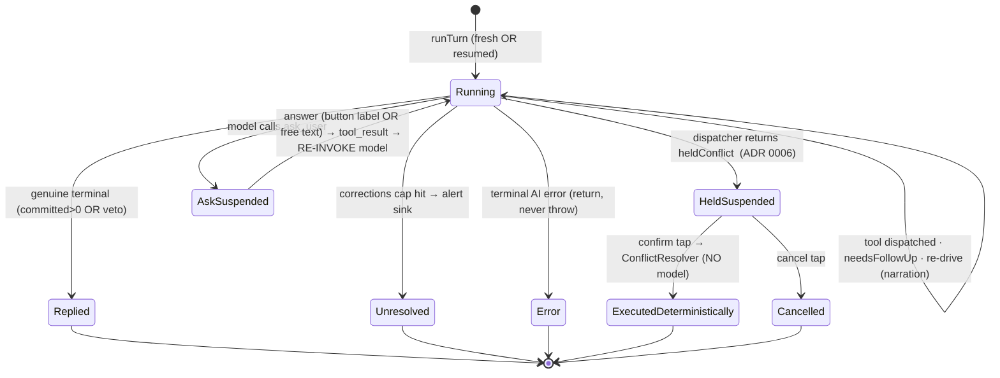
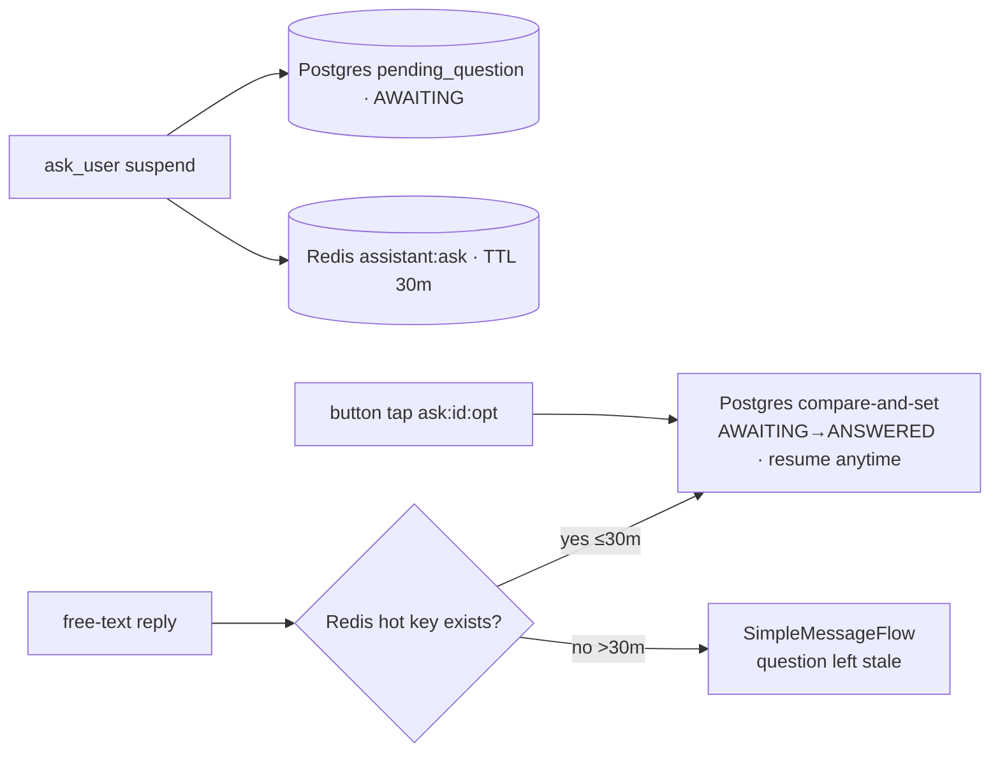

# Assistant layered architecture — target (ask_user + full Claude Code pattern adoption)

> **Canonical docs:** current state → [ai-workflow](ai-workflow.md) · backlog → [ai-workflow-tasks](ai-workflow-tasks.md) (Stories 3–8 draw on this). This file remains the **deep design** for the layer model, suspend/resume, and the migration plan; decisions in [ADR 0009](../adr/0009-assistant-narration-redrive.md) / [ADR 0010](../adr/0010-assistant-ask-user-stateful-resume.md).

- **Status**: Draft (design approved in principle; two decisions locked — full CC pattern adoption + stateful suspend/resume)
- **Last updated**: 2026-06-18
- **Owner**: @danil
- **Related ADRs**: [0006 — schedule context & conflicts](../adr/0006-assistant-schedule-context-and-conflicts.md) · [0007 — provider connector abstraction](../adr/0007-provider-connector-abstraction.md) · [0009 — narration re-drive](../adr/0009-assistant-narration-redrive.md) · [0010 — stateful ask_user resume](../adr/0010-assistant-ask-user-stateful-resume.md)
- **Related specs**: [ai-workflow](ai-workflow.md) (today) · [assistant-tool-loop-redrive](assistant-tool-loop-redrive.md) (the bug fix this hosts) · [telegram-ai-assistant](telegram-ai-assistant.md)

## Context

We want the assistant to **feel like a person**: it should be able to ask a question with **tappable options OR a free-text reply**, pause, and then **seamlessly continue the same task** when the user answers. Today the loop runs to completion inside one webhook job; a question can only be asked as plain text and the next turn reconstructs intent from history (lossy, and the seam where the [narration bug](ai-workflow.md#13-known-failure-mode-today--narration-without-writing) lives).

This spec defines the **target layered architecture** for the assistant: the layers a message and an answer pass through, the clean separation of the **answer flow** from the **simple-message flow**, and how we adopt the proven Claude Code communication patterns. It is the structural home for two already-specced changes — the [re-drive loop](assistant-tool-loop-redrive.md) and the batch `create_tasks` tool — plus the new `ask_user` capability.

**Locked decisions** (see [telegram-ai-assistant](telegram-ai-assistant.md) lineage for why):
- **Scope = full Claude Code pattern adoption**: `needsFollowUp` content-scan continue-signal (distrust `stop_reason`); the `buildTool` Tool contract (fail-closed defaults, model-facing `prompt()` vs UI `description()`, Zod input schema); a `withRetry` transport layer (529/overload fallback, `Retry-After`, jitter); structured-output discipline; and the **`ask_user`** tool (a question with **optional** quick-reply options — omit them for a plain text-only question; a typed reply is always accepted).
- **Resume = stateful, durable**: `ask_user` **suspends** the turn; the in-flight session (accumulated `toolRounds` + the pending `ask_user` tool_use id + option→label map) is persisted **durably to Postgres** (the system of record) and mirrored to **Redis with a 30-minute TTL** (the hot index). The user's answer (button tap **or** typed text) is fed back as the `ask_user` `tool_result` and we **re-enter the same loop**, re-invoking the model. **A reply after the 30-minute Redis TTL still resumes — from Postgres.**

## Goals

- A clean **layered** architecture: each layer one responsibility, dependencies point strictly downward.
- The **answer flow** is cleanly **separated** from the **simple-message flow** yet **converges** at one loop entry — no duplicated orchestration.
- `ask_user` suspend/resume is **wire-correct** (every `tool_use` gets exactly one `tool_result`; no question/answer duplication) and stays **physically distinct** from the deterministic ADR-0006 conflict path.
- Hosts the re-drive loop, batch `create_tasks`, and the escalation alert sink **without special-casing**.
- **Incremental, test-safe migration** — the 15 existing assertions (esp. the 4 ADR-0006 cases) stay green at every step.

## Non-goals

- Re-invoking the model to resolve a **time conflict** — forbidden by [ADR 0006](../adr/0006-assistant-schedule-context-and-conflicts.md); that path stays deterministic. `ask_user` is a *different* mechanism.
- Streaming token UX, MCP, sub-agents, plan mode, compaction stages — Claude Code machinery that does not fit an async Telegram backend (we keep the rolling-summary memory model, [ADR 0005](../adr/0005-assistant-conversation-memory-model.md)).
- Changing the BullMQ `attempts: 1` posture (every terminal path **returns**, never throws).

## The one correction that reshapes the migration

> **The root `CLAUDE.md` "No tests" line is stale.** These two modules have **11 `*.spec.ts` files**. `assistant.service.spec.ts` (~15 cases) **constructs `AssistantService` directly** (a 12-arg positional constructor with mocked `ai`/`vendor`/`redis`/`toolDispatcher`) and asserts on `handleText`/`handleCommand`/`handleCallback`. `tool-dispatcher.service.spec.ts` is 32 KB.

So the migration is **not** "delete the god-service." Each step keeps `AssistantService`'s three public methods + constructor green, until the final step rehomes (never deletes) the assertions. The ADR-0006 cases are the hard floor: held-no-reinvoke, confirm-writes, cancel-writes-nothing, partial-batch-no-rethrow.

## The layer model

A message travels **top → bottom**; a reply travels **bottom → top**. Dependencies point **strictly downward**. The loop (L4) is **vendor-blind, Redis-blind, ORM-blind** — it speaks the `AiConnector` port (L10) and a dispatcher interface (L5), and is handed a `TurnState` by L3.

| # | Layer | Single responsibility | Modules |
|---|---|---|---|
| L0 | Ingress / transport | Auth webhook, enqueue, 200, mint `correlationId` | `ingress/assistant-webhook.controller.ts` |
| L1 | Intake / identity | Normalize, dedupe, resolve `User`, STT (off the request path) | `ingress/webhook.consumer.ts`, `ingress/voice-transcriber.ts` |
| L2 | **Inbound router (taxonomy)** | Classify into exactly one of 4 flows — the **divergence gate** | `ingress/inbound-router.ts` |
| L3 | **Turn lifecycle** | Seed fresh-vs-resume, persist, host the **`runTurn` convergence point** | `session/turn-runner.service.ts`, `session/pending-interaction.store.ts`, `session/conversation.store.ts`, `session/turn-audit.store.ts` |
| L4 | **Orchestration (the loop)** | `needsFollowUp` scan, dispatch, write-accounting, re-drive, `ask_user` suspend → `LoopOutcome` | `orchestration/tool-loop.service.ts`, `terminal-classifier.ts`, `write-ledger.ts`, `correction-driver.ts` |
| L5 | Tools | `buildTool` contract, registry, Zod-dispatch, HandleMap; hosts `ask_user` + `create_tasks` | `tools/` (+ `definitions/*.tool.ts`) |
| L6 | Context | Rebuild prompt + seed `[eN]` HandleMap aliases each turn | `context/context-builder.service.ts` |
| L7 | Domain services | Calendar behaviour + durable suspended-turn state via the strict 3-layer data access | `TaskService`, `TaskGroupService`, `schedule-reader.service.ts`, `*DatabaseService`, **`pending_question` entity + `PendingQuestionDatabaseService`** |
| L8 | **Conflict (ADR 0006)** | Held write → **deterministic** execute on tap, **NO model** | `conflict/held-conflict.store.ts`, `conflict/conflict-resolver.service.ts` |
| L9 | Reply / egress | `LoopOutcome` → vendor I/O; sole `vendor.send*` caller | `reply/reply-presenter.service.ts`, `reply/quick-reply.builder.ts` |
| L10 | AI transport | One round-trip + `withRetry` + `AiToolChoice` | `ai/anthropic/anthropic-ai.connector.ts`, `ai/anthropic/with-retry.ts` |
| L11 | Background + alerts | Summarizer/memory (Haiku); `assistant.correction_exhausted` sink | `background/{summarizer,memory-extractor,alert.connector}.ts` |

**Convergence guarantee (kills duplication):** a fresh message and an answer-to-a-question differ *only in how `TurnState` is seeded*. Once seeded, both call the identical `ToolLoopService.run(state)` and both reconverge at `ReplyPresenter.present(outcome)`. No flow owns a second copy of "call the model / persist / send".

## The inbound flow taxonomy (4 flows, one gate)

`inbound-router.ts` (promoted from `webhook.consumer.routeForUser`) classifies one inbound into **exactly one** flow:

```
classifyFlow(normalized, user):
  Command                                  → CommandFlow         (no LLM)
  Callback && data startsWith "confirm:"   → ConflictConfirmFlow (ADR 0006, NO model)
  Callback && data startsWith "ask:"       → AnswerFlow          (button → re-invoke model)
  Text/Voice && pendingQuestionExists()    → AnswerFlow          (free-text → re-invoke model)
  else (Text/Voice, no pending)            → SimpleMessageFlow   (fresh turn)
```

The case today's code never had — **a typed message while an `ask_user` is pending** — is resolved by a cheap Redis `EXISTS` on `pendingQuestionKey(userId)` before falling through to "fresh". The `ask:` vs `confirm:` callback prefixes keep the two suspend/resume paths disjoint **at the wire level**.

## Sequence — Flow A (simple message, fresh turn)

```mermaid
sequenceDiagram
  participant TG as Telegram
  participant Ctl as L0 Controller
  participant Csm as L1 Consumer
  participant Rtr as L2 Router
  participant TR as L3 TurnRunner
  participant Loop as L4 ToolLoop
  participant AI as L10 Connector
  participant Disp as L5 Dispatcher
  participant Rep as L9 ReplyPresenter
  TG->>Ctl: POST /webhook
  Ctl->>Csm: enqueue → 200
  Csm->>Rtr: normalize · dedupe · resolve User
  Rtr->>TR: SimpleMessageFlow (no pending)
  Note over TR: persist USER · state = TurnState.fresh(text)  ← SEED A
  rect rgb(232,245,233)
  Note over TR,Loop: ── CONVERGENCE: ToolLoopService.run(state) ──
  TR->>Loop: run(state)
  loop until !needsFollowUp
    Loop->>AI: complete(... toolRounds) [withRetry]
    AI-->>Loop: CompletionResult
    Note over Loop: needsFollowUp = scan toolCalls.length (NOT stop_reason)
    Loop->>Disp: dispatch(toolCall)
    Disp-->>Loop: outcome (result | heldConflict | suspend)
  end
  Loop-->>TR: LoopOutcome
  end
  Note over TR: persist tool-round audit
  TR->>Rep: present(outcome)
  Note over Rep: reply→sendText+persist+background · held→cache+keyboard · ask→cache+keyboard (SUSPEND) · unresolved→alert+honest reply · error→AI_FAILURE_REPLY
```

## Sequence — Flow B (answer to a pending question, button OR free text)

```mermaid
sequenceDiagram
  participant TG as Telegram
  participant Csm as L1 Consumer
  participant Rtr as L2 Router
  participant TR as L3 TurnRunner
  participant PS as L3 PendingStore
  participant Loop as L4 ToolLoop
  participant Rep as L9 ReplyPresenter
  TG->>Csm: tap "ask:tok:opt2"  OR  types "actually, Friday"
  Csm->>Rtr: normalize · resolve User (ack callback if button)
  Rtr->>TR: AnswerFlow (button token OR free-text within hot window)
  TR->>PS: loadAndClaim  (Redis GETDEL hot · else Postgres compare-and-set: status AWAITING→ANSWERED)
  Note over TR: answer = button ? optionLabels[id] : rawText   ← DIVERGENCE (the only fork)
  Note over TR: seededRounds = pending.toolRounds + {toolCallId: askToolUseId, content: answer}  ← SEED B
  rect rgb(232,245,233)
  Note over TR,Loop: ── SAME CONVERGENCE: ToolLoopService.run(state) — model RE-INVOKED ──
  TR->>Loop: run(state)  // resumedRounds seeded
  Loop-->>TR: LoopOutcome  // may suspend AGAIN (new pending row)
  end
  TR->>Rep: present(outcome)   // identical tail to Flow A
```

**Divergence** = one branch in `inbound-router` + one line in `TurnRunner` (button→label vs text→raw). **Convergence** = `ToolLoopService.run(state)` — one signature, indifferent to whether `toolRounds` arrived empty (Flow A) or seeded with the synthetic `ask_user` `tool_result` (Flow B), because the loop already appends-and-re-enters every round. Seeding is just "round-zero's result came from a human, not the dispatcher".

## Suspend / resume state machine



### Why the two suspend paths are non-conflatable (the ADR-0006 constraint)

| | **ask_user** (`pending_question`) | **Held conflict** (ADR 0006, `held_conflict`) |
|---|---|---|
| Trigger | model **calls** `ask_user` (dispatcher → `suspend`) | a write **overlaps** (dispatcher → `heldConflict`) |
| Stored | `toolRounds` + `askToolUseId` + `optionLabels` (in-flight session) | `HeldConflictBatch.actions` (resolved writes) |
| **Durability** | **Postgres `pending_question` (system of record)** + Redis hot index | **Redis only** — ephemeral by design (ADR 0006: a stale conflict must *expire*, not resurrect; the calendar may have changed) |
| Hot key / TTL | `pendingQuestionKey(userId)` = `assistant:ask:*`, **30 min** (**new**) | `heldConflictKey(token)` = `assistant:held:*`, `ASSISTANT_HELD_CONFLICT_TTL_SECONDS` (**unchanged**) |
| Callback prefix | `ask:` | `confirm:` / `cancel:` |
| Late reply (after TTL) | **button → resumes from Postgres**; free-text → see policy below | not resumable — expired |
| On answer | **RE-INVOKE the model** (`run`, seeded) | **execute deterministically** (`ConflictResolver`, **no model**) |
| Resolver | `TurnRunner.resume` → `ToolLoopService.run` | `conflict-resolver.service.ts` |

Mutually exclusive by construction (as the re-drive spec already proves for held-vs-narration): a held write returns `LoopOutcome.held` *before* any ask check; an `ask_user` returns `LoopOutcome.ask` and never enters `executeHeldBatch`. Different keyspace, kind, prefix, resolver. Both keyspaces live in one file (`redis.constants.ts`) so disjointness is auditable at a glance.

## Wire-format correctness of the resume (the Anthropic 400 hazard)

`ToolRound` requires every `tool_result` to pair to a `tool_use` by `toolCallId === ToolCall.id`; the connector renders rounds as alternating `tool_use`/`tool_result` turns. The resume is legal **by construction**:

1. On suspend, `LoopOutcome.ask.toolRounds` = every completed round **including** the assistant round carrying the `ask_user` `tool_use` — **but not** its `tool_result` (the result *is* the user's answer).
2. On resume, `TurnRunner` appends exactly one synthetic `{ toolCallId: askToolUseId, content: answer }`. The model sees a settled history with exactly one just-closed `tool_use`. No interleave 400.

This mirrors the re-drive spec's rule that a corrective nudge is a plain user `PromptBlock`, **never** a synthetic `ToolRound` — the two new mechanisms respect the same wire invariant from opposite directions.

## Durability of a suspended `ask_user` turn (Redis 30 min + Postgres)

A suspended question must survive both the 30-minute hot window **and** a process restart, because the user may answer hours later. Two tiers, with **Postgres as the system of record**:



- **`pending_question` table (new entity, L7).** `conversationId` (FK, cascade), `askToolUseId`, `payload` jsonb (`toolRounds`, `optionLabels`, `question`, `correlationId`, `vendorChatId`), `status` (`AWAITING | ANSWERED | CANCELLED | EXPIRED`), `expiresAt`, timestamps. A **partial unique index on `(conversationId) WHERE status = 'AWAITING'`** enforces at most one open question per conversation; an index on `(status, expiresAt)` serves cleanup. Follows the strict entity → repository → `PendingQuestionDatabaseService` → migration order.
- **Redis** holds only the hot pointer `pendingQuestionKey(userId)` with **TTL 30 min** (`ASSISTANT_ASK_USER_TTL_SECONDS = 1800`). Its presence is the cheap signal for the router's free-text fast-path.
- **Claim = atomic, idempotent.** Resume does `Redis GETDEL` (hot) **or** `UPDATE pending_question SET status='ANSWERED' WHERE id=? AND status='AWAITING' RETURNING *` (durable). Zero rows ⇒ already resumed ⇒ ignore — the Postgres compare-and-set is the durable equivalent of `GETDEL`, so two concurrent answers can't double-resume.
- **Late-reply policy** (resolves [open decision 2](#open-questions)):
  - **Button tap** carries the row id (`ask:<pending_question_id>:<opt>`, ≤64 B) → **resumes from Postgres anytime**, until a hard retention (`ASSISTANT_ASK_USER_RETENTION_HOURS`, default 168 = 7 days; past that → "that question expired"). A button is an unambiguous answer to *that* question.
  - **Free-text** is auto-interpreted as the answer **only inside the 30-min Redis window**. After it lapses, a typed message starts a **fresh** turn (the stale question is left as-is) — we never silently consume an unrelated message days later as an answer.
- **Cleanup.** A `@nestjs/schedule` job marks `AWAITING` rows past `expiresAt`/retention as `EXPIRED` (hygiene + metrics; correctness is already guaranteed by the compare-and-set).
- **Held conflicts stay Redis-only** (ADR 0006): they are deliberately ephemeral. Re-confirming a stale overlap after a long gap is unsafe because the calendar may have moved, so they must expire rather than persist.

## Does the tool set sent to the model change?

Yes — in three distinct ways. (The model still receives one flat `tools[]` array every turn; no ToolSearch / deferral — 12 tools is well under any bloat threshold.)

**1. Three new tools join the array (9 → 12).**
- `ask_user` — AskUserQuestion: `{ question, options?: {id,label}[].max(4) }`. **Options optional** — omit them for a plain open-ended question (no buttons, the user just types); supply 2–4 for a quick-reply keyboard. Either way the turn suspends statefully and a typed reply resumes. `call()` touches no DB.
- `create_tasks` — batch create (re-drive spec).
- `check_availability` — batch slot validation, recurrence-aware (see below).

**2. *How* tools are defined changes — single source of truth.** Today each tool is defined **twice**: a hand-written JSON schema in `ASSISTANT_TOOL_SCHEMAS` *and* a parallel Zod validator (`createTaskInputSchema` …) — drift risk. Under `buildTool` (CC §3.2) each tool is **one** `BuiltTool` with a Zod `inputSchema`; the API schema is **derived** — `{ name, description: await tool.prompt(), input_schema: zodToJsonSchema(tool.inputSchema) }`. So the JSON the model sees is *generated* from the Zod schema, not maintained alongside it. The `WRITE_TOOLS` / `SCHEDULE_FETCH_TOOLS` sets become **derived** from `registry.writeNames()` / `readNames()` instead of hand-maintained.

**3. A conditional `tool_choice` now accompanies the array.** Today it is **never** sent (always implicit `auto`). New behaviour, following CC (which forces only in a narrow case):
- normal rounds → `auto` (unchanged);
- a **re-drive correction round only** → `tool_choice: 'any'` (forces *a* tool call after narration-without-writing). The corrective message still permits `ask_user` as the honest escape, so a genuinely-uncertain model asks rather than fabricating.

**What does *not* change:** the array is **identical across the simple-message and answer flows** (the registry is turn-independent), and tool **order is stable** (new tools appended, never reordered) so the ADR-0004 cache breakpoint #1 survives — the tools prefix re-baselines once when the new tools land, then stays byte-stable.

## Lookups & proactive availability — `check_availability` (recurrence-aware)

**Can the model look ahead?** Yes. The preloaded agenda only covers today + `ASSISTANT_PRELOAD_HORIZON_DAYS` (= 7), so for a 2-week-ahead create the model calls `list_tasks(from = today, to = today+14d)` — **one** call, arbitrary range, occurrence-aware (it goes through `scheduleReader.occurrencesInRange` → `findOccurrencesInRange`, which merges one-offs **and** expanded recurring instances). The per-turn limit (`ASSISTANT_MAX_SCHEDULE_FETCHES = 5`) caps the **number** of reads, not the distance — so a fortnight lookahead spends one of five.

**Can it validate a batch of slots in one call?** Not today — and that gap is why we add `check_availability`. `find_free_slots` answers "where are the gaps", not "are these 10 slots free"; the only real conflict primitive (`TaskService.findOverlapping`) is reachable solely as a *write side-effect* (the ADR-0006 hold). Validating 10+ proposals today means 10+ probes — impossible under the 5-fetch cap.

`check_availability` (new **read / schedule-fetch** tool, **never** a write):
- **Input:** `slots: { startAt, endAt, calendarId?, excludeTaskId? }[].min(1).max(25)`.
- **Output:** per slot `{ index, free, conflicts: { handle, title, occurrenceStart, occurrenceEnd }[] }` — conflicts carry `[eN]` handles so the model can move/skip them immediately.
- **Correctness contract (non-negotiable):** it calls `TaskService.findOverlapping` **once per slot with that slot's exact bounds** — the *same* source the write-time hold trusts, so a "free" verdict and a later `create_task` never disagree. It must **never** read raw `task` rows / `findInRange` (those miss recurring occupancy) and must not union the slots into one window (over-reports).
- **Cost:** one batch = **one** of the five fetches (the whole point vs probing).
- **Flow:** `check_availability(slots)` → all free → `create_tasks(slots)` → report; some busy → `ask_user` with the conflicting handles as options ("skip / pick another / overwrite"), or let the deterministic ADR-0006 hold take over for a single slot. The hold stays the authoritative last line; `check_availability` pre-empts most of them.
- **Recurring *proposals*** can't be validated in a single `findOverlapping` call (it tests one window) — the tool must either reject them honestly or self-expand the proposed rule and check each occurrence.

**Recurrence — verified in code (not assumed):**
- ✅ Conflict detection **against existing recurring events is correct**: `findClashingRecurringAnchors` loads anchors by `recurrenceRuleId` (no `startAt` predicate) and expands into the proposed window, so the 5th occurrence of a series whose master is weeks earlier **is** caught. The `CLAUDE.md` "No recurrence expansion" line is **stale** (it means "never *materialize*"; on-read expansion ships).
- ⚠️ **Latent gaps in the *existing* hold flow** (pre-date this work — flagged for honesty, not introduced here): (1) recurring **creates** skip the hold entirely (`handleCreateTask` only checks `if (!recurrence && startAt && endAt)`) — a new series can be booked over existing events silently; (2) recurring **edits** skip it (`updateRecurring` has no `findOverlapping`); (3) a far-past anchor can exhaust `MAX_GENERATION_STEPS` and return empty → a rare silently-missed conflict. `check_availability` is the **read-side** mitigation; it does **not** close write-side gaps (1)/(2), and its verdict is "no conflict found in window", not a hard guarantee (caveat 3).

## Bulk actions & loop budgets

**Bulk = many tool calls in one turn (primary), not one mega-tool.** The model emits several `tool_use` blocks per turn — e.g. delete + create + lookup together — and the loop already dispatches **all of a round's calls serially, in emission order** (`for (const toolCall of roundToolCalls)`), accumulating held conflicts and committing the rest. Heterogeneous bulk works mechanically today; the refactor leans into it (the `buildTool` `isWrite`/`isReadOnly` flags describe safety, they don't change dispatch).

- **Dispatch stays serial, in emission order** — a deliberate divergence from Claude Code's read-parallel partitioning. For one user's calendar, serial gives deterministic write order (delete→create), no races, and keeps the held-conflict batch accumulation valid; the latency cost is negligible. (CC also runs *writes* serially — it only parallelizes reads, which we don't need.)
- **Homogeneous batch tools complement, never replace it.** `check_availability([slots])` and `create_tasks([...])` collapse a dense same-kind operation into one call for token efficiency / atomic validation; mixed bulk still rides parallel calls.
- **Mixed-round precedence:** if a round yields both a held conflict and an `ask_user`, **held-confirm wins** — resolve the conflict deterministically first.

**Three orthogonal budgets — not one "5 operations" limit:**

| Budget | Limits | For |
|---|---|---|
| `ASSISTANT_MAX_TOOL_ROUNDTRIPS` | model round-trips per turn | genuine *decision-dependent* multi-step: lookup → decide → act |
| `ASSISTANT_MAX_SCHEDULE_FETCHES` = 5 | schedule reads per turn | backstop against fetch loops |
| `ASSISTANT_MAX_CORRECTIONS` = 5 | re-drive after narration-without-writes **only** ([ADR 0009](../adr/0009-assistant-narration-redrive.md)) | recovery, not "do 5 things" |

The multi-round loop exists for "the lookup result informs the next action" — **not** for probing one date per round. Batched tools keep it short: a "create 10, checking availability" turn is **Round 1** `check_availability([10])` → **Round 2** `create_tasks([free])` + `ask_user(conflicts)` → reply — **two rounds, one fetch**. The system prompt instructs the model to gather in one batched call and act in one batched turn; the 5-fetch cap is the backstop.

## How the Claude Code patterns map in

- **needsFollowUp content-scan** (CC §3.1) → `terminal-classifier.ts` decides continuation by scanning `result.toolCalls?.length`, **not** `stopReason`. Replaces the unconditional terminal return at `assistant.service.ts:350-363`.
- **Tool contract** (CC §3.2) → `build-tool.ts`: `buildTool(def) = { ...TOOL_DEFAULTS, ...def }` (defaults first), fail-closed `isWrite/isReadOnly`, model-facing `prompt()` vs UI `description()`, Zod `inputSchema`. `WRITE_TOOLS`/`SCHEDULE_FETCH_TOOLS` become **derived** from the registry — closes the "forgot to add to the Set" drift.
- **withRetry transport** (CC §3.4) → `ai/anthropic/with-retry.ts`; `getRetryDelay` copied verbatim (zero-coupling), 529/overload fallback, `Retry-After`, jitter. The loop never sees a 529.
- **Structured output** → `completeStructured` already on the port; reused for the optional answer-vs-new-request gate (open decision 2).
- **AskUserQuestion** (CC §4d) → `ask-user.tool.ts`: Zod `{ question, options?: {id,label}[].max(4) }` — **options optional** (omit ⇒ plain text-only question, no buttons; a typed reply always resumes). `call()` touches **no DB** and signals suspend.

## Where re-drive + batch + alert sink live

- **Re-drive → L4** `tool-loop.service.ts` + pure helpers. `classifyTerminalTurn`, `correction-driver.ts` (corrective user `PromptBlock`, `toolChoice:'any'` next round only, cap `< maxToolRoundtrips`, kill-switch `ASSISTANT_MAX_CORRECTIONS=0`). The veto/claim regexes move into `terminal-classifier.ts` as the single source. `corrections` rides through suspend/resume in `TurnState` so a re-drive interrupted by an `ask_user` keeps its budget.
- **Batch `create_tasks` → L5** `definitions/create-tasks.tool.ts`: `z.array(createTaskInputSchema).min(1).max(25)`, fan-out to `TaskService.create` in input order; held items reuse the existing batch-hold path. No loop change.
- **Alert sink → L11** `background/alert.connector.ts` (ADR-0007 base + factory + `SentryAlertConnector` + dev no-op). L3 acts on `LoopOutcome.unresolved`. **No throw** (queue is `attempts:1`).

## Module tree

```
src/modules/assistant/
├── assistant.module.ts
├── assistant.config.ts          # + maxCorrections, askUserTtlSeconds (1800), askUserRetentionHours (168)
├── assistant.prompts.ts
├── assistant.types.ts           # TurnState, LoopOutcome, PendingInteraction, AskUserRequest (cross-layer)
│
├── ingress/                     # L0–L2
│   ├── assistant-webhook.controller.ts
│   ├── webhook.consumer.ts      # slimmed (dedupe + user-resolve)
│   ├── voice-transcriber.ts     # extracted
│   └── inbound-router.ts        # ★ L2 — 4-flow taxonomy + pendingQuestion EXISTS
│
├── session/                     # L3
│   ├── turn-runner.service.ts   # ★ CONVERGENCE — runTurn()
│   ├── pending-interaction.store.ts  # ask_user suspend/resume (Redis)
│   ├── conversation.store.ts    # getOrCreateConversation + persistMessage
│   └── turn-audit.store.ts      # persistToolRounds
│
├── orchestration/               # L4 (vendor/redis/orm-blind)
│   ├── tool-loop.service.ts     # ★ THE LOOP — run(TurnState): LoopOutcome
│   ├── terminal-classifier.ts   # classifyTerminalTurn + veto/claim patterns
│   ├── write-ledger.ts          # committed/attempted + isFalseSuccessReply
│   └── correction-driver.ts     # buildCorrectionMessage, corrections counter
│
├── context/context-builder.service.ts   # L6; pulls schemas from registry
│
├── tools/                       # L5
│   ├── tool.contract.ts         # Tool<Input,Output>, fail-closed defaults
│   ├── build-tool.ts            # buildTool(def)
│   ├── tool-registry.ts         # name→BuiltTool; toSchemas(); writeNames()/readNames()
│   ├── tool-dispatcher.service.ts   # thinned: safeParse + registry.run()
│   ├── handle-map.ts
│   └── definitions/
│       ├── list-tasks · find-free-slots · create-task · create-tasks (NEW)
│       ├── update-task · complete-task · delete-task · set-reminder
│       ├── list-groups · create-group
│       └── ask-user.tool.ts     # NEW
│
├── conflict/                    # L8 — ADR 0006, deterministic, isolated
│   ├── held-conflict.store.ts
│   └── conflict-resolver.service.ts     # NO model
│
├── reply/                       # L9
│   ├── reply-presenter.service.ts       # SOLE vendor.send* caller
│   └── quick-reply.builder.ts
│
├── commands/command-handler.service.ts
├── schedule-reader.service.ts
└── background/                  # L11
    ├── summarizer.service.ts
    ├── memory-extractor.service.ts
    └── alert.connector.ts       # NEW

src/modules/redis/redis.constants.ts     # + pendingQuestionKey() beside heldConflictKey()
src/modules/database/                     # NEW durable suspended-turn state
├── entities/pending-question.entity.ts   # conversationId, askToolUseId, payload jsonb, status, expiresAt
├── repositories/pending-question.repository.ts
└── services/pending-question-database.service.ts
src/migrations/<unixMs>-pending-question.ts   # raw SQL: table + partial-unique(conversationId WHERE AWAITING) + (status,expiresAt) idx
src/modules/ai/
├── ai.types.ts                 # + AiToolChoice; toolChoice? on CompletionRequest
└── anthropic/
    ├── anthropic-ai.connector.ts        # wraps complete() in withRetry; maps AiToolChoice
    └── with-retry.ts                    # NEW
```

## Migration plan (incremental, test-safe)

Each step keeps existing specs green; the god-service is dismantled by **behaviour-preserving lifts** before any new behaviour is added.

1. **`redis.constants.ts`** — add `pendingQuestionKey(userId)` (`assistant:ask:*`) beside `heldConflictKey`. Pure addition.
2. **`session/conversation.store.ts` + `turn-audit.store.ts`** — lift `getOrCreateConversation`/`persistMessage`/`persistToolRounds`; delegate. Behaviour-identical.
3. **`reply/`** — extract `sendReply`; become the sole `vendor.send*` caller. Wire calls identical.
4. **`conflict/`** — extract `holdAndAsk`/`executeHeldBatch`/`handleCallback` body into a store + deterministic resolver. **The 4 ADR-0006 cases are the merge gate.**
5. **`orchestration/tool-loop.service.ts` (keystone)** — lift `runToolLoop` + `buildHeldPrompt`; regexes + `isFalseSuccessReply` into pure helpers. **Pure lift first** (`LoopOutcome` = `reply|held|error`, body byte-identical). Highest-risk step.
6. **`ai/` withRetry + `AiToolChoice`** — independent of the loop refactor; connector wraps `complete()`.
7. **Tool contract** — `buildTool` + registry; migrate the 9 handlers into `definitions/*.tool.ts` **one tool per PR**, old+new side-by-side; derive the WRITE/READ sets. Add `create-tasks.tool.ts`.
8. **Re-drive + alert sink** — `classifyTerminalTurn` + `correction-driver` + `LoopOutcome.unresolved` → `alert.connector`.
9. **`ask_user` + durable pending store** — the `pending_question` entity → repository → `PendingQuestionDatabaseService` → migration; then `ask-user.tool.ts` (suspend signal), `pending-interaction.store.ts` (two-tier: Postgres system of record + Redis 30-min hot index, atomic compare-and-set claim), `LoopOutcome.ask`, and a `@nestjs/schedule` cleanup job. Config: `ASSISTANT_ASK_USER_TTL_SECONDS = 1800`, `ASSISTANT_ASK_USER_RETENTION_HOURS = 168`.
10. **`inbound-router.ts` + `turn-runner.service.ts` (convergence)** — the 4-flow gate + the single `runTurn` fork; retarget the consumer to `TurnRunner`; **rehome** `assistant.service.spec.ts` into `turn-runner.service.spec.ts` + per-layer specs (move the assertions, never delete).

## Open questions

- [ ] **Where `AssistantService` lands.** Recommended: delete it at step 10 and rehome the spec in the same PR. Alternative: keep a thin 3-method facade (lower blast radius, vestigial class). The spec drives the real class directly, so this is load-bearing.
- [x] **Free-text-while-pending semantics** — *resolved* by the [durability policy](#durability-of-a-suspended-ask_user-turn-redis-30-min--postgres): free-text auto-resumes **only inside the 30-min hot window**; after it lapses a typed message starts a fresh turn (no silent late consumption). Buttons resume from Postgres anytime. A cheap Haiku "answer vs new request?" gate (the `completeStructured` plumbing exists) remains an optional fast-follow to also reject *in-window* non-answers.
- [ ] **Per-chat concurrency.** Two inbound updates while a question is pending race (last-writer-wins). `GETDEL` blocks double-resume of the same question; a per-user advisory lock around `runTurn` closes the two-messages race. Defer unless burst inbound is observed.
- [ ] **`buildTool` migration scope** (step 7). Correctness-neutral churn over 9 working handlers; reasonable to do one-per-PR and defer the last few. `ask_user` and `create_tasks` are authored as `buildTool` natively regardless.

## References

- Today's flow: [ai-workflow](ai-workflow.md)
- The bug fix this hosts: [assistant-tool-loop-redrive](assistant-tool-loop-redrive.md)
- Conflict rule (must not break): [ADR 0006](../adr/0006-assistant-schedule-context-and-conflicts.md)
- Connector contract: [ADR 0007](../adr/0007-provider-connector-abstraction.md)
- Pattern source: `/Users/danil/personal-projects/claude-code-src/AI_COMMS_TOOLSET_RESEARCH.md` (§3.1 loop, §3.2 Tool, §3.4 retry, §4d AskUserQuestion)
