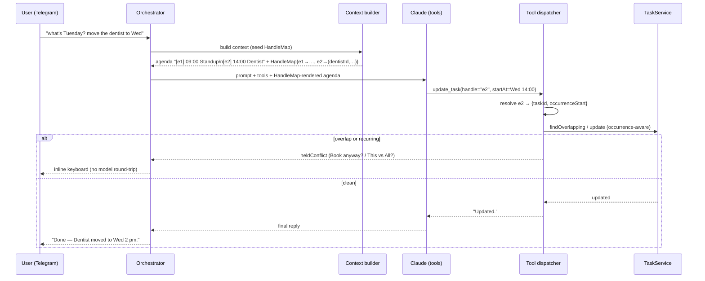

# Assistant task-domain tools & per-turn handles

> **Canonical docs:** current state → [ai-workflow](ai-workflow.md) · backlog → [ai-workflow-tasks](ai-workflow-tasks.md). This file remains the **deep design** for the tool surface, the per-turn handle scheme, and the addressing-rationale (Alternatives considered). The shipped surface is summarised in [ai-workflow §7](ai-workflow.md#7-tools-handles--recurrence); forthcoming tools are Stories 2/5/7 in the backlog.

- **Status**: Implemented (deep design reference)
- **Last updated**: 2026-06-03
- **Owner**: @danil
- **Related ADRs**: [0004 — assistant-prompt-composition-and-caching](../adr/0004-assistant-prompt-composition-and-caching.md) · [0006 — assistant-schedule-context-and-conflicts](../adr/0006-assistant-schedule-context-and-conflicts.md) · [0007 — provider-connector-abstraction](../adr/0007-provider-connector-abstraction.md)

## Context

The [Telegram AI assistant](telegram-ai-assistant.md) shipped with a narrow, **event-centric** tool surface — `list_events`, `find_free_slots`, `create_event`, `update_event`, `delete_event`, `set_reminder` — over Cue's much richer `Task` domain (the unified event **+ todo** primitive, with completion, groups, and recurrence). Two concrete gaps surfaced in review:

**1. The addressing gap (verified in code).** Every *write* tool requires a `taskId` (`tool-schemas.ts` — `update_event`/`delete_event`/`set_reminder` all take `taskId: z.string()`), but **no read path ever returns one**. `list_events` renders `formatEventLine()` → `"ccc dd LLL HH:mm–HH:mm title"` with no id (`event-formatting.ts`), `find_free_slots` returns slot strings, and the preloaded agenda (context block 5) uses the *same* formatter. The only id the model ever sees is the one `create_event` echoes back (`Created event "X" (uuid)`). Consequence: **the model can reliably mutate only an event it created earlier in the same conversation, or one whose UUID the user pasted.** The everyday request — *"move my dentist appointment to Thursday"* for a pre-existing event — has no path: the model can *see* it in the agenda but has no id to pass to `update_event`.

**2. The domain-coverage gap.** Cue's primitive is `Task`, but the assistant can't: create a plain **todo** (no time), **mark anything done** (despite `TaskService.setCompleted` existing and `completedAt` driving the reporting feature), **see or assign task groups**, or **express recurrence**. A user saying *"remind me to stretch every weekday"* would, at best, push the model toward creating N separate rows — the exact anti-pattern [ADR 0002](../adr/0002-rrule-not-materialized.md) forbids.

Both gaps reduce to one root problem: **the assistant has no robust way to *address* the thing the user refers to.** For a one-off that address is a task id; for a recurring task it's a `(taskId, originalStart)` occurrence pair (the [recurrence-expansion spec](recurrence-expansion.md)'s identity). Solve addressing once and you fix the move/delete-existing flow *and* unlock recurring-instance edits.

Constraints and prior decisions:

- **[ADR 0004](../adr/0004-assistant-prompt-composition-and-caching.md) caching.** Anything that changes per turn lives in the volatile block (5) below both cache breakpoints. Whatever id-carrying scheme we add must be cheap and must **not** push volatile data above a breakpoint.
- **[ADR 0006](../adr/0006-assistant-schedule-context-and-conflicts.md) conflict hold.** Overlapping writes are held in Redis and resolved by an inline keyboard with **no model round-trip**. We reuse this exact mechanism for the recurring-edit "this / following / all" prompt.
- **Strict data-access.** Tools dispatch only into feature services (`TaskService`, `CalendarService`, `TaskGroupService`) — never repositories/entities. The richer service methods are delivered by the [recurrence-expansion spec](recurrence-expansion.md).
- **Nothing is in production.** No backwards-compat shims; we replace the tool surface rather than alias it (repo convention).

## Goals

- The model can **reliably target any task the user refers to** — including pre-existing ones and individual occurrences of a recurring series — without the user ever seeing or typing an id.
- The tool surface reflects the **real `Task` domain**: create/list/update/complete/delete tasks (timed events **and** todos), manage **task groups**, and express **recurrence as one task** (never N rows).
- The id-carrying scheme is **cheap** (≈1 token per shown task), **never leaks UUIDs** to the model, and resolves **server-side**.
- All existing assistant guarantees are preserved: the conflict hold, ask-don't-guess clarification, the 5-fetch cap, caching, and the J.A.R.V.I.S. persona.

## Non-goals

- **The recurrence expansion engine and edit-scope operations** — owned by [specs/recurrence-expansion.md](recurrence-expansion.md). This spec *consumes* its `Occurrence` type and `TaskService` methods, and decides *when* to ask the user which edit scope.
- **Reminder/notification delivery.** `set_reminder` stays a graceful no-op until [specs/notification-delivery.md](notification-delivery.md) lands; it is re-keyed to handles but still no-ops.
- **Cross-turn handle persistence.** Handles are per-turn; a reference to something shown in an *earlier* turn triggers a cheap re-list. (See [Alternatives](#persist-handles-across-turns-in-redis).)
- **Multi-calendar selection UX**, calendar sharing, or a settings surface for groups.
- **Changing the inbound pipeline, linking, STT, memory, or caching block order** — unchanged from the [telegram-ai-assistant spec](telegram-ai-assistant.md).

## Proposed design

### Per-turn handles — the addressing scheme

The chosen approach (a **React `key`** for calendar rows):

- **Every task/occurrence the model is *shown*** — the preloaded agenda (context block 5) and every `list_tasks` result — is rendered with a compact ordinal alias: `[e1]`, `[e2]`, … (`e` for "entry"). `find_free_slots` is exempt (slots aren't tasks).
- The orchestrator owns a per-turn **`HandleMap`**: `alias → { taskId: string; occurrenceStart?: Date }`. It is **seeded** by the context builder while rendering the agenda and **appended** by `list_tasks` calls during the tool loop (aliases keep counting up within the turn so they never collide). It lives in memory for the turn only — the orchestrator already holds turn state.
- **Mutation tools** (`update_task`, `complete_task`, `delete_task`, `set_reminder`) take a `handle` string, not a raw id. The dispatcher resolves `handle → { taskId, occurrenceStart? }` from the `HandleMap` (passed in `ToolDispatchContext`) before calling the service.
- A handle resolving to `{ taskId, occurrenceStart }` addresses a **single recurring occurrence**; one resolving to `{ taskId }` addresses a **one-off or the series master**. The dispatcher forwards both to the [recurrence-expansion](recurrence-expansion.md) edit path, which (with the edit scope) decides occurrence-override vs. series edit.
- **Stale/unknown handle** (e.g. a cross-turn reference, or the model inventing one) → a **recoverable tool error**: *"That reference isn't in view — list the day again to refresh it."* The model re-lists (cheap, within the 5-fetch cap) and retries. The system prompt teaches this.

Why this over the alternatives (full analysis in [Alternatives](#alternatives-considered)): ≈1 token/row instead of ~15 for a raw UUID, in the **uncached** volatile block where every token recurs every turn; no UUID leakage into model text; and it fits the dominant flow exactly — *"what's Tuesday? move the dentist"* is **one** user turn, so the handles from `list_tasks` (or the preloaded agenda) are still live when `update_task` fires.

### Tool surface — event → task vocabulary

The event-centric tools are **replaced** (not aliased) by a task-domain surface. Dispatch still targets feature services only; the richer methods come from the [recurrence-expansion spec](recurrence-expansion.md).

| Tool | Replaces | Purpose | Key inputs |
|---|---|---|---|
| `list_tasks` | `list_events` | List tasks in a range and/or by group / completion; returns aliased lines + seeds handles. Counts against the 5-fetch cap. | `from?`, `to?`, `group?` (name), `includeCompleted?`, `onlyTodos?` |
| `create_task` | `create_event` | Create a timed event, all-day event, **or todo** (no time); optional recurrence; optional group. | `title`, `startAt?`, `endAt?`, `isAllDay?`, `notes?`, `group?` (name), `recurrence?`, `requiresCompletion?`, `timezone?`, `calendarId?` |
| `update_task` | `update_event` | Edit a task/occurrence **by handle**; for recurring, carries `editScope`. | `handle`, `title?`, `startAt?`, `endAt?`, `group?`, `recurrence?`, `editScope?` |
| `complete_task` | *(new)* | Mark a task/occurrence complete or incomplete. | `handle`, `completed?` (default `true`) |
| `delete_task` | `delete_event` | Soft-delete a one-off/whole series (`all`), **skip a single occurrence** (`editScope:"this"`), or **truncate the series** at the occurrence (`editScope:"this_and_following"` — ends the rule the day before, preserving past occurrences). | `handle`, `editScope?` |
| `find_free_slots` | *(unchanged)* | Open slots in a range. No handle (slots aren't tasks). | `from`, `to`, `durationMinutes` |
| `set_reminder` | *(unchanged, no-op)* | Graceful "coming soon" until [notification-delivery](notification-delivery.md). Re-keyed to `handle`. | `handle`, `offsetMinutes`, `channel?` |
| `list_groups` | *(new)* | List the user's task groups (names + task counts) so the model knows what exists. | — |
| `create_group` | *(new)* | Create a task group on the fly ("put this in a new 'Home reno' project"). | `name`, `color?`, `icon?` |

- **`recurrence`** is an object mirroring `RecurrenceRule`: `frequency` (`DAILY`/`WEEKLY`/`MONTHLY`/`YEARLY`), `interval?`, `byWeekday?` (0=Mon…6=Sun), `byMonthDay?`, `byMonth?`, `endType` (`NEVER`/`UNTIL_DATE`/`COUNT`), `endDate?`, `count?`. LLMs map natural language to this well — *"every weekday until end of July"* → `{ frequency: WEEKLY, byWeekday: [0,1,2,3,4], endType: UNTIL_DATE, endDate: "2026-07-31" }`. The dispatcher validates with the same Zod shape the [recurrence DTO](recurrence-expansion.md#data-model) enforces and passes it straight to `TaskService.create`/`update` — **one task, one rule.**
- **`editScope`** ∈ `this` | `this_and_following` | `all`. **Omitted on a recurring task ⇒ the assistant asks** (next section). On a non-recurring task it's ignored.
- **Groups are referenced by name, not handle.** Groups are few and user-named; the model sees the group list (context + `list_groups`) and passes a name. The dispatcher resolves name → group via `TaskGroupService.findByName`; **ambiguous** name ⇒ clarify; **missing** name ⇒ the model is told to confirm/`create_group` (never auto-create implicitly). This avoids a second volatile handle namespace above the cache line.

### Forthcoming tools (assistant-layered-architecture refactor)

The [layered-architecture refactor](assistant-layered-architecture.md) adds three tools and leans into heterogeneous **parallel tool calls** — the model may emit create + update + delete + lookup in one turn; the loop already dispatches all of a round's tool calls **serially, in emission order**:

- **`ask_user`** — ask with 2–4 tappable options **or** a plain free-text answer (options optional); suspends the turn with a durable, resumable session ([ADR 0010](../adr/0010-assistant-ask-user-stateful-resume.md)).
- **`create_tasks`** — batch create (`createTaskInput[]`), fanning out to `TaskService.create` in order; the token-efficient path for "create N".
- **`check_availability`** — a **read** batch pre-flight: validate a list of `{ startAt, endAt }` slots in one call (occupancy via `findOverlapping`), so the model can check-then-create-or-clarify without N single probes. Advisory; the write-time hold stays the floor.

These belong to that (Draft) spec; the surface above is what ships today. The narration re-drive that backstops batch writes is [ADR 0009](../adr/0009-assistant-narration-redrive.md).

### Recurring edits — choosing the scope

A recurring edit must resolve to one of three scopes (the three operations from the [recurrence-expansion spec](recurrence-expansion.md#recurring-edit-semantics--the-three-scopes)): **this occurrence** → `applyOccurrenceOverride`, **this and following** → `splitSeries`, **all** → master `update`. `update_task` / `delete_task` accept an explicit `editScope` (`this` | `this_and_following` | `all`).

**v1 — model-driven ask.** When the model issues a recurring edit **without** `editScope`, the dispatcher does **not** guess: it returns a recoverable tool result — *"This is a repeating task. Apply to just this one, this and future, or all? Re-issue with `editScope`."* The model then asks the user one concise question (the existing [ask-don't-guess](telegram-ai-assistant.md#replies-and-clarifying-questions) path) and re-calls with the chosen scope. A non-recurring task ignores `editScope`. If the model supplies a confident scope from explicit phrasing — "move **all** my standups" — it executes immediately. This keeps the dispatcher self-contained and reuses the clarify path, with no new held-action state.

**Deferred enhancement.** The scope question can later be presented as a free, no-round-trip [ADR 0006](../adr/0006-assistant-schedule-context-and-conflicts.md) inline keyboard (This one / This & future / All), mirroring the conflict hold — matching how iOS/Google Calendar behave. v1 keeps it model-driven to avoid extending the held-action mechanism now.

### Context-builder changes

- The preloaded agenda (block 5) renders `[eN]` aliases via the shared formatter and **seeds the `HandleMap`**. Once the [recurrence-expansion spec](recurrence-expansion.md) lands, the agenda is built from `Occurrence[]`, so each *occurrence* gets its own alias mapping to `{ taskId, occurrenceStart }`.
- A small **groups line** is added to the **per-user stable region** (block 3/profile area — cache-friendly, changes rarely): `Groups: Work, Home, Fitness`. By **name only** — no volatile aliases above the cache breakpoint. The model assigns/filters by name; `list_groups` returns fuller detail on demand.
- The shared `formatEventLine` → `formatTaskLine(occurrence, tz, alias?)` so the agenda, `list_tasks`, and command handlers stay byte-consistent (a divergence would split the cache and confuse handle references).
- Block ordering, the two breakpoints, and the timestamp-below-both rule are **unchanged** ([ADR 0004](../adr/0004-assistant-prompt-composition-and-caching.md)).

### System-prompt updates

The [persona](telegram-ai-assistant.md#voice-and-persona) is unchanged. The "Working with the calendar" rules gain:

- Tasks are referenced by their bracketed handle (`[e2]`); to act on something not currently in view, list it again first.
- Repeating tasks are **one task with a recurrence**, never many — use the `recurrence` field; do not create copies for future dates.
- Todos (no time) are first-class — create them without a start time.
- To assign a group, use its name from the group list; if it doesn't exist, confirm before creating one.

### API

**No new HTTP endpoints.** The webhook ingress, `/assistant/link`, and the AASA route are unchanged ([telegram-ai-assistant spec](telegram-ai-assistant.md#api)). All change is internal: tool schemas, the dispatcher, the context builder, the orchestrator's `HandleMap`, and the system prompt. The richer `TaskService`/`TaskGroupService` methods are delivered (service-layer, no endpoints) by the [recurrence-expansion spec](recurrence-expansion.md).

### Error handling

| Failure | Behavior |
|---|---|
| Unknown / stale `handle` (cross-turn, or invented) | Recoverable tool error → model re-lists the day and retries (within the 5-fetch cap). |
| Ambiguous `group` name (>1 match) | Clarify — ask which group (free-text or pick-list), per [ask-don't-guess](telegram-ai-assistant.md#replies-and-clarifying-questions). |
| `group` name not found | Tell the model; it confirms with the user, optionally `create_group`. Never auto-create implicitly. |
| `editScope` omitted on a recurring task | Recoverable tool result asking the model to re-issue with a scope (`this` / `this_and_following` / `all`); the model asks the user one concise question. (Deferred: free inline-keyboard scope pick.) |
| `editScope` / `recurrence` on a non-recurring task | Ignore scope; treat `recurrence` as "make it recurring" (a valid edit). |
| `create_task` with neither time nor `requiresCompletion` resolvable | Default to a todo (`requiresCompletion: true`, no time). |
| Overlapping write (timed) | Existing [ADR 0006](../adr/0006-assistant-schedule-context-and-conflicts.md) layer-4 conflict hold — occurrence-aware via [recurrence-expansion](recurrence-expansion.md#conflict-checking-with-recurrence). **Caveat (known gap):** only **non-recurring** creates / one-off moves run the hold today; **recurring** creates & edits bypass it — tracked as a standalone fix (see [recurrence-expansion](recurrence-expansion.md#conflict-checking-with-recurrence)). |
| Tool validation error (bad recurrence combo, etc.) | Returned to the model as the tool result so it can correct — never a raw stack trace to the user. |

## Alternatives considered

### Embed the raw UUID in every read line

Simplest and most robust — `update_task` could take the literal id. **Rejected** as the default: a UUID is ~15 tokens × every agenda/list row, in the **volatile, uncached** block where it recurs every single turn; and it leaks opaque UUIDs into model-visible text (occasionally echoed at users). Per-turn ordinal handles cost ~1 token and never leak. (Raw ids remain the trivial fallback if handle resolution ever proves fragile.)

### Natural-language resolution in the write tools

Let `update_task` take "the dentist appointment on the 4th" and resolve server-side. **Rejected** for tasks: it re-implements fuzzy search + disambiguation and is risky for deletes (wrong match = destructive). We *do* use light name-resolution for **groups**, because they're low-cardinality, user-named, and a wrong match is non-destructive and easily clarified — the cost/benefit flips.

### Persist handles across turns in Redis

Keep the `HandleMap` per conversation with a TTL so "move it" works across turns. **Rejected for v1**: adds transient state, a TTL/expiry path, and cross-turn staleness (the calendar may have changed). The re-list cost is one cheap `list_tasks` within the existing fetch cap. Revisit if telemetry shows frequent cross-turn references.

### Keep event-only tools, bolt `recurrence` onto `create_event`

Minimal diff. **Rejected**: it leaves todos, completion, and groups unreachable and entrenches the "event" misnomer over a `Task` domain — the user explicitly chose to evolve the vocabulary to `create_task`/`list_tasks`/`complete_task` + `*_group`. Doing it now (nothing in production) avoids a second migration of the model's mental model later.

### Let the model decide recurring edit scope itself (no ask)

Have the model infer this/following/all. **Rejected**: the scope is genuinely ambiguous from most phrasing ("move my standup"), getting it wrong is destructive across many dates, and a deterministic inline-keyboard ask is free (no round-trip) and matches every mainstream calendar. The model may still pass an explicit `editScope` when the user is unambiguous.

### Numeric DB ids or short hashes instead of ordinals

`[a1b2]`-style short hashes. **Rejected**: ordinals (`e1`, `e2`) are the cheapest, reset cleanly per turn, and carry no accidental meaning; a per-turn map makes them unambiguous without any global stability requirement.

## Rollout

Ships behind the existing assistant; **depends on [recurrence-expansion](recurrence-expansion.md) landing first** (it provides the `Occurrence` type, occurrence-aware `findInRange`, the edit-scope ops, and `TaskGroupService`). Build order within this spec:

- **Task A1 — Tool schemas + dispatcher + handle resolution.** Replace the tool list with the task-domain surface; add the `HandleMap` type + resolution; re-key mutations to `handle`; wire `recurrence`/`group`/`editScope`; dispatch into the new `TaskService`/`TaskGroupService` methods; the recurring-edit "ask scope" held-action. Owns `tools/tool-schemas.ts`, `tools/tool-dispatcher.service.ts`, the tool-related types in `assistant.types.ts`, and a new `tools/handle-map.ts`. Tests: handle resolve/miss, each tool, group name-resolution + ambiguity, recurrence pass-through, editScope hold. Depends on [recurrence-expansion R2](recurrence-expansion.md#rollout).
- **Task A2 — Context builder handles + orchestrator threading + prompt.** Seed the `HandleMap` while rendering the `Occurrence`-based agenda; thread it through the tool loop into `ToolDispatchContext`; render the groups line in the per-user block; `formatEventLine → formatTaskLine`; extend the system prompt. Owns `context-builder.service.ts`, `assistant.service.ts` (map threading + edit-scope hold reuse), `assistant.prompts.ts`, `event-formatting.ts`. Tests: agenda seeds handles, map threads to dispatch, prompt rules present, occurrence aliases. Depends on A1's `HandleMap` contract + [recurrence-expansion](recurrence-expansion.md)'s `findInRange`.

**Docs**: update the [telegram-ai-assistant spec](telegram-ai-assistant.md) tool list + [architecture.md](../architecture.md) to point at the new surface; this spec moves `Draft → Implemented` on completion. The tool-surface rename + the per-turn-handle addressing decision are **ADR-worthy** — pin them in a short ADR if the design proves stable (see Open questions).

## Open questions

- [ ] **ADR for the addressing scheme** — per-turn handles + occurrence identity is a cross-cutting contract; promote to an ADR once validated in use.
- [ ] **Handle prefix** — `e1` (entry) vs `t1` (task); and should groups ever get handles if group cardinality grows? v1: `e`-ordinals for tasks, names for groups.
- [ ] **Todos in the preloaded agenda** — surface timeless todos in the pushed agenda, or only via `list_tasks(onlyTodos)`? (Shared question with [recurrence-expansion](recurrence-expansion.md#open-questions).)
- [ ] **Explicit-scope confidence** — when do we trust a model-supplied `editScope` and skip the ask vs. always confirm destructive multi-date edits? Lean: always ask unless the user's wording is unambiguous ("all").
- [ ] **`list_tasks` default window** — when `from`/`to` are omitted, default to the preloaded horizon, or require a range? Lean: default to today→+7d to match the agenda.

## References

- Backend capability this consumes: [specs/recurrence-expansion.md](recurrence-expansion.md)
- Parent design (pipeline, persona, caching, linking — unchanged): [specs/telegram-ai-assistant.md](telegram-ai-assistant.md)
- Caching / prompt block order (handles live in the volatile block): [ADR 0004](../adr/0004-assistant-prompt-composition-and-caching.md)
- Conflict hold reused for the edit-scope ask: [ADR 0006](../adr/0006-assistant-schedule-context-and-conflicts.md)
- Recurrence model: [ADR 0002](../adr/0002-rrule-not-materialized.md)
- Tool dispatch + schemas today: [`tool-dispatcher.service.ts`](../../src/modules/assistant/tools/tool-dispatcher.service.ts) · [`tool-schemas.ts`](../../src/modules/assistant/tools/tool-schemas.ts)
- Shared formatter: [`event-formatting.ts`](../../src/modules/assistant/event-formatting.ts)
- Events are Tasks: [`task.entity.ts`](../../src/modules/database/entities/task.entity.ts) · [`task-group.entity.ts`](../../src/modules/database/entities/task-group.entity.ts)
