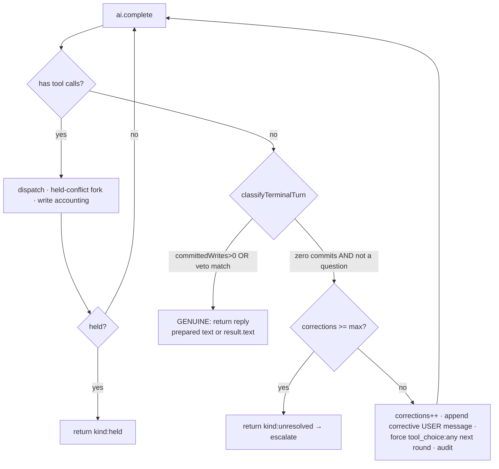

# Assistant tool-loop re-drive — "Target" (validate → feedback → retry ≤5 → escalate)

> **Canonical docs:** current state → [ai-workflow](ai-workflow.md) · backlog → [ai-workflow-tasks](ai-workflow-tasks.md) (this is **Story 1**, + **Story 2** batch `create_tasks`). This file remains the **deep design** behind those stories; decision recorded in [ADR 0009](../adr/0009-assistant-narration-redrive.md).

- **Status**: Draft (design approved in principle; two product decisions locked — see [Decisions](#decisions-locked))
- **Last updated**: 2026-06-18
- **Owner**: @danil
- **Related ADRs**: [0006 — schedule context & conflicts](../adr/0006-assistant-schedule-context-and-conflicts.md) · [0007 — provider connector abstraction](../adr/0007-provider-connector-abstraction.md) · [0009 — narration re-drive](../adr/0009-assistant-narration-redrive.md)
- **Related specs**: **[ai-workflow](ai-workflow.md)** (the "Today" state; §13 is the bug this fixes) · [telegram-ai-assistant](telegram-ai-assistant.md)

## Context

The assistant has a confirmed, reproducible failure: on a **batch create** ("create all seven driving lessons for Jun 10–20") the model emits a text-only `end_turn` turn that *narrates* the action — **"…Создаю все семь в группе Driving Lessons."** — with **zero tool calls**. The loop's terminal check returns that text verbatim; nothing is saved. Production DB confirms zero of seven created; the user said "Отлично" and never knew. Full diagnosis and the exact line anchors are in [ai-workflow §13](ai-workflow.md#13-known-failure-mode-today--narration-without-writing).

Why the existing mitigation is insufficient: the `isFalseSuccessReply` guard now *detects* the false claim (swaps it for "didn't save, try again") but **never re-drives the model** — the tasks still aren't created and the user must re-ask manually. It is a detector wired to a cosmetic action, not a recovery path. It is also purely lexical (EN+RU regex) with real blind spots (an English "Creating all seven…" slips through entirely).

The structural root: the loop **cannot distinguish** "I narrated a plan I never executed" from "I'm asking a clarifying question" — both are `end_turn` + text + no tool calls — so it terminates on the first such turn, never giving the model a round on which it actually emits the `create_task` calls.

## Goals

- A batch-create (or any write request) that the model *narrates without executing* is **automatically re-driven** until the writes actually commit — no manual re-ask.
- The model produces its tool calls **and** its message in the same turn; after dispatch the orchestrator **validates** the outcome (req 1).
- On success, the user gets the prepared success message (req 2a); on errors/conflicts, structured feedback goes back to the model (req 2b); the model self-corrects, **capped at 5 correction iterations** (req 2c); after 5, the turn **escalates via logs + a real alert sink** (req 2d).
- Genuine clarifying questions and already-committed writes are **never** forced to write or re-driven (no regression of the "ask, don't guess" policy or [ADR 0006](../adr/0006-assistant-schedule-context-and-conflicts.md)).
- Creating N tasks becomes a **single batch tool call**, removing the cognitive load that tips the model into narration in the first place.

## Non-goals

- Re-planning **time conflicts** by re-invoking the model — forbidden by [ADR 0006](../adr/0006-assistant-schedule-context-and-conflicts.md); conflicts stay on the deterministic hold-and-confirm path. Re-drive is a *different* failure class (the model produced **no** action; a conflict is the model producing a **clashing** action).
- A second LLM provider, or any change to the connector's stateless one-round-trip contract.
- Fixing the §12 guard's regex coverage as the primary mechanism — the redrive trigger is **structural**, not lexical (the regex is demoted to a logging hint).
- Replacing the partial-batch "5 of 7 committed" reporting (a pre-existing guard tier-1 limitation, out of scope; the batch tool reduces its likelihood).

## Decisions (locked)

| Decision | Choice | Consequence |
|---|---|---|
| **Scope** | Re-drive loop **+ a batch `create_tasks` tool** | Larger change: new tool schema + Zod array validator + dispatcher fan-out + spec note in [assistant-task-tools](assistant-task-tools.md). |
| **Escalation (req 2d)** | Structured log **+ wire a real Sentry/alert sink** | New observability dependency. Introduced behind a thin connector (ADR 0007 style) so it's swappable; `assistant.correction_exhausted` is its first event. |

Technical defaults taken (overridable): the re-drive trigger is **structural** (zero tools + zero commits + not-a-question), with `MUTATION_CLAIM_PATTERN` as a logged confidence hint only; `tool_choice` is forced to `'any'` on the **first** correction; the whole mechanism has a kill-switch (`ASSISTANT_MAX_CORRECTIONS=0` falls back to today's guard).

## Proposed design

### The re-drive loop

Replaces the unconditional terminal return at `assistant.service.ts:350-363`. Per round, after `ai.complete(...)`:



Key rules:

- **`classifyTerminalTurn(text, committedWrites, attemptedWrites)`** reuses the guard's precedence as the gate: `committedWrites > 0` **or** `CLAIM_VETO_PATTERN` match → `genuine`; else → `narration_without_write`. The veto is the **hard floor** that keeps real questions passing through. `MUTATION_CLAIM_PATTERN` is consulted only to set `correctionReason` for logging — it is **not** required to trigger (this closes the EN-batch-narration gap).
- The corrective nudge is appended as a **plain user `PromptBlock`** in `prompt.messages`, **never** as a synthetic `ToolRound`. *(Critical wire-format fact: the connector renders every `ToolRound` as a paired `tool_use`+`tool_result`; a fabricated `tool_result` with no matching `tool_use` is an Anthropic `400`.)*
- `tool_choice: 'any'` is set for the **next** round only (reset to `'auto'` at the top of each iteration), so re-drive forces *a* tool call rather than more prose. Forcing happens only when `corrections > 0` — a first-round question runs `auto` and passes through (double-protected with the veto).
- The corrections counter is **strictly below** `ASSISTANT_MAX_TOOL_ROUNDTRIPS`, so the corrections cap escalates with the *right* reply before the round-trip ceiling masks it.

### How it maps to the requirements

| Req | Mechanism |
|---|---|
| **1** — tools + message same turn, then validate | round 0 left free (text + tool_use coexist); validation = existing `committedWrites` / `isError` accounting |
| **2a** — success → prepared message | capture the model's text as `preparedReply` on the committing round; release it verbatim on a `genuine` terminal (no extra round) |
| **2b** — errors/conflicts → feedback to model | tool errors already replay as `tool_result(isError:true)`; the narration case adds the corrective user message |
| **2c** — retry, cap 5 | `corrections` counter, `ASSISTANT_MAX_CORRECTIONS` (default 5) |
| **2d** — escalate after 5 | `kind:'unresolved'` → structured `assistant.correction_exhausted` log **+ alert sink** + honest user reply |

### Batch `create_tasks` tool

A new `WRITE_TOOLS` member taking `z.array(createTaskInputSchema).min(1)` (cap the array length, e.g. ≤ 25). The dispatcher fans out to `TaskService.create` per item **in input order**, returning a structured per-item result (`created` handle / `error` / `held`) so partial outcomes feed back cleanly. This makes the forced re-drive call trivially correct — "create all seven" becomes one tool call, not seven — and cuts token cost. Held-conflict items route through the existing batch-hold path. *(Additive; documented in [assistant-task-tools](assistant-task-tools.md).)*

### Escalation sink

A thin `AlertConnector` abstraction (ADR 0007 style: base contract + factory + a `SentryAlertConnector` impl), so the alert vendor stays swappable and local/dev degrades to a no-op. The orchestrator emits one structured event on exhaustion:

```
logger.error({ event: 'assistant.correction_exhausted', cid, userId,
               corrections, attemptedWrites, committedWrites, lastErrors })
alerts.capture('assistant.correction_exhausted', { ...context })
```

The user receives an honest `CORRECTION_EXHAUSTED_REPLY` ("I wasn't able to save all of those… nothing was changed; please try again, or send them one at a time."). **No throw** by default — under the current queue `attempts: 1` a throw wouldn't replay anyway, and not throwing keeps `onFailed` reserved for genuine transport failures. *(If `attempts` is ever raised, the escalation path must become a BullMQ `UnrecoverableError` — recorded in ADR 0009.)*

### Reconciliation with existing flows

- **Held conflicts (ADR 0006) — untouched.** A held write means a tool *was* dispatched (`attemptedWrites > 0`) and the loop returns `kind:'held'` before any terminal check, so a held turn never reaches re-drive and a narration turn never enters `holdAndAsk`/Redis. Mutually exclusive by construction.
- **The §12 guard becomes defence-in-depth.** After a successful re-drive `committedWrites > 0`, so the guard returns `false` and the genuine text is sent. The guard still covers the residual cases (kill-switch on, or cap hit). Both share the *same* `CLAIM_VETO_PATTERN` / `MUTATION_CLAIM_PATTERN` constants — one source of truth.

## Data model / types

No DB schema change. Type changes only:

- `ai.types.ts` — `export type AiToolChoice = 'auto' | 'any' | { name: string }`; add `toolChoice?: AiToolChoice` to `CompletionRequest`. Vendor-neutral; the connector translates (`'any' → {type:'any'}`, `{name} → {type:'tool',name}`, else undefined; degrade to undefined if tools unsupported — never throw).
- `assistant.service.ts` — extend `LoopOutcome` with `{ kind: 'unresolved'; corrections; attemptedWrites; lastErrors }`.
- `assistant.types.ts` — add `correctionReason?: 'claim_without_writes' | 'writes_errored'` to `ToolRoundAuditPayload` (greppable: lets us measure re-drive frequency / false-positive rate via one SQL query before/after rollout).

## Error handling / escalation

| Situation | Behaviour |
|---|---|
| Narration, no tools, zero commits, not a question | append corrective user message, force `tool_choice:'any'`, re-drive |
| Re-drive emits the writes | normal success path; prepared/`result.text` sent |
| Re-drive emits a held conflict | existing hold-and-confirm; ends `kind:'held'` |
| Genuine clarifying question (round 0) | passes straight through, zero re-drive, `tool_choice` never forced |
| Writes attempted but all error | existing `tool_result(isError)` feedback; counts toward corrections |
| `corrections` reaches `ASSISTANT_MAX_CORRECTIONS` | `kind:'unresolved'` → structured log + alert sink + honest reply |
| `ASSISTANT_MAX_CORRECTIONS = 0` | kill-switch: today's guard behaviour, no re-drive |

## Edge cases

- **Clarifying question must not be forced** — veto (tier 2) catches it *and* force only applies after `corrections > 0`. Double-protected; the single most important non-regression.
- **Idempotency on re-drive** — re-drive fires only when `committedWrites === 0`, so there is nothing to double-create within the turn. Clean property; no idempotency key needed.
- **Partial batch (5 of 7)** — `committedWrites > 0` → `genuine` → no re-drive; the 2 errors are already visible to the model as `tool_result(isError)`. The batch tool reduces the chance of this split.
- **Wrong tool under force** — `'any'` forces *a* tool, not the right one; a stalling `list_tasks` burns a schedule-fetch + a correction and terminates into escalation rather than looping forever. `{type:'tool', name:'create_task'}` is rejected as too strong (wrong when intent was update/delete).
- **Corrections cap vs round-trip ceiling** — `maxCorrections (5) < maxToolRoundtrips`; corrections escalate first with the correct reply; the ceiling remains the runaway backstop.

## Alternatives considered

- **Minimal lexical re-drive (gate on `MUTATION_CLAIM_PATTERN`).** Smallest, but inherits the regex blind spots — an English "Creating all seven…" would neither be detected nor re-driven. Rejected as the trigger; the regex survives only as a logging hint.
- **Prepared-reply two-phase commit as the whole design.** Elegant (capture success text, release only on commit) but its staleness machinery and a dispatch-level idempotency set are over-engineering for a *zero-commit* bug. Grafted the commit-gate idea; rejected the machinery.
- **Force `tool_choice` on every turn.** Would break the "ask, don't guess" policy (a genuine question can't be asked if a tool is always forced). Rejected; force only on a re-drive round.
- **Throw to fail the BullMQ job as the escalation.** Visible in queue dashboards, but a latent footgun: if `attempts` is ever raised it replays the whole turn and re-creates tasks unless converted to `UnrecoverableError`. Rejected as default in favour of the alert sink; documented in ADR 0009.
- **Batch tool only, no re-drive.** Reduces but does not eliminate narration (the model can still narrate even a single batch call). Necessary-but-insufficient; ship both.

## Rollout

1. Connector: `AiToolChoice` + `mapToolChoice` + thread into the existing `buildCreateParams` override branch (reuses the `completeStructured`-proven plumbing). Unit-test the translation + degradation.
2. Config: `ASSISTANT_MAX_CORRECTIONS` (Zod, default 5) + `assistant.config.ts` getter.
3. Orchestrator: `classifyTerminalTurn`, `buildCorrectionMessage`, the `corrections`/`forceToolChoice`/`preparedReply` locals, the rewritten terminal block, the `unresolved` branch.
4. Batch `create_tasks` tool: schema + Zod array validator + dispatcher fan-out + tests; update [assistant-task-tools](assistant-task-tools.md).
5. Alert sink: `AlertConnector` + `SentryAlertConnector` + env wiring; emit `assistant.correction_exhausted`.
6. ADR **0009 — narration re-drive** (copy `../adr/TEMPLATE.md`): distinct failure class from ADR 0006; appends a user message + forces `tool_choice`, never `holdAndAsk`; records the `maxCorrections < maxToolRoundtrips` and `attempts:1`→`UnrecoverableError` constraints.
7. Tests: bug repro→recovery (round 0 narrates → 2nd `complete` with `toolChoice:'any'` + corrective user block → emits creates → committed); question still passes through; cap exhaustion → `unresolved` + log + reply; held mid-batch still `held`; guard precedence unchanged.

**Kill-switch:** `ASSISTANT_MAX_CORRECTIONS=0` disables re-drive and reverts to today's guard. Roll out with the `correctionReason` audit field first to measure the real re-drive/false-positive rate before tuning.

## Open questions

- [ ] **First-correction force policy** — force `'any'` immediately (default, fastest recovery) vs re-prompt `auto` on attempt 1 and escalate to `'any'` on attempt 2 (one extra round, lower risk of a fabricated forced write). Default: force on attempt 1, behind the `ASSISTANT_MAX_CORRECTIONS` kill-switch.
- [ ] **Batch array cap** — what max length for `create_tasks` (≤ 25 proposed) before we ask the user to split?
- [ ] **Alert sink vendor** — Sentry vs an OTel/metric pipeline behind the same `AlertConnector`. Decision can follow the abstraction.
- [ ] **`correctionReason` retention** — prune `role=tool` audit rows with a `correctionReason` on the same schedule as the rest (the existing retention TODO).

## References

- The "Today" state and §13 bug: [ai-workflow](ai-workflow.md)
- Conflict rule we must not break: [ADR 0006](../adr/0006-assistant-schedule-context-and-conflicts.md)
- Connector contract: [ADR 0007](../adr/0007-provider-connector-abstraction.md)
- Tools (batch addition): [assistant-task-tools](assistant-task-tools.md)
- Code touch-points: `src/modules/assistant/assistant.service.ts` (loop 303-494, terminal 350-363, guard 541-559/748) · `src/modules/ai/ai.types.ts` · `src/modules/ai/anthropic/anthropic-ai.connector.ts` · `src/modules/assistant/tools/tool-schemas.ts` · `tool-dispatcher.service.ts` · `src/config/env.config.ts`
