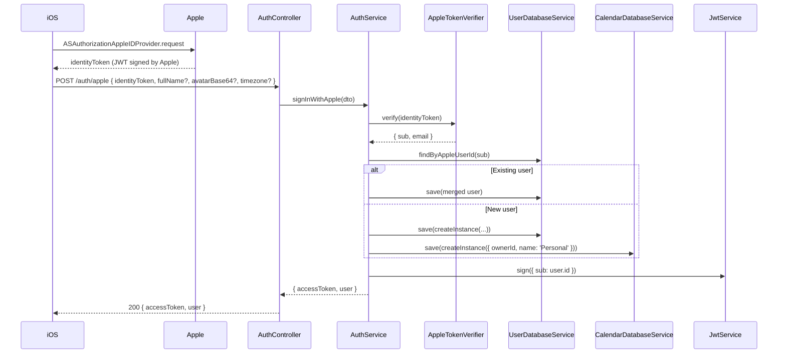

# Auth — Apple Sign-In

- **Status**: Implemented
- **Last updated**: 2026-05-31
- **Owner**: @danil
- **Related ADRs**: —

## Context

Cue is a single-platform (iOS) app at launch. Apple Sign-In is the path of least friction for iOS users, satisfies App Store policy (any third-party social login requires Apple Sign-In to also be offered), and provides a stable, anonymizable user identifier (`sub`) without us touching email/password.

## Goals

- iOS client exchanges an Apple-issued identity token for a long-lived Cue JWT.
- First-time sign-in provisions a `User` row **and** a default `Calendar` so subsequent writes (Task, TaskGroup, NotificationStrategy) have a valid `calendarId`.
- Returning sign-in updates profile fields (name, avatar, timezone) when the client supplies fresher values, but skips the DB write when nothing changed.
- An authenticated GET endpoint returns the current user profile.
- A break-glass CLI path (dev only) can provision a user and mint a token without going through Apple — for local development and seed data.

## Non-goals

- Refresh tokens. JWT TTL is configured at issuance; the client re-signs-in to renew.
- Password / email / magic-link / Google / GitHub auth.
- Account deletion / data export (planned separately, App Store eventually requires it).
- Multi-device session revocation (`/auth/sessions`, "sign out all devices") — future spec.
- Apple Sign-In on web.

## Proposed design

### Apple identity token verification

`AppleTokenVerifier` fetches Apple's JWKS (cached), validates the token's signature, issuer (`https://appleid.apple.com`), audience (our `APPLE_CLIENT_ID` bundle id), and expiry. Returns `{ sub, email | null }`.

### User provisioning

First sign-in:
1. Create `User` with `{ appleUserId: sub, email, displayName: dto.fullName, avatarBase64, timezone: dto.timezone ?? 'UTC' }`.
2. Create one `Calendar` named `Personal` owned by that user.

Returning sign-in:
1. Load existing `User` by `appleUserId`.
2. Merge non-null fields from the DTO (Apple only sends the name on the very first sign-in; the client may re-supply it on subsequent calls for completeness).
3. `save()` only if at least one field changed.

### Profile-photo handling

Apple Sign-In does not expose a profile picture. The iOS client reads the "me" Contacts entry and uploads it as `avatarBase64` (raw base64, no data-URL prefix). Stored as `text` (Postgres `varchar` can't hold encoded images). DTO limit: 5 MB encoded.

### JWT issuance

- Algorithm: HS256 with `JWT_SECRET` from env (rotate via redeploy; old tokens become invalid).
- Payload: `{ sub: user.id }` (Cue UUID, not Apple `sub`).
- TTL: `JWT_EXPIRATION` from env.

### Dev / break-glass path

`dev-auth.controller.ts` + `dev-only.guard.ts` expose `/auth/dev/provision` in non-production environments. It calls `AuthService.provisionUser` directly (bypassing Apple verification), then `issueTokenForUser`. Guard refuses to run when `NODE_ENV === 'production'`.

### Authenticated endpoint

`GET /auth/me` is guarded by `AccessTokenGuard`. The guard decodes the bearer JWT, loads the user by `payload.sub`, and attaches it to the request. `@CurrentUser()` extracts it for the controller. Returns 401 on missing/invalid/expired token, 404 if the user has been deleted.

## API

See [`../api/openapi.yaml`](../api/openapi.yaml) under `/auth/*` for canonical request/response shapes.

## Error handling

| Failure | Surface | Status |
|---|---|---|
| Apple token signature invalid | `UnauthorizedException` | 401 |
| Apple token expired | `UnauthorizedException` | 401 |
| Apple `aud` mismatch | `UnauthorizedException` | 401 |
| JWKS fetch fails | bubble up; client retries sign-in | 503 |
| DTO validation fails | `ValidationPipe` default | 400 |
| Cue JWT missing/invalid on `/auth/me` | `AccessTokenGuard` | 401 |
| User no longer exists on `/auth/me` | `NotFoundException` from `findOneByOrThrow` | 404 |
| Dev endpoint hit in production | `ForbiddenException` from guard | 403 |

## Alternatives considered

### Apple Sign-In server-side flow (authorization code → token endpoint)

The "full" OAuth code grant — iOS sends an authorization code, server exchanges with Apple's token endpoint, gets a refresh token. Rejected because:
- We don't need a refresh token; JWT TTL renewal via re-sign-in is acceptable on a phone (Face ID is one tap).
- Maintaining client_secret JWT signing (Apple requires a JWT-signed `client_secret`) and key rotation adds operational burden.
- The identity-token-only flow is what's recommended for native iOS apps and is what `ASAuthorizationAppleIDCredential` returns directly.

### Storing `email` as the primary user identifier

Apple's "Hide my email" feature returns a relay address that can rotate. `sub` is stable, opaque, and per-app. Email is convenience metadata only.

### Refresh tokens

Would extend session lifetime without re-prompting Face ID. Rejected for v1 — Face ID re-sign-in is fast on iOS and avoids storing a second long-lived secret on the device. Revisit if user research shows friction.

## Rollout

Already shipped in commit `e91e7d5`. Future schema changes (e.g. adding `Session` for revocation) ship as additive migrations.

## Open questions

- [ ] Token revocation strategy if a device is lost — currently rely on JWT expiry.
- [ ] Should `email` updates from Apple (post-sign-in) overwrite the stored value if the user previously had "Hide my email" and later disabled it? Currently we only set on first sign-in.

## References

- [`src/modules/auth/auth.service.ts`](../../src/modules/auth/auth.service.ts)
- [`src/modules/auth/apple-token.verifier.ts`](../../src/modules/auth/apple-token.verifier.ts)
- [`src/modules/auth/dev-auth.controller.ts`](../../src/modules/auth/dev-auth.controller.ts)
- [Apple — Authenticating users with Sign in with Apple](https://developer.apple.com/documentation/sign_in_with_apple/sign_in_with_apple_rest_api/authenticating_users_with_sign_in_with_apple)
