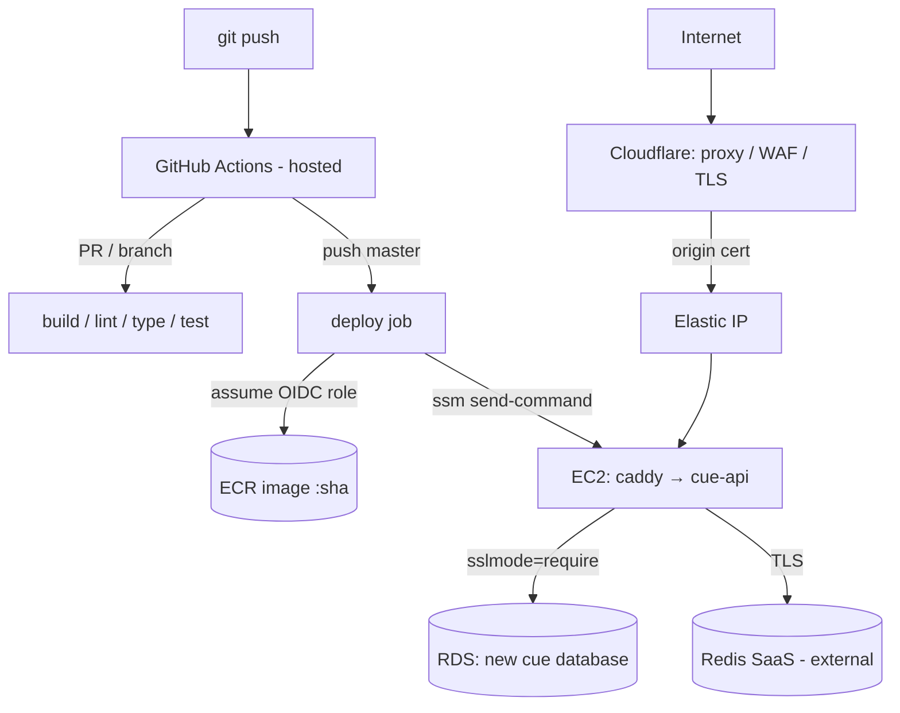

# Deployment & CI/CD

- **Status**: In progress — Phases 0–1 & 4 built; **Phase 2 active**
- **Last updated**: 2026-06-06
- **Owner**: Danil Makarov
- **Related ADRs**: [0008](../adr/0008-iac-terraform-github-actions-ec2.md)

## Implementation tracker

> Living status for the deployment build. The design rationale is in the sections below
> and in [ADR 0008](../adr/0008-iac-terraform-github-actions-ec2.md); this section tracks
> **what's done, what's decided, and notes from execution.**
>
> Branch `infra/deployment-cicd` · Region `eu-north-1`

### Status at a glance

| Phase | Scope | Status |
|---|---|---|
| 0 · State bootstrap | S3 state bucket (native lock) | 📝 committed · ⏳ not applied |
| 1 · Image + ECR | multi-stage Dockerfile, ECR repo | ✅ verified locally · ⏳ ECR not applied |
| 2 · Compute + DB | EC2, EIP, SGs, IAM, SSM, new `cue` DB | 🔄 **active — planning** |
| 3 · Edge | DNS, TLS, WAF, origin lockdown | ⛔ blocked — edge fork (Route53 vs Cloudflare) |
| 4 · CI | `ci.yml` + `_quality.yml` | ✅ done & verified (green) |
| 5 · CD | `deploy.yml` (OIDC → ECR → SSM) | ⏳ needs Phase 2 outputs |

Legend: ✅ done · 🔄 in progress · 📝 written, not applied · ⏳ waiting · ⛔ blocked

### Decision log

| Date | Decision | Why |
|---|---|---|
| 06-05 | IaC = **Terraform** | Transferable skill; best at adopting existing infra; one tool for AWS + edge |
| 06-05 | Runners = **GitHub-hosted + OIDC** | Zero-ops, keyless; frees the 2 manual runner EC2s |
| 06-05 | Delivery = **Docker → ECR**, EC2 pulls via **SSM Run Command** | Immutable artifacts, exact rollbacks, no inbound SSH |
| 06-05 | Existing RDS/VPC **referenced read-only**, not imported | Live DB never in Terraform's blast radius |
| 06-05 | App host = **fresh EC2** (t3.small, AL2023) | Consistent with "manage only new" |
| 06-05 | DB = **new `cue` database** on the existing RDS | Reuse the instance; isolated from other DBs |
| 06-05 | Redis = **external managed (SaaS)**, direct connection | No sidecar; the app already consumes Redis |
| 06-05 | Build = **`nest build && tsc-alias`**, exclude `bin/` (flat `dist/main.js`) | `@/` aliases resolve at runtime; fixes `start:prod` |
| 06-05 | Migrations = **on boot** (`DB_RUN_MIGRATIONS=true`) | Simple & correct for a single instance |
| 06-05 | CI lint gate green via **test-file rule scoping** | Cleared 64 pre-existing problems → 0 errors |
| 06-06 | Region **eu-north-1**; domain `api.cue.makarov.app` in **Route53** | Provided by owner |
| 06-06 | Edge = **PENDING** — Cloudflare via Route53 subdomain delegation, or Route53-native | Decided at Phase 3; only affects the EC2 `:443` ingress |

### Phase 2 — Compute & DB wiring  🔄 active

**Goal:** a running Dockerized EC2 in the VPC that reaches a new `cue` database — **no public
traffic yet** (that lands in Phase 3).

**Context**
- Reuse the existing RDS (referenced read-only); the only change to it is one additive
  ingress rule on its security group.
- Public `:443` ingress is **deferred to Phase 3** (depends on the edge decision), so
  nothing is publicly exposed in Phase 2.

**Steps / checklist**
- [ ] Read-only discovery (`describe-*`): VPC, public/private subnets, RDS endpoint+port+SG+engine, Route53 zone
- [ ] Apply Phase 0 bootstrap (state bucket) + wire `backend.hcl`
- [ ] `data.tf` — existing VPC / subnets / RDS / RDS SG (read-only)
- [ ] `security.tf` — app SG (egress 5432→RDS, 443→internet; no SSH) + RDS-SG ingress from app SG
- [ ] `ec2.tf` + `eip.tf` — EC2 (AL2023, t3.small) + user_data (docker/compose/`/opt/cue`) + Elastic IP
- [ ] `iam.tf` — instance role: ECR pull, SSM core, SSM-Param read `/cue/production/*`, CloudWatch logs
- [ ] `ssm.tf` — `/cue/production/*` params (config + SecureString secrets)
- [ ] `terraform plan` → **owner review** → `apply`
- [ ] Create `cue` DB + `cue_app` role on RDS (via SSM session) → store creds in SSM
- [ ] Checkpoint: SSM in, `docker compose up`, `/health` ok against RDS + Redis SaaS

**Open items (need input)**
- RDS **master credentials** to create the `cue` DB (or owner runs the SQL and shares `cue_app` creds)
- **App secrets** for SSM (JWT, Apple, Telegram, Anthropic, OpenAI, model IDs, Redis SaaS host/port/password/db) — paste, or create placeholders and fill in the console
- Confirm **t3.small** (~$15/mo)
- Edge fork (Route53 vs Cloudflare) — parked for Phase 3

**Implementation notes**
- _(filled during execution: discovered VPC/subnet/SG ids, AMI, plan highlights, gotchas…)_

## Context

cue-api has no hosting or pipeline yet. We want production hosting on AWS plus an
automated pipeline (**build → coding-standards & test → deploy**, deploy only on
`master`), built with Infrastructure as Code and GitHub Actions — both new to this
project, and an explicit learning goal.

Constraints and existing assets:

- An **RDS PostgreSQL** instance already exists and should be reused.
- Two manually-configured EC2 "runner" boxes exist; going GitHub-hosted frees them.
- The API should sit behind **Cloudflare** (DNS, WAF, TLS) on a stable **Elastic IP**.
- The app already scripts its quality gates: `pnpm lint` (ESLint, which also enforces
  Prettier), `pnpm type` (tsc), `pnpm test` (Jest, `--passWithNoTests`).

## Goals

- A push to `master` automatically builds, checks, and deploys cue-api to production.
- Every PR / branch runs build + lint + type + test before merge.
- Production is reachable over HTTPS at a stable hostname, fronted by Cloudflare.
- The whole app stack (compute, networking, edge, registry, IAM) is reproducible from
  Terraform — no console clicking.
- The existing RDS instance is reused via a dedicated `cue` database, with zero risk to
  whatever else lives on it.

## Non-goals

- Multi-instance, autoscaling, or zero-downtime blue/green. One instance; a deploy is a
  brief container restart.
- A staging environment. Production only for now.
- Importing the existing RDS or the manual runner EC2s into Terraform. RDS is referenced
  read-only; the runners are retired/repurposed out of band.
- Operating a self-hosted runner. GitHub-hosted runners are used (revisitable later).
- An observability stack (centralised logs/metrics/alerting) beyond container health.

## Proposed design



### Components

- **Terraform** (`infra/`) — `bootstrap/` creates the S3 state bucket once; `production/`
  manages everything else (ECR, EC2, Elastic IP, security groups, IAM OIDC role, SSM
  parameters, Cloudflare). The existing VPC and RDS are pulled in as read-only `data`
  sources.
- **Image** — multi-stage `Dockerfile` (pnpm via corepack, prod-pruned, non-root,
  `node:20-slim`). The build runs `nest build && tsc-alias`, rewriting `@/*` path aliases
  to relative paths so `node dist/main` resolves them. Built and pushed to **ECR** tagged
  with the git SHA; immutable tags, scan-on-push, lifecycle keeps the last 10.
- **Compute** — a single Terraform-created EC2 (Amazon Linux 2023, SSM agent built in)
  with an Elastic IP. Runs `docker-compose.prod.yml`: **Caddy** (TLS via Cloudflare
  origin cert) → **cue-api**. **Redis is an external managed service** (Redis SaaS); the
  app connects to it directly over the network (no sidecar). The EC2 needs egress to the
  SaaS endpoint — allowlist the Elastic IP in the SaaS console if it restricts by IP, and
  enable TLS in the client if the SaaS requires it.
- **Edge** — Cloudflare proxied DNS A-record → Elastic IP, SSL **Full (Strict)**, basic
  WAF/rate-limit. The EC2 security group allows 443 **only from Cloudflare IP ranges**
  (`data.cloudflare_ip_ranges`), so the origin can't be reached around the proxy.
- **CI** (`.github/workflows/ci.yml` + reusable `_quality.yml`) — on every PR: pnpm
  + node 20 (cached), install, `pnpm lint`, `pnpm type`, `pnpm test`. Unit tests mock
  their dependencies, so no service container is needed; a `postgres:15` service gets
  added when integration tests (`test:e2e`) land.
- **CD** (`.github/workflows/deploy.yml`) — on push to `master`, `environment: production`
  (optional required-reviewer gate). Assumes the OIDC role, builds + pushes the image,
  then `aws ssm send-command` runs `deploy/deploy.sh <sha>` on the box.

### Deploy sequence

```mermaid
sequenceDiagram
  participant GH as GitHub Actions (hosted)
  participant AWS as AWS STS / ECR / SSM
  participant EC2 as App EC2
  participant RDS as RDS (cue db)
  GH->>AWS: assume deploy role (OIDC, no static keys)
  GH->>AWS: docker push ECR:<sha>
  GH->>AWS: ssm send-command deploy.sh <sha>
  AWS->>EC2: run deploy.sh
  EC2->>AWS: ecr pull <sha>; read SSM params -> app.env
  EC2->>RDS: run migrations on boot (DB_RUN_MIGRATIONS=true)
  EC2->>EC2: docker compose up -d; health check /health
  EC2-->>GH: command result (success / fail)
```

### Data model — reusing RDS

An RDS *instance* is a Postgres *server* hosting many isolated *databases*. We add a
dedicated database + least-privilege role on the existing instance (one-time, run from
the in-VPC EC2 since RDS is private):

```sql
CREATE DATABASE cue;
CREATE ROLE cue_app LOGIN PASSWORD '<generated>';
GRANT ALL PRIVILEGES ON DATABASE cue TO cue_app;
```

Same endpoint/port/security-group; only `DB_DATABASE`, `DB_USERNAME`, `DB_PASSWORD`
change. No impact on other databases on the instance (they share only the box's
CPU/RAM/IOPS/connection pool). Connection uses `sslmode=require` (`DB_DISABLE_SSL_AUTH=false`).

### Config & secrets

Runtime config lives in **SSM Parameter Store** under `/cue/production/*`, read by the
EC2 instance role at deploy time and rendered into `app.env`. The env schema
(`src/config/env.config.ts`) makes most of these **required** — the container refuses to
boot without them:

| Group | Parameters |
|---|---|
| Core | `NODE_ENV=production`, `PORT=3000` |
| Database | `DB_HOST` (RDS endpoint), `DB_PORT`, `DB_USERNAME=cue_app`, `DB_PASSWORD` 🔒, `DB_DATABASE=cue`, `DB_RUN_MIGRATIONS=true`, `DB_SYNCHRONIZE=false`, `DB_DISABLE_SSL_AUTH=false`, `DB_LOGGING=false` |
| Redis (external SaaS) | `REDIS_HOST` (SaaS host), `REDIS_PORT`, `REDIS_PASSWORD` 🔒, `REDIS_DB` |
| Auth | `JWT_SECRET` 🔒 (≥32 chars), `APPLE_CLIENT_ID` |
| Telegram | `TELEGRAM_BOT_TOKEN` 🔒, `TELEGRAM_WEBHOOK_SECRET` 🔒 |
| AI / STT | `ANTHROPIC_API_KEY` 🔒, `OPENAI_API_KEY` 🔒, `ASSISTANT_MODEL_MAIN`, `ASSISTANT_MODEL_BACKGROUND`, `STT_MODEL` |

🔒 = SecureString. No secrets in the image or in GitHub; AWS auth is via OIDC (no stored keys).

### Error handling

- **Migration failure** — runs on boot; a bad migration crashes the container, the
  health check fails, and the SSM command returns non-zero so the deploy job goes red.
- **Health gate** — `deploy.sh` polls `GET /health`; failure fails the deploy.
- **Rollback** — re-run the deploy with the previous SHA (immutable tags make this exact).
  No automated blue/green in v1.

## Alternatives considered

### AWS CDK / Pulumi (TypeScript IaC)
Attractive: same language as the app. Lost: weaker at adopting existing resources, CDK is
AWS-only and can't manage Cloudflare, and Terraform is the more transferable skill — the
explicit learning goal.

### Self-hosted GitHub runners on the existing EC2s
Attractive: reuses paid boxes, in-VPC access to RDS, deeper "runner" learning. Lost:
maintenance/patching burden, and GitHub-hosted + OIDC is keyless and zero-ops for a small
API. Easy to add later by registering a `self-hosted`-labelled box for just the deploy job.

### Build artifact + pm2/systemd over SSH
Attractive: simplest, fewest parts. Lost: no immutable artifact, fuzzier rollbacks, and
requires inbound SSH. ECR images + SSM give reproducibility and no open ports.

### Importing the existing RDS into Terraform
Attractive: single source of truth. Lost: a careless plan could propose replacing a live
database. Referenced read-only instead; importing is a fine later exercise.

### Cloudflare Tunnel (cloudflared) instead of Elastic IP
Attractive: no public origin, no origin cert. Lost: the requirement is an Elastic IP +
Cloudflare proxy; tunnel changes that topology.

## Rollout

Phased; each phase has a working checkpoint.

- **Phase 0** — Terraform state bootstrap (S3 bucket, native locking).
- **Phase 1** — Dockerfile + ECR (image builds and pushes by hand).
- **Phase 2** — EC2 + Elastic IP + security groups + RDS wiring + the new `cue` database.
- **Phase 3** — Cloudflare (DNS, Full-Strict TLS, origin lockdown).
- **Phase 4** — CI workflow.
- **Phase 5** — CD workflow (OIDC → ECR → SSM deploy).

Reversible: `terraform destroy` removes only the new resources; the RDS instance is never
in Terraform's blast radius.

## Open questions

- [ ] **AWS facts** (Phase 2 discovery): VPC id, a public subnet id, RDS instance id +
      endpoint, RDS security-group id. _(Region `eu-north-1` provided.)_
- [ ] **Edge** (Phase 3): keep Cloudflare via Route53 subdomain delegation, or go
      Route53-native? `api.cue.makarov.app` is in Route53. Determines the EC2 `:443` ingress.

### Resolved

- ✅ **Path aliases** — adopted `tsc-alias`; the build emits alias-free JS.
- ✅ **Redis** — external managed service (Redis SaaS), connected directly; no sidecar.
- ✅ **Migrations** — run on boot via `DB_RUN_MIGRATIONS=true` (accepted for single instance).

## References

- ADR [0008](../adr/0008-iac-terraform-github-actions-ec2.md)
- `infra/`, `Dockerfile`, `docker-compose.prod.yml`, `deploy/deploy.sh`
- GitHub OIDC ↔ AWS; Cloudflare Terraform provider; AWS SSM Run Command.
