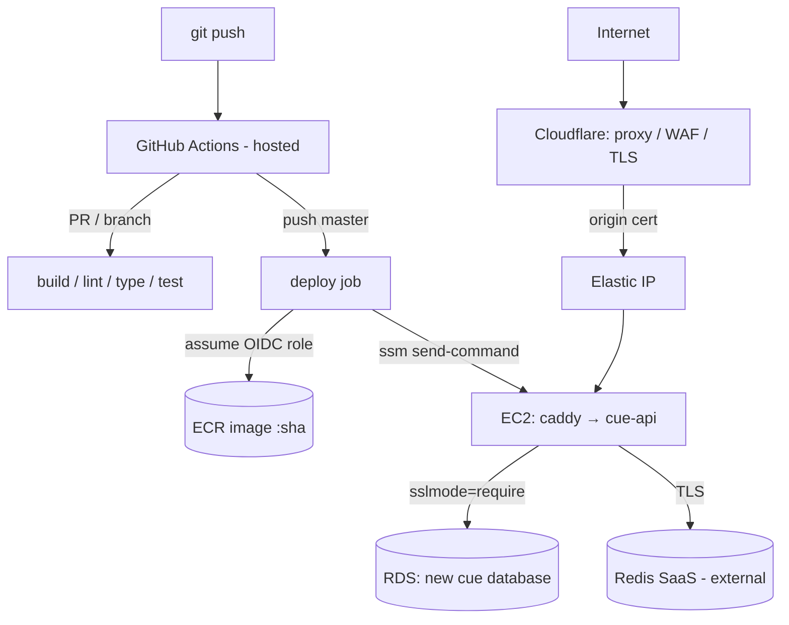

# Deployment & CI/CD

- **Status**: In progress — **Phases 0–4 applied; Phase 5 (CD) written** (`cicd.tf` + `deploy.yml`), pending `apply` + repo var + first push. Remaining: owner prereqs (origin cert · `cue` DB · secrets) → first green deploy
- **Last updated**: 2026-06-08
- **Owner**: Danil Makarov
- **Related ADRs**: [0008](../adr/0008-iac-terraform-github-actions-ec2.md)

## Implementation tracker

> Living status for the deployment build. The design rationale is in the sections below
> and in [ADR 0008](../adr/0008-iac-terraform-github-actions-ec2.md); this section tracks
> **what's done, what's decided, and notes from execution.**
>
> Branch `infra/deployment-cicd` · Region `eu-north-1`

### Status at a glance

| Phase | Scope | Status |
|---|---|---|
| 0 · State bootstrap | S3 state bucket (native lock) | ✅ applied |
| 1 · Image + ECR | multi-stage Dockerfile, ECR repo | ✅ applied (ECR live) |
| 2 · Compute + DB | EC2, EIP, SGs, IAM, SSM, new `cue` DB | ✅ applied · ⏳ owner: create `cue` DB + seed secrets |
| 3 · Edge | DNS, TLS, rate-limit, origin lockdown | ✅ live · cert/key TF-managed in SSM (survives replacement) |
| 4 · CI | `ci.yml` + `_quality.yml` | ✅ done & verified (green) |
| 5 · CD | `cicd.tf` (OIDC role) + `deploy.yml` | 📝 written · ⏳ owner: `apply` + set `AWS_DEPLOY_ROLE_ARN` + push |

Legend: ✅ done · 🔄 in progress · 📝 written, not applied · ⏳ waiting · ⛔ blocked

### Decision log

| Date | Decision | Why |
|---|---|---|
| 06-05 | IaC = **Terraform** | Transferable skill; best at adopting existing infra; one tool for AWS + edge |
| 06-05 | Runners = **GitHub-hosted + OIDC** | Zero-ops, keyless; frees the 2 manual runner EC2s |
| 06-05 | Delivery = **Docker → ECR**, EC2 pulls via **SSM Run Command** | Immutable artifacts, exact rollbacks, no inbound SSH |
| 06-05 | Existing RDS/VPC **referenced read-only**, not imported | Live DB never in Terraform's blast radius |
| 06-05 | App host = **fresh EC2** (t3.small, AL2023) | Consistent with "manage only new" |
| 06-05 | DB = **new `cue` database** on the existing RDS | Reuse the instance; isolated from other DBs |
| 06-05 | Redis = **external managed (SaaS)**, direct connection | No sidecar; the app already consumes Redis |
| 06-05 | Build = **`nest build && tsc-alias`**, exclude `bin/` (flat `dist/main.js`) | `@/` aliases resolve at runtime; fixes `start:prod` |
| 06-05 | Migrations = **on boot** (`DB_RUN_MIGRATIONS=true`) | Simple & correct for a single instance |
| 06-05 | CI lint gate green via **test-file rule scoping** | Cleared 64 pre-existing problems → 0 errors |
| 06-06 | Region **eu-north-1**; domain `api.cue.makarov.app` in **Route53** | Provided by owner |
| 06-06 | Edge = **PENDING** — Cloudflare via Route53 subdomain delegation, or Route53-native | Decided at Phase 3; only affects the EC2 `:443` ingress |
| 06-07 | Edge = **Cloudflare via Route53 subdomain delegation** | Matches the documented design (rate-limit/DDoS, hidden origin) + the existing Caddy origin-cert setup; exercises "one tool for AWS + edge" |
| 06-08 | Edge = **dedicated apex `makarov.my` on Cloudflare** (registrar Spaceship); host **`cue-api.makarov.my`** | Supersedes 06-07: CF subdomain zones are Enterprise-only (err 1116) and partial/CNAME is Business-only. A dedicated apex gets full free Cloudflare while `makarov.app` stays in Route53; a 1-label host → free Universal SSL (`*.makarov.my`) |

### Phase 2 — Compute & DB wiring  🔄 active

**Goal:** a running Dockerized EC2 in the VPC that reaches a new `cue` database — **no public
traffic yet** (that lands in Phase 3).

**Context**
- Reuse the existing RDS (referenced read-only); the only change to it is one additive
  ingress rule on its security group.
- Public `:443` ingress is **deferred to Phase 3** (depends on the edge decision), so
  nothing is publicly exposed in Phase 2.

**Steps / checklist**
- [x] Read-only discovery — VPC/subnets/RDS/SG/Route53 captured (see notes below)
- [x] `data.tf` — VPC / public subnet / RDS endpoint / AL2023 AMI (read-only data sources)
- [x] `security.tf` — app SG (no inbound; broad egress) + additive RDS-SG ingress from app SG
- [x] `ec2.tf` + `eip.tf` — EC2 (AL2023, t3.small, IMDSv2, gp3) + user_data + Elastic IP
- [x] `iam.tf` — instance role: ECR pull, SSM core, SSM-Param read + scoped KMS decrypt, CloudWatch logs
- [x] `ssm.tf` — `/cue/production/*` **config** params only (secrets seeded via seed-secrets.sh)
- [x] `seed-secrets.sh` — committed helper to seed SecureString secrets out-of-band
- [ ] Owner: apply bootstrap (state bucket) → `terraform apply` production (review plan first)
- [ ] Owner: `./seed-secrets.sh` + create `cue` DB + `cue_app` role on RDS
- [ ] Checkpoint: SSM in, pull image, reach RDS:5432, `/health` ok

**Open items (need input)**
- RDS **master credentials** to create the `cue` DB (or owner runs the SQL and shares `cue_app` creds)
- **App secrets** for SSM (JWT, Apple, Telegram, Anthropic, OpenAI, model IDs, Redis SaaS host/port/password/db) — paste, or create placeholders and fill in the console
- Confirm **t3.small** (~$15/mo)
- Edge fork (Route53 vs Cloudflare) — parked for Phase 3

**Implementation notes**

_Discovery — 2026-06-06 (account `540607980315`, eu-north-1):_
- ⚠️ CLI is authenticated as the **account root user** — recommend creating an IAM admin user for Terraform before applying.
- VPC `vpc-02b006a0af428b08e` — **default VPC**, `172.31.0.0/16`, IGW `igw-01d90d6c84a5846e8`.
- Public subnets (main RT → IGW): `subnet-05d284c27d3c4a954` (1a), `subnet-0403aa8c32233e318` (1b), `subnet-07012c7c8cdb2e800` (1c). → **EC2 → `subnet-05d284c27d3c4a954` (eu-north-1a)**.
- Private subnets (RDS subnet group, no IGW route): `subnet-0d09476daed0f4154` (1a), `subnet-08d65261609c4b9b8` (1b), `subnet-07632bd9382086619` (1c).
- RDS `database-1`: `database-1.cjqkaiam2axk.eu-north-1.rds.amazonaws.com:5432`, **Postgres 17.4** (not 15), master user `postgres`, SG `sg-05f54517be0f41c56` (`rds-ec2-1`). ⚠️ `PubliclyAccessible=true` but it sits in private subnets, so it isn't actually internet-routable.
- RDS SG ingress today: 5432 from SG `sg-075d1a9370ae6fd69` (existing console "connect-to-EC2" companion) + `194.104.23.255/32` ("My PC"). → Plan: **new app SG** + one additive ingress rule on `sg-05f54517be0f41c56` from it (don't reuse the companion SG).
- Route53: `api.cue.makarov.app` lives under zone `makarov.app` (`Z1000320164QL0NBGLXWD`); no `cue.makarov.app` subzone yet (relevant to the Phase 3 edge fork).
- Note: ephemeral CI test DB + docs should say **postgres:17** (prod is 17.4), not 15.

_Phase 2 Terraform written — 2026-06-06, uncommitted:_ `data.tf`, `security.tf`, `iam.tf`, `ec2.tf`, `eip.tf`, `ssm.tf` (+ `user-data.sh.tftpl`, `seed-secrets.sh`); `variables.tf` defaults set to discovered ids. Apply sequence: bootstrap → `terraform apply` production (owner reviews plan) → `./seed-secrets.sh` + create `cue` DB → checkpoint.

### Phase 3 — Edge (Cloudflare)  ✅ live · origin cert/key TF-managed in SSM

**Goal:** the API reachable over HTTPS at `cue-api.makarov.my`, fronted by Cloudflare
(proxy, TLS, rate-limit), with the EC2 origin reachable **only** through Cloudflare.

**Decision (06-08):** front the API with a **dedicated apex domain — `makarov.my`, registered
at Spaceship — fully managed by Cloudflare**. How we got here: Cloudflare won't host a
*subdomain* zone (`cue.makarov.app`) outside Enterprise (error 1116), and Partial/CNAME setup
(keep DNS in Route53, proxy one host) is Business-only (~$200/mo). A dedicated apex gets
**full, free** Cloudflare while `makarov.app` stays untouched in Route53. The host is
**`cue-api.makarov.my`** — one label deep, so Cloudflare's free **Universal SSL**
(`makarov.my` + `*.makarov.my`) covers it; a two-level host (`api.cue.makarov.my`) would
need Advanced Certificate Manager (~$10/mo).

**Context**
- Public TLS terminates at Cloudflare, which re-encrypts to the origin over the **Cloudflare
  Origin CA cert** that Caddy serves (SSL = Full (Strict)). The `Caddyfile` / compose are
  unchanged.
- No Route53 in the edge: Cloudflare is authoritative for the whole `makarov.my` zone. The
  owner points **Spaceship's** nameservers at the `cloudflare_nameservers` output to activate it.
- The origin is hidden: the app SG allows 443 **only** from `data.cloudflare_ip_ranges`
  (IPv4); a direct hit to the Elastic IP is dropped. No `:80` — Cloudflare redirects
  http→https at the edge.
- Secrets stay out of git/state (Option B): the CF API token comes from
  `TF_VAR_cloudflare_api_token`. **Exception**: the origin cert/key are now TF-managed into SSM
  (supplied via `TF_VAR_origin_*` at apply time) so they survive instance replacement — these two
  *do* land in Terraform state (encrypted S3 backend). See the Phase 3 cert note below.

**What Terraform manages** (`edge.tf` + the SG rule in `security.tf`)
- `data.cloudflare_zone` — **references** the existing `makarov.my` zone (you connected it to Cloudflare by hand); TF manages only what's inside it.
- `cloudflare_record` proxied **A** `cue-api` → Elastic IP.
- `cloudflare_zone_settings_override` — SSL strict, Always-Use-HTTPS, min TLS 1.2, TLS 1.3,
  HSTS (1y, includeSubdomains; preload off).
- `cloudflare_ruleset` (http_ratelimit) — 100 req/10s/IP → 10s block (free-plan caps the
  window/block at 10s). Managed WAF rulesets are paid → deferred; Cloudflare L3/4 DDoS is free + automatic.
- app SG: 443 ingress from the Cloudflare IPv4 ranges.
- `user-data` writes `/opt/cue/.env` (`CUE_DOMAIN=cue-api.makarov.my`) so Caddy serves the host.

**Status / checklist**
- [x] `edge.tf` — **references** the existing CF zone (data source), proxied A, zone settings (Full-Strict/HSTS), rate-limit
- [x] `security.tf` — 443 ingress from `cloudflare_ip_ranges` — **applied (live on the SG)**
- [x] `ec2.tf` + `user-data.sh.tftpl` — pass `api_hostname`; write `/opt/cue/.env` (`CUE_DOMAIN`)
- [x] `variables.tf` — `edge_zone_name=makarov.my`, `api_hostname=cue-api.makarov.my`; `fmt`+`validate` clean
- [x] Owner: `makarov.my` connected to Cloudflare + Spaceship nameservers set (done manually)
- [x] Owner: `terraform apply` — A record + Full-Strict/HSTS settings + rate-limit created; EC2 recreated (EIP kept)
- [x] Owner: created a **Cloudflare Origin CA cert** (host `cue-api.makarov.my`); now TF-managed —
      supply via `TF_VAR_origin_*`, stored to SSM, laid down by `deploy.sh` (see the cert note below)
- [x] Checkpoint: `curl https://cue-api.makarov.my/health` → **200** (live 2026-06-09)

**✅ Resolved (2026-06-09) — origin cert/key are TF-managed in SSM and re-applied on every deploy**

The app EC2 is **replaced** whenever the AL2023 AMI rolls: `data.aws_ssm_parameter.al2023_ami`
feeds `aws_instance.app.ami`, so the first `terraform apply` after AWS publishes a new AMI forces
a fresh instance (new id, **same** Elastic IP + `Name=cue-api` tag). The Cloudflare Origin CA cert
used to be installed by hand at `/opt/cue/origin/{cert,key}.pem`, which lives **only on the
instance's disk** — so a replacement booted with an empty `/opt/cue/origin`, Caddy couldn't load
its cert, and the public URL **521**'d even though the app container was healthy. This bit us on
**2026-06-09**: an AMI roll during a routine apply replaced the box, so the freshly-deployed app was
`Up (healthy)` while `https://cue-api.makarov.my` returned 521 until the cert was reinstalled.

**The fix** — the cert + key are now stored in SSM and laid down automatically on every deploy:
- `variables.tf` — `origin_cert_pem` / `origin_key_pem` (both `sensitive`), supplied out-of-band at
  apply time via `TF_VAR_origin_*` (never committed; `*.pem` / `*.tfvars` are git-ignored).
- `ssm.tf` — writes them to `/cue/production/ORIGIN_{CERT,KEY}_PEM` as **SecureString**,
  **base64-encoded** so each value is single-line (a raw multi-line PEM would corrupt the
  `deploy.sh` app.env sweep).
- `deploy/deploy.sh` — skips them in the app.env sweep, then base64-decodes them into
  `/opt/cue/origin/{cert,key}.pem` (cert `644`, key `600`) **before** `docker compose up`.
- **No new IAM**: the instance role already has SSM read + `kms:Decrypt` for `/cue/production/*`
  (`iam.tf`). The cert now survives every replacement automatically.

**Trade-off** — unlike the seed-secrets.sh secrets (Option B: never in state), these two values
**do** enter Terraform state (the cost of `terraform apply` ownership). State lives in the encrypted
S3 backend; treat it as sensitive.

**Apply / activation order** — the updated `deploy.sh` + compose only reach the box on instance
replacement (they're baked into `user_data` at first boot, and a `user_data` change doesn't replace
a running instance by default), so:
1. `export TF_VAR_origin_cert_pem="$(cat origin-cert.pem)"` (and `…_key_pem` likewise).
2. `terraform apply` — creates the two SSM params (and the CloudWatch log group, below).
3. Roll the new `deploy.sh`/compose onto the box: `terraform apply -replace=aws_instance.app`
   (re-runs user_data → next deploy uses them, and validates cert-survival end-to-end), **or**
   manually sync `/opt/cue/{deploy.sh,docker-compose.prod.yml}` and redeploy.
4. **Run a deploy** (push to `master`, re-run the deploy workflow, or run `deploy.sh` on the box via
   SSM with the latest image tag). **This step is not optional after a replacement**: `user_data`
   only lays down files — it does **not** start the stack, so a freshly replaced box has no Caddy
   and the public URL returns **521** until the first deploy renders `app.env`, writes the cert/key
   into `/opt/cue/origin/`, and `docker compose up`s. (This is exactly what bit us on 2026-06-09.)

To **rotate** the cert later: re-apply with new `TF_VAR_origin_*`, redeploy, then
`docker restart cue-caddy-1` (a running Caddy reads its cert only at start).

**Manual fallback** (SSM unreachable, or you need an immediate fix on the current box):

```bash
INSTANCE=$(aws ec2 describe-instances --region eu-north-1 \
  --filters "Name=tag:Name,Values=cue-api" "Name=instance-state-name,Values=running" \
  --query 'Reservations[].Instances[].InstanceId' --output text)
aws ssm start-session --region eu-north-1 --target "$INSTANCE"
# on the box (sudo): write the Cloudflare Origin CA cert + key, then lock the key down
sudo install -d -m 755 /opt/cue/origin
sudo tee /opt/cue/origin/cert.pem >/dev/null   # paste the Origin Certificate, then Ctrl-D
sudo tee /opt/cue/origin/key.pem  >/dev/null   # paste the Private Key, then Ctrl-D
sudo chmod 644 /opt/cue/origin/cert.pem && sudo chmod 600 /opt/cue/origin/key.pem
sudo docker restart cue-caddy-1                 # or just wait — restart: unless-stopped self-recovers
```

Verify: `curl -s https://cue-api.makarov.my/health` → `OK`.

**Resolved** — Spaceship nameservers point at Cloudflare and the `makarov.my` zone is active (the
site resolves end-to-end through Cloudflare), so the earlier "nameserver change" item is done.

**Notes**
- Provider pinned `cloudflare/cloudflare 4.52.7` (v4 attribute names — `zone`, `value`).
- Earlier attempts (06-07/08): Route53 subdomain delegation → CF rejected the subdomain zone
  (1116); a bad SG-rule description (`>` is not in AWS's allowed charset) was also fixed.
  Everything **non-edge is applied** (ECR, EC2, EIP, IAM, SSM, the 16 SG rules), so the box
  already reaches RDS — only the Cloudflare apex zone + origin cert remain.
- Universal SSL covers one subdomain level only — that's why the host is `cue-api.makarov.my`,
  not `api.cue.makarov.my`.
- The `makarov.my` zone is **referenced** (`data.cloudflare_zone`), not created by TF — you
  connected it in Cloudflare by hand. TF owns only the records/settings/ruleset inside it (and
  all of AWS). If you manually added a `cue-api` DNS record, delete it first so TF can create
  it without a conflict.

### Phase 5 — Continuous delivery (CD)  📝 written, not applied

**Goal:** every push to `master` ships itself — re-run the quality gate, build & push the
image to ECR (tagged with the commit SHA), then run `deploy/deploy.sh` on the box via SSM Run
Command. AWS auth is **keyless** (GitHub OIDC → a deploy role); no static keys anywhere. The
first successful run also delivers the first image, so `GET /health` finally returns 200.

**What Terraform manages** (`cicd.tf`)
- `aws_iam_openid_connect_provider.github` — trusts `token.actions.githubusercontent.com`
  (audience `sts.amazonaws.com`). AWS validates the provider cert against trusted CAs, so the
  thumbprint is vestigial (kept only because the API still requires the field).
- `aws_iam_role.deploy` (`cue-api-deploy`) — assumable **only** by `repo:danilmakarow/cue-api`
  on the `production` environment or the `master` ref (`StringLike` on the OIDC `sub`).
- Its inline policy — least-privilege: ECR auth + **push** to the `cue-api` repo only;
  `ec2:DescribeInstances` (resolve the target by tag); `ssm:SendCommand` to the
  `AWS-RunShellScript` document, **tag-scoped** to the `Name=cue-api` instance (survives
  instance replacement); `ssm:GetCommandInvocation` to gate on the result. **No** secret/SSM
  param read — that stays with the instance role (`iam.tf`).
- `output.deploy_role_arn` — the role ARN to wire into GitHub (below).

**The workflow** (`.github/workflows/deploy.yml`)
- `on: push: branches: [master]`; `concurrency: deploy-production` (no cancel — never interrupt
  an in-flight deploy); `permissions: id-token: write` on the deploy job (OIDC).
- `quality` reuses `_quality.yml` (same gate as PR CI) and **gates** the deploy.
- `deploy`: OIDC assume → `amazon-ecr-login` → `docker build && push :<sha>` → resolve the
  instance by `Name=cue-api` → `aws ssm send-command` runs
  `AWS_REGION=… ECR_REGISTRY=… /opt/cue/deploy.sh <sha>` → poll `GetCommandInvocation` until a
  terminal status, print stdout/stderr, fail the job unless `Success`.
- `environment: production` — optional **required-reviewer** gate, and it pins the OIDC subject.

**Status / checklist**
- [x] `cicd.tf` — OIDC provider + deploy role + least-privilege policy; `fmt`+`validate` clean
- [x] `deploy.yml` — quality-gated build→push→SSM-deploy; valid YAML
- [ ] Owner: `terraform apply` (adds 3 resources: OIDC provider, role, role policy)
- [ ] Owner: set repo **variable** `AWS_DEPLOY_ROLE_ARN` to the **ARN that** `terraform output -raw deploy_role_arn` **prints** (e.g. `arn:aws:iam::<acct>:role/cue-api-deploy`) — paste the ARN value, **not** the command text
- [ ] Owner (optional): Settings → Environments → **production** → required reviewers
- [ ] **Prereqs to a green deploy** (Phase 2/3 owner items): `cue` DB + `cue_app` role created,
      `./seed-secrets.sh` run, `TF_VAR_origin_*` set + applied (cert/key in SSM)
- [ ] Checkpoint: push to `master` → Actions deploy green → `curl https://cue-api.makarov.my/health` → 200

**Notes**
- If the AWS account **already** has a GitHub OIDC provider, `apply` errors with
  `EntityAlreadyExists` — `terraform import aws_iam_openid_connect_provider.github <arn>` once,
  then re-apply.
- The role ARN is **not** a secret (account-identifying only), so it's a repo *variable*, not a
  secret. OIDC means no AWS keys are ever stored in GitHub.
- Rollback = re-run the workflow at the previous green SHA (immutable ECR tags make it exact),
  or **Re-run jobs** on that run.

## Context

cue-api has no hosting or pipeline yet. We want production hosting on AWS plus an
automated pipeline (**build → coding-standards & test → deploy**, deploy only on
`master`), built with Infrastructure as Code and GitHub Actions — both new to this
project, and an explicit learning goal.

Constraints and existing assets:

- An **RDS PostgreSQL** instance already exists and should be reused.
- Two manually-configured EC2 "runner" boxes exist; going GitHub-hosted frees them.
- The API should sit behind **Cloudflare** (DNS, WAF, TLS) on a stable **Elastic IP**.
- The app already scripts its quality gates: `pnpm lint` (ESLint, which also enforces
  Prettier), `pnpm type` (tsc), `pnpm test` (Jest, `--passWithNoTests`).

## Goals

- A push to `master` automatically builds, checks, and deploys cue-api to production.
- Every PR / branch runs build + lint + type + test before merge.
- Production is reachable over HTTPS at a stable hostname, fronted by Cloudflare.
- The whole app stack (compute, networking, edge, registry, IAM) is reproducible from
  Terraform — no console clicking.
- The existing RDS instance is reused via a dedicated `cue` database, with zero risk to
  whatever else lives on it.

## Non-goals

- Multi-instance, autoscaling, or zero-downtime blue/green. One instance; a deploy is a
  brief container restart.
- A staging environment. Production only for now.
- Importing the existing RDS or the manual runner EC2s into Terraform. RDS is referenced
  read-only; the runners are retired/repurposed out of band.
- Operating a self-hosted runner. GitHub-hosted runners are used (revisitable later).
- A full observability stack (metrics dashboards / alerting). Container **logs** now ship to
  CloudWatch Logs (see *Logging* below); metrics + alerting remain out of scope.

## Proposed design



### Components

- **Terraform** (`infra/`) — `bootstrap/` creates the S3 state bucket once; `production/`
  manages everything else (ECR, EC2, Elastic IP, security groups, IAM OIDC role, SSM
  parameters, Cloudflare). The existing VPC and RDS are pulled in as read-only `data`
  sources.
- **Image** — multi-stage `Dockerfile` (pnpm via corepack, prod-pruned, non-root,
  `node:24-slim`). The build runs `nest build && tsc-alias`, rewriting `@/*` path aliases
  to relative paths so `node dist/main` resolves them. Built and pushed to **ECR** tagged
  with the git SHA; immutable tags, scan-on-push, lifecycle keeps the last 10.
- **Compute** — a single Terraform-created EC2 (Amazon Linux 2023, SSM agent built in)
  with an Elastic IP. Runs `docker-compose.prod.yml`: **Caddy** (TLS via Cloudflare
  origin cert) → **cue-api**. **Redis is an external managed service** (Redis SaaS); the
  app connects to it directly over the network (no sidecar). The EC2 needs egress to the
  SaaS endpoint — allowlist the Elastic IP in the SaaS console if it restricts by IP, and
  enable TLS in the client if the SaaS requires it.
- **Edge** — Cloudflare proxied DNS A-record → Elastic IP, SSL **Full (Strict)**, basic
  WAF/rate-limit. The EC2 security group allows 443 **only from Cloudflare IP ranges**
  (`data.cloudflare_ip_ranges`), so the origin can't be reached around the proxy.
- **CI** (`.github/workflows/ci.yml` + reusable `_quality.yml`) — on every PR: pnpm
  + node 20 (cached), install, `pnpm lint`, `pnpm type`, `pnpm test`. Unit tests mock
  their dependencies, so no service container is needed; a `postgres:15` service gets
  added when integration tests (`test:e2e`) land.
- **CD** (`.github/workflows/deploy.yml`) — on push to `master`, `environment: production`
  (optional required-reviewer gate). Assumes the OIDC role, builds + pushes the image,
  then `aws ssm send-command` runs `deploy/deploy.sh <sha>` on the box.

### Deploy sequence

```mermaid
sequenceDiagram
  participant GH as GitHub Actions (hosted)
  participant AWS as AWS STS / ECR / SSM
  participant EC2 as App EC2
  participant RDS as RDS (cue db)
  GH->>AWS: assume deploy role (OIDC, no static keys)
  GH->>AWS: docker push ECR:<sha>
  GH->>AWS: ssm send-command deploy.sh <sha>
  AWS->>EC2: run deploy.sh
  EC2->>AWS: ecr pull <sha>; read SSM params -> app.env
  EC2->>RDS: run migrations on boot (DB_RUN_MIGRATIONS=true)
  EC2->>EC2: docker compose up -d; health check /health
  EC2-->>GH: command result (success / fail)
```

### Data model — reusing RDS

An RDS *instance* is a Postgres *server* hosting many isolated *databases*. We add a
dedicated database + least-privilege role on the existing instance (one-time, run from
the in-VPC EC2 since RDS is private):

```sql
CREATE DATABASE cue;
CREATE ROLE cue_app LOGIN PASSWORD '<generated>';
GRANT ALL PRIVILEGES ON DATABASE cue TO cue_app;
```

Same endpoint/port/security-group; only `DB_DATABASE`, `DB_USERNAME`, `DB_PASSWORD`
change. No impact on other databases on the instance (they share only the box's
CPU/RAM/IOPS/connection pool). Connection uses `sslmode=require` (`DB_DISABLE_SSL_AUTH=true` —
TLS on, RDS cert not verified against the default CA bundle).

### Config & secrets

Runtime config lives in **SSM Parameter Store** under `/cue/production/*`, read by the
EC2 instance role at deploy time and rendered into `app.env`. The env schema
(`src/config/env.config.ts`) makes most of these **required** — the container refuses to
boot without them:

| Group | Parameters |
|---|---|
| Core | `NODE_ENV=production`, `PORT=3000` |
| Database | `DB_HOST` (RDS endpoint), `DB_PORT`, `DB_USERNAME=cue_app`, `DB_PASSWORD` 🔒, `DB_DATABASE=cue`, `DB_RUN_MIGRATIONS=true`, `DB_SYNCHRONIZE=false`, `DB_DISABLE_SSL_AUTH=true`, `DB_LOGGING=false` |
| Redis (external SaaS) | `REDIS_HOST` (SaaS host), `REDIS_PORT`, `REDIS_PASSWORD` 🔒, `REDIS_DB` |
| Auth | `JWT_SECRET` 🔒 (≥32 chars), `APPLE_CLIENT_ID` |
| Telegram | `TELEGRAM_BOT_TOKEN` 🔒, `TELEGRAM_WEBHOOK_SECRET` 🔒 |
| AI / STT | `ANTHROPIC_API_KEY` 🔒, `OPENAI_API_KEY` 🔒, `ASSISTANT_MODEL_MAIN`, `ASSISTANT_MODEL_BACKGROUND`, `STT_MODEL` |

🔒 = SecureString. No secrets in the image or in GitHub; AWS auth is via OIDC (no stored keys).

### Error handling

- **Migration failure** — runs on boot; a bad migration crashes the container, the
  health check fails, and the SSM command returns non-zero so the deploy job goes red.
- **Health gate** — `deploy.sh` polls `GET /health`; failure fails the deploy.
- **Rollback** — re-run the deploy with the previous SHA (immutable tags make this exact).
  No automated blue/green in v1.

### Logging

Both containers log to **CloudWatch Logs** via Docker's `awslogs` driver
(`docker-compose.prod.yml`):

- **Group** `/cue/production` (Terraform `logs.tf`, `retention_in_days = 30`). **Streams** `api`
  and `caddy`. The instance role already authorizes `CreateLogStream`/`PutLogEvents` on
  `/cue/*` (`iam.tf`), so no new IAM.
- **Read them**: `aws logs tail /cue/production --follow --region eu-north-1` (or
  `--log-stream-names api`). The AWS console → CloudWatch → Log groups works too.
- **Trade-off**: with the `awslogs` driver, on-box `docker logs` / `docker compose logs` no longer
  read locally (the driver streams off-box). `deploy.sh`'s failure path therefore pulls recent
  `api` events from CloudWatch instead.
- **Ordering**: `awslogs-create-group` is `"false"`, so the log group must exist (apply `logs.tf`)
  before the box runs the new compose — see the Phase 3 *Apply / activation order* above; the same
  instance-replacement step ships the awslogs compose change onto the box.
- Logs are **not** instance-local anymore, so they survive replacement and the box's disk can't
  fill with unrotated json-file logs (the previous default).

## Alternatives considered

### AWS CDK / Pulumi (TypeScript IaC)
Attractive: same language as the app. Lost: weaker at adopting existing resources, CDK is
AWS-only and can't manage Cloudflare, and Terraform is the more transferable skill — the
explicit learning goal.

### Self-hosted GitHub runners on the existing EC2s
Attractive: reuses paid boxes, in-VPC access to RDS, deeper "runner" learning. Lost:
maintenance/patching burden, and GitHub-hosted + OIDC is keyless and zero-ops for a small
API. Easy to add later by registering a `self-hosted`-labelled box for just the deploy job.

### Build artifact + pm2/systemd over SSH
Attractive: simplest, fewest parts. Lost: no immutable artifact, fuzzier rollbacks, and
requires inbound SSH. ECR images + SSM give reproducibility and no open ports.

### Importing the existing RDS into Terraform
Attractive: single source of truth. Lost: a careless plan could propose replacing a live
database. Referenced read-only instead; importing is a fine later exercise.

### Cloudflare Tunnel (cloudflared) instead of Elastic IP
Attractive: no public origin, no origin cert. Lost: the requirement is an Elastic IP +
Cloudflare proxy; tunnel changes that topology.

## Rollout

Phased; each phase has a working checkpoint.

- **Phase 0** — Terraform state bootstrap (S3 bucket, native locking).
- **Phase 1** — Dockerfile + ECR (image builds and pushes by hand).
- **Phase 2** — EC2 + Elastic IP + security groups + RDS wiring + the new `cue` database.
- **Phase 3** — Cloudflare (DNS, Full-Strict TLS, origin lockdown).
- **Phase 4** — CI workflow.
- **Phase 5** — CD workflow (OIDC → ECR → SSM deploy).

Reversible: `terraform destroy` removes only the new resources; the RDS instance is never
in Terraform's blast radius.

## Open questions

- [x] **AWS facts** (Phase 2 discovery): captured 2026-06-06 (see the Phase 2 notes).
- [x] **Edge** (Phase 3): **resolved 06-08** — dedicated apex `makarov.my` on Cloudflare
      (registrar Spaceship), host `cue-api.makarov.my`. The earlier 06-07 plan (Cloudflare via
      Route53 subdomain delegation) was abandoned — CF subdomain zones are Enterprise-only
      (err 1116). See the Phase 3 section; the EC2 `:443` is locked to Cloudflare IP ranges.

### Resolved

- ✅ **Path aliases** — adopted `tsc-alias`; the build emits alias-free JS.
- ✅ **Redis** — external managed service (Redis SaaS), connected directly; no sidecar.
- ✅ **Migrations** — run on boot via `DB_RUN_MIGRATIONS=true` (accepted for single instance).

## References

- ADR [0008](../adr/0008-iac-terraform-github-actions-ec2.md)
- `infra/`, `Dockerfile`, `docker-compose.prod.yml`, `deploy/deploy.sh`
- GitHub OIDC ↔ AWS; Cloudflare Terraform provider; AWS SSM Run Command.
