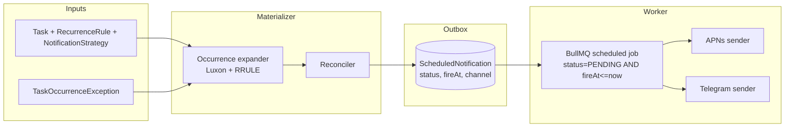

# Notification delivery

- **Status**: Draft (not yet implemented)
- **Last updated**: 2026-05-31
- **Owner**: @danil
- **Related ADRs**: [0002 — rrule-not-materialized](../adr/0002-rrule-not-materialized.md)

## Context

Tasks have associated reminders (a `NotificationStrategy` = set of `NotificationRule`s, each = `offsetMinutes` + `channel`). At the right moment we need to push a payload via APNs and/or send a Telegram message. The data model exists; the delivery path does not.

The challenge:
- Recurring tasks must fan out into individual fireable rows respecting `TaskOccurrenceException` (skips, time shifts).
- Time-zone correctness — a "9am" task means 9am wall-clock in the task's `timezone`, regardless of where the user currently is or DST.
- Delivery must be **at-least-once** with retries, idempotent on the receiver side, and survive process restarts.
- Edits to a task (change time, delete, complete) must invalidate pending reminders.

## Goals

- Convert `Task` + `RecurrenceRule` + `NotificationStrategy` into concrete `ScheduledNotification` rows for the next horizon (e.g. 30 days).
- Dispatch due `ScheduledNotification` rows through APNs and/or Telegram with bounded retry.
- On task mutation (edit, delete, complete), reconcile pending notifications.
- Observability: every status transition is recorded; backlog and failure rate are surfacable.

## Non-goals

- In-app / WebSocket "live" notifications. APNs covers background and Telegram covers cross-device — that's sufficient for v1.
- SMS / email channels.
- User-configured quiet hours / do-not-disturb beyond what each channel provides natively.
- Web push.

## Proposed design



### Materialization (write side)

A `NotificationMaterializerService` runs:

1. **On task create / edit / delete** — synchronously within the request transaction, reconciling `ScheduledNotification` rows for the affected task within the horizon.
2. **On a periodic job (daily)** — extends the horizon for all recurring tasks (`@nestjs/schedule` `@Cron` daily at 03:00 UTC).

Algorithm per task:

```
horizon_end = now + 30 days
upcoming    = expand(recurrenceRule, from: now, to: horizon_end)
             - exceptions[type=CANCEL]
             ⊕ exceptions[type=SHIFT]    // override startAt
desired = flat_map(upcoming, occurrence =>
  effective_strategy(task).rules.map(rule =>
    { taskId, userId, channel: rule.channel, fireAt: occurrence - rule.offsetMinutes }))
existing = ScheduledNotification.find(taskId, status=PENDING)
diff(existing, desired) -> { to_create, to_delete }
```

Mutating rows must be transactional — use `typeorm-transactional`.

### Dispatch (read side)

A `NotificationDispatchWorker` (BullMQ):

- Polls every 30s for `status = PENDING AND fireAt <= now() AND attemptCount < MAX_ATTEMPTS`. Composite index on `(status, fireAt)` already exists.
- Locks the row (`SELECT ... FOR UPDATE SKIP LOCKED`) so multiple workers can run.
- Sends via the channel's client:
  - **APNs**: per-device fan-out using rows from `Device`. If all devices fail, the notification is FAILED, not DELIVERED.
  - **Telegram**: send to the linked chat from `TelegramLink`.
- Marks `DELIVERED` on success, increments `attemptCount` and bumps `fireAt` (exponential backoff) on failure, marks `FAILED` on max attempts.

### Mutation invalidation

- **Task deleted (soft)**: cascade deletes `ScheduledNotification` rows (FK already configured).
- **Task edited (time/strategy)**: materializer re-runs; reconciles diff.
- **Task completed**: future pending notifications for that task are deleted. (One-time tasks only; for recurring tasks, completion is per-occurrence and only the matching occurrence's pending notifications are deleted.)

### Time-zone discipline

Always store `timestamptz`. Expand RRULE using Luxon `DateTime` in the task's `timezone`, then convert each occurrence to UTC for `fireAt`. Never use server-local time. DST transitions handled by Luxon — verified via tests once the test harness exists.

## Error handling

| Failure | Behavior |
|---|---|
| APNs bad device token | Mark the `Device` inactive; do not retry that device. |
| APNs 5xx | Exponential backoff up to `MAX_ATTEMPTS` (5). |
| Telegram chat blocked / deleted | Mark `TelegramLink` inactive; do not retry. |
| Worker dies mid-row | `FOR UPDATE` released → another worker picks it up after lock timeout. |
| Materialization fails for one task | Log + Sentry; do not block the request. |

## Alternatives considered

### "Just send on a cron" — no outbox table

A simple loop: every minute, find tasks whose `nextNotificationAt` falls in the last minute, send. Rejected because:
- No retry record — a transient APNs failure means a lost reminder.
- No way to reconcile when a task edit happens between materialization and delivery.
- Multi-rule strategies (`-1h`, `-15m`, `0m`) need separate row state anyway.

### Push the whole "active reminders" table to Redis on boot, sleep until next event

Lower latency, fewer DB hits. Rejected because reminders are sparse (a few per user per day) and the outbox table approach gives us audit trail + retry semantics for free. Revisit if DB load becomes a bottleneck.

### Per-user cron jobs in a scheduling library (Agenda, node-cron)

Rejected — we already have Postgres as the durable store; adding another scheduler state is duplication. BullMQ is used here only as the *worker* runtime, with Postgres as the source of truth.

## Rollout

1. Add `NOTIFICATION_HORIZON_DAYS`, `BULLMQ_*` env vars to the Zod schema.
2. Implement `NotificationMaterializerService`; hook into `TaskService` create/update/delete.
3. Add daily horizon-extension cron.
4. Implement `NotificationDispatchWorker` with APNs sender first; Telegram in a follow-up PR.
5. Add Sentry breadcrumbs around dispatch.
6. Backfill: on first deploy, run materializer over all existing recurring tasks.

## Open questions

- [ ] Should the materializer enqueue a BullMQ delayed job per `ScheduledNotification` (job-scheduled = `fireAt`) instead of polling? Tradeoff: lower latency but more Redis memory and harder to cancel on edits.
- [ ] User-level quiet hours — defer to v2 or v1?
- [ ] How do we surface delivery failures back to the user? (Settings screen "your last 5 reminders failed"?)
- [ ] Per-device APNs failure threshold for auto-deactivation.

## References

- Entity: [`scheduled-notification.entity.ts`](../../src/modules/database/entities/scheduled-notification.entity.ts)
- Entity: [`notification-strategy.entity.ts`](../../src/modules/database/entities/notification-strategy.entity.ts)
- Recurrence model: [ADR 0002](../adr/0002-rrule-not-materialized.md)
- iOS-side consumer expectations: [cue-ios specs/](../../../cue-ios/docs/specs/)
