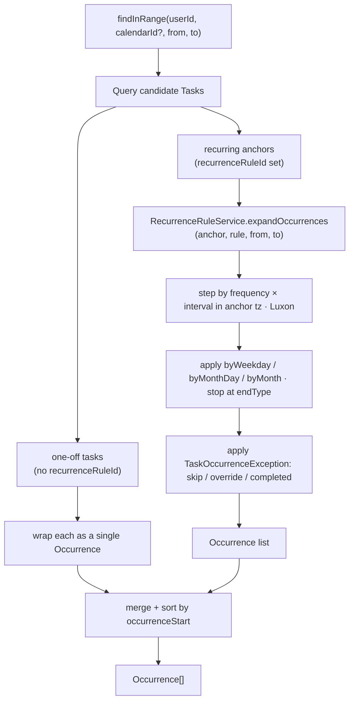

# Recurrence expansion & recurring-task edit semantics

- **Status**: Implemented
- **Last updated**: 2026-06-03
- **Owner**: @danil
- **Related ADRs**: [0001 — postgres-uuid-pks](../adr/0001-postgres-uuid-pks.md) · [0002 — rrule-not-materialized](../adr/0002-rrule-not-materialized.md)

## Context

[ADR 0002](../adr/0002-rrule-not-materialized.md) chose the RFC 5545 model: a recurring task is **one `Task` + one `RecurrenceRule` + zero-or-more `TaskOccurrenceException` rows**, and occurrences are computed on demand — never materialized. The **schema for this already exists and ships in the initial migration** (`recurrence_rule`, `task_occurrence_exception`, the `Task.recurrenceRuleId` / `Task.groupId` FKs). What does **not** exist is the code that makes the model real:

- `RecurrenceRuleService`, `TaskOccurrenceExceptionService`, and `TaskGroupService` are empty skeletons (constructor only).
- `TaskService.findInRange` returns **raw `Task` rows**. It does not expand rules. So a weekly task created months ago surfaces as a single anchor row (or not at all, if its `startAt` predates the query window) instead of one occurrence per week. **Recurring tasks are effectively invisible to every range read today** — including the assistant's preloaded agenda and the future iOS calendar render.

This is the gating capability for two consumers:

- **The Telegram AI assistant** ([specs/assistant-task-tools.md](assistant-task-tools.md)) needs to *show* recurring occurrences, *create* a repeating task as one rule (not N rows — the exact anti-pattern [ADR 0002](../adr/0002-rrule-not-materialized.md) forbids), and *edit* a single occurrence vs. the whole series.
- **The iOS calendar** will read the same `findInRange` to render month/week views; expansion must live in the backend so both clients agree.

Constraints and prior decisions that shape this:

- **[ADR 0002](../adr/0002-rrule-not-materialized.md): never materialize.** Expansion is on-read, in-memory, bounded to the query window. Only divergences (`TaskOccurrenceException`) are persisted.
- **Per-task `timezone` (IANA) + `luxon`.** DST correctness lives in one place — the rule's anchor timezone and Luxon arithmetic. A "weekly at 09:00" task keeps wall-clock 09:00 across a DST transition. `luxon` is already a dependency; the project standard for tz math.
- **Strict data-access pattern** ([architecture.md](../architecture.md)): `Entity → BaseRepository → BaseDatabaseService → FeatureService`. Feature services inject only their `*DatabaseService`; all writes go through `.save()`.
- **`Task` is the unified primitive** — a timed event, an all-day event, or a todo (no time). Recurrence and groups apply to all three.
- **Vendor/own over new deps.** The `RecurrenceRule` entity is a deliberately bounded subset of RFC 5545, not the full grammar — see [Alternatives: `rrule` library](#use-the-rrule-npm-library-for-expansion).

## Goals

- A range read returns the **correct set of occurrences** for recurring tasks within `[from, to)`, with `TaskOccurrenceException` rows (skips / time overrides / per-instance completion) applied, DST-correct, and bounded — never materialized.
- `TaskService.findInRange` returns a merged, time-sorted stream of **one-off tasks + expanded recurring occurrences**, each carrying a stable occurrence identity `(taskId, originalStart)`. Both the assistant and the future REST calendar read consume it.
- Recurring **edits support three scopes**: *this occurrence* (write a `TaskOccurrenceException`), *this and following* (split the series), *all* (edit the master `Task` / `RecurrenceRule`).
- `TaskService` supports creating/updating a task **with a recurrence rule and/or a group**, creating **todos** (no time), and toggling completion at both **series and occurrence** granularity.
- `TaskGroupService`, `RecurrenceRuleService`, and `TaskOccurrenceExceptionService` gain real domain methods following the strict data-access pattern.

## Non-goals

- **Notification fan-out.** Materializing `ScheduledNotification` rows from a rule is owned by [specs/notification-delivery.md](notification-delivery.md). This spec computes calendar occurrences only; it does not schedule reminders.
- **The assistant tool surface, per-turn handles, and the ask-the-user edit-scope prompt** — those are [specs/assistant-task-tools.md](assistant-task-tools.md). This spec exposes the three edit-scope **operations**; the assistant decides *when* to ask which.
- **REST endpoints / controllers** for tasks and groups. The repo has no controllers yet; this is a **service-layer** capability. HTTP exposure lands with the broader task-CRUD + auth work and `api/openapi.yaml`.
- **Full RFC 5545.** Only the fields the `RecurrenceRule` entity models (`frequency`, `interval`, `byWeekday`, `byMonthDay`, `byMonth`, `endType` + `endDate` / `count`). No `BYSETPOS`, `BYYEARDAY`, `WKST`, `RDATE`, multi-rule `RRULE` sets.
- **Series-wide conflict detection** ("does this weekly rule ever clash with another series"). v1 conflict-checks a *single* concrete occurrence on its date — see [Conflict checking](#conflict-checking-with-recurrence).

## Proposed design



### The Occurrence view

An **`Occurrence` is a computed value, not a row.** It is the unit every range read returns and every per-instance edit targets.

```ts
interface Occurrence {
  task: Task;                 // the anchor row (series master, or the one-off itself)
  originalStart: Date;        // the rule-generated start BEFORE overrides — the stable id
  occurrenceStart: Date;      // effective start (override applied)
  occurrenceEnd: Date | null; // effective end (override applied; null for todos / open-ended)
  title: string;              // effective title (override applied)
  completedAt: Date | null;   // per-instance for recurring; task.completedAt for one-offs
  isRecurring: boolean;       // task.recurrenceRuleId != null
  isException: boolean;       // a TaskOccurrenceException row applied
}
```

- **Identity** = `(task.id, originalStart)`. This is exactly the `TaskOccurrenceException` unique key ([ADR 0002](../adr/0002-rrule-not-materialized.md)) and the address the assistant's per-turn handles resolve to ([assistant-task-tools spec](assistant-task-tools.md)).
- For a **non-recurring** task the single occurrence mirrors the row: `originalStart = occurrenceStart = task.startAt`, `completedAt = task.completedAt`, `isRecurring = false`. A **todo** (no `startAt`) is one occurrence with null times — surfaced by `findInRange` only when the caller asks for todos (see [TaskService changes](#taskservice-changes)).

### Expansion engine — `RecurrenceRuleService.expandOccurrences`

```
expandOccurrences(anchor: Task, rule: RecurrenceRule, windowFrom: Date, windowTo: Date): Occurrence[]
```

Algorithm (all date math in `anchor.timezone` via Luxon, so wall-clock time is preserved across DST):

1. **Seed** at `anchor.startAt`. Compute the fixed occurrence duration `dur = anchor.endAt − anchor.startAt` (null when the anchor has no `endAt`).
2. **Step** the period cursor by `frequency × interval` (`DAILY`/`WEEKLY`/`MONTHLY`/`YEARLY`). Day-of-month overflow is **skipped, not clamped** (day-31 in a 30-day month produces no occurrence, per iCal `BYMONTHDAY` semantics).
3. **Expand, then limit** within each period — the RFC 5545 expand/limit rule (this is what makes *"every weekday"* → `{ WEEKLY, byWeekday: [0,1,2,3,4] }` correctly yield five occurrences per week, not one). The `by*` axis **matching** the frequency *expands* the period into multiple candidates; the **other** `by*` axes act as *limiting filters* on those candidates:
   - `DAILY` — the cursor day is the only candidate; all `by*` limit.
   - `WEEKLY` — `byWeekday` (0=Mon … 6=Sun) expands the week into one candidate per listed weekday; `byMonthDay`/`byMonth` limit.
   - `MONTHLY` — `byMonthDay` expands the month into one candidate per listed day (overflow skipped); `byWeekday`/`byMonth` limit.
   - `YEARLY` — `byMonth` × `byMonthDay` expand; `byWeekday` limits.
   An empty/absent `by*` means "no constraint on that axis"; candidates before the series seed are dropped, and per-period candidates are de-duplicated and sorted.
4. **Terminate** on `endType`: `NEVER` → stop at `windowTo`; `UNTIL_DATE` → stop at `endDate`; `COUNT` → stop after the *n*th generated occurrence (counted from the series start, **not** from the window — so `COUNT` is window-independent and correct).
5. **Window-clip**: keep only occurrences whose `[start, start+dur)` intersects `[windowFrom, windowTo)`. For `COUNT`/`UNTIL` the generator still has to count from the series origin to land the right instances in-window.
6. **Apply exceptions**: for each generated `originalStart`, look up `TaskOccurrenceException(taskId, originalStart)`. `isSkipped` → drop the occurrence; otherwise apply `overrideStartAt` / `overrideEndAt` / `overrideTitle` / `completedAt`.
7. **Safety bound**: cap generated occurrences per call (default `MAX_OCCURRENCES_PER_WINDOW = 1000`, env-tunable). If hit, return what fits and **`log()` a truncation warning** — never silently cap (a 1000-occurrence single-window read is almost certainly a too-wide range, not a real agenda).

Exceptions for a series are loaded **once per expansion** (one `findBy({ taskId })`, indexed by `originalStart` in memory) — not per-occurrence — to keep expansion to a single extra query per recurring anchor.

### TaskService changes

`findInRange` is the keystone change. Today: `findInRange(userId, calendarId, from, to): Promise<Task[]>`. New behavior and shape:

```
findInRange(userId, from, to, opts?: {
  calendarId?: string;
  groupId?: string;
  includeCompleted?: boolean;   // default false
  includeTodos?: boolean;       // default false — timed/all-day only, preserving today's agenda behavior
}): Promise<Occurrence[]>
```

1. **Query candidates** owned by the user (ownership asserted via calendar), optionally scoped by `calendarId`/`groupId`:
   - **one-off** tasks (`recurrenceRuleId IS NULL`) whose `[startAt, endAt)` intersects `[from, to)`;
   - **recurring anchors** (`recurrenceRuleId IS NOT NULL`) **regardless of `startAt`** — a long-running weekly series anchored months ago still yields in-window occurrences. Filter out anchors whose `endType`/`endDate`/`count` provably terminate before `from` where cheaply determinable; otherwise let `expandOccurrences` clip. See [Query cost](#query-cost--indexing).
2. Wrap one-offs as single `Occurrence`s.
3. Expand each recurring anchor via `RecurrenceRuleService.expandOccurrences` (loading its rule + exceptions).
4. **Merge** one-offs + occurrences, drop completed unless `includeCompleted`, **sort by `occurrenceStart`**, return.

> ⚠️ **Breaking return-type change.** `findInRange` moves from `Task[]` to `Occurrence[]`. Its callers — `ScheduleReaderService`, the assistant's `list_events`/`find_free_slots` dispatch, the preloaded-agenda formatter — are updated in the [assistant-task-tools spec](assistant-task-tools.md). The `Occurrence` type is **this spec's deliverable**, imported there. This dependency fixes the build order: **this spec lands first.**

Other `TaskService` additions:

- **`create`** gains optional `recurrence` (a `CreateRecurrenceRuleDto`) and `groupId`. When `recurrence` is present: create the `RecurrenceRule` (via `RecurrenceRuleService`), then the `Task` with `recurrenceRuleId` set — **one task, one rule**, never N rows. Validate `groupId` belongs to the same calendar.
- **Todos**: `create` already allows null `startAt`/`endAt`; make that path first-class (a todo with `requiresCompletion = true`, no time).
- **Completion** — `setCompleted` stays for one-offs/series-master. Add **`setOccurrenceCompleted(userId, taskId, originalStart, completed)`** for a single recurring instance → upserts a `TaskOccurrenceException` with `completedAt`.
- **`findOverlapping`** becomes occurrence-aware for the conflict check — see below.

### Recurring-edit semantics — the three scopes

`TaskService` exposes the three operations; the assistant ([spec](assistant-task-tools.md)) decides when to ask which (reusing the [ADR 0006](../adr/0006-assistant-schedule-context-and-conflicts.md) hold-and-ask inline keyboard). For a non-recurring task, any scope collapses to a plain single-row update.

| Scope | Operation | Implementation |
|---|---|---|
| **This occurrence** | `applyOccurrenceOverride(userId, taskId, originalStart, { startAt?, endAt?, title?, isSkipped? })` | Upsert a `TaskOccurrenceException(taskId, originalStart)`. Delete-one = `isSkipped: true`. The master rule is untouched. |
| **This and following** | `splitSeries(userId, taskId, originalStart, changes)` | End the existing rule just before `originalStart` (`UNTIL_DATE = originalStart − 1 day`, or convert to `COUNT`), then create a **new `Task` + new `RecurrenceRule`** (the old rule cloned with `changes` applied) anchored at `originalStart`. Exceptions dated `≥ originalStart` migrate to the new task; earlier ones stay. |
| **All** | plain `update` on the master `Task` and/or its `RecurrenceRule` | Single-row update(s). Pre-existing exceptions are preserved (they remain keyed by their `originalStart`). |

`splitSeries` is the subtle one; its edge cases (an override exactly on the split boundary; a `COUNT` rule split mid-count) are enumerated in [Open questions](#open-questions). v1 keeps the common paths correct and documents the rest.

### Conflict checking with recurrence

`findOverlapping` (used by the assistant's [ADR 0006](../adr/0006-assistant-schedule-context-and-conflicts.md) layer-4 conflict hold) must see expanded occurrences:

- For a **single** new/moved concrete occurrence `[start, end)`, expand all of the user's tasks **into that bounded day/window** and return any occurrence that overlaps (excluding the task being edited, by `(taskId, originalStart)`).
- **Series-wide** clash detection (would a *new weekly rule* ever overlap an existing series across all time) is **out of scope v1** — unbounded and rarely what the user means. The single-occurrence check covers "book the dentist Tuesday 3pm" against whatever already recurs on that Tuesday.

> ⚠️ **Write-side gap (post-ship finding, tracked separately).** `findOverlapping` is occurrence-aware and **does** detect clashes against existing recurring occupancy. But the assistant's dispatcher only *invokes* it for **non-recurring** creates and **one-off** moves (`tool-dispatcher.service.ts` guards the hold with `if (!recurrence && startAt && endAt)`; `updateRecurring` has no overlap check). So **creating or editing a recurring task currently bypasses the conflict hold entirely** — a new series can be booked over existing events silently. This is a defect in the *write path*, not the engine; it is tracked as a standalone fix and flagged in [assistant-layered-architecture.md](assistant-layered-architecture.md). The read-side `check_availability` tool mitigates but does not close it.

### Group service

`TaskGroupService` (skeleton today) gains, following the pattern:

- `create(userId, dto: CreateTaskGroupDto)` — validates the calendar is owned by the user.
- `findAllForUser(userId)` / `findAllByCalendar(userId, calendarId)` — ordered by `sortOrder`.
- `findByName(userId, name)` — supports the assistant resolving a group by name (with duplicate-name disambiguation handled by the caller).
- `rename` / `remove` — standard, via `.save()` / soft semantics (groups are not soft-deleted; `Task.groupId` is `SET NULL`).

### Data model

**No new tables** — `recurrence_rule`, `task_occurrence_exception`, `task_group`, and the `Task` FKs already exist (`src/migrations/1776546898362-initial-schema.ts`). Two **additive, reversible** changes may be warranted for read performance (see [Query cost](#query-cost--indexing)):

- A **partial index** on `task (calendarId) WHERE recurrenceRuleId IS NOT NULL` so "all recurring anchors for a calendar" doesn't scan every row.
- Confirm the existing `(taskId, originalStartAt)` unique constraint on `task_occurrence_exception` serves the exception lookup (it does — no change).

New **DTOs** (validated, `class-validator`): `CreateRecurrenceRuleDto` / `UpdateRecurrenceRuleDto` (frequency, interval, by-arrays, endType + endDate/count, with cross-field validation: `COUNT` ⇒ `count` set, `UNTIL_DATE` ⇒ `endDate` set), `CreateTaskGroupDto`, and the extension of `CreateTaskDto`/`UpdateTaskInput` with `recurrence?` + `groupId?`.

### Query cost & indexing

The cost risk: step 1 must consider **every recurring anchor for the user** (their `startAt` tells us nothing about whether they hit the window). For a single user this is small (people have tens, not millions, of recurring series), but the query should still be scoped by calendar and use the partial index above rather than a full table scan. Expansion itself is cheap ([ADR 0002](../adr/0002-rrule-not-materialized.md): <10ms for 1k-occurrence windows). The per-anchor exception load is one indexed query. Net: one candidate query + one exception query per recurring anchor in range. Acceptable for the assistant's 7-day agenda and a month-view calendar read; revisit with a materialized cache only if telemetry demands it.

### Error handling

| Failure | Behavior |
|---|---|
| Invalid rule at create (`COUNT` without `count`, `UNTIL_DATE` without `endDate`, empty frequency) | DTO validation rejects before any write; surfaced as a domain error. |
| Expansion exceeds `MAX_OCCURRENCES_PER_WINDOW` | Return the capped set + `log()` a truncation warning. Never silent. |
| Edit-scope op on a **non-recurring** task | Collapse to a plain single-row update; ignore the scope. |
| `applyOccurrenceOverride` race (two writers, same `(taskId, originalStart)`) | The unique constraint makes it an upsert; last-writer-wins on fields, no duplicate rows. |
| `splitSeries` where `originalStart` equals the series start | No split needed — equivalent to **all**; short-circuit to a master update. |
| Group `groupId` not owned by the user / wrong calendar | Reject (403/404 via the existing ownership guard in `TaskService`). |
| Occurrence requested outside the rule (bad `originalStart`) | Treated as no-op for skip/complete; for override, reject as "not an occurrence of this series". |

## Alternatives considered

### Use the `rrule` npm library for expansion

Attractive: battle-tested RFC 5545 expansion, handles edge cases we'd otherwise write. **Rejected for v1** because: (1) our `RecurrenceRule` is a deliberately small, bespoke subset — mapping it to/from `rrule`'s option bag (and back for storage) is its own surface to maintain and test; (2) `rrule`'s timezone handling is a known friction point and we already standardize on **Luxon** for every other time computation — mixing two date stacks invites DST bugs at the seam; (3) the project prefers **owning a bounded reference implementation over adding a dependency** when the scope is small and the correctness is testable. The expansion we need is a few hundred well-tested lines. *(Build-vs-buy here is genuinely ADR-worthy — see [Open questions](#open-questions); if the rule grammar grows toward full RFC 5545, revisit.)*

### Materialize occurrences as rows

Rejected by [ADR 0002](../adr/0002-rrule-not-materialized.md) — "edit all future" becomes a multi-row update, indefinite series need a sliding-window cron, and tz changes force re-materialization. This spec is the on-read counterpart of that decision.

### Expand in the database (recursive CTE / `generate_series`)

Tempting for "let Postgres do the range read in one query". Rejected: DST-correct stepping and the `TaskOccurrenceException` merge are far clearer in app code with Luxon, and keeping a **single expansion path** means the assistant, the REST calendar, and any future consumer share identical semantics — no "SQL says X, app says Y" drift.

### Return `Task[]` plus a side-channel occurrence array

Keeps `findInRange`'s signature. Rejected: it lets callers ignore occurrences (re-introducing the invisibility bug) and muddies identity. A first-class `Occurrence` view **forces** every caller to handle instances, which is the point.

### Compute occurrences lazily per-caller instead of in `TaskService`

Push expansion into each consumer (assistant, iOS read). Rejected: duplicated, drift-prone, and it leaks the rule model past the service boundary, violating the strict data-access pattern. Expansion is domain logic and belongs in `TaskService` / `RecurrenceRuleService`.

## Rollout

Service-layer only; **no endpoints, no user-visible change on its own** — it unblocks the [assistant-task-tools spec](assistant-task-tools.md) and the future REST calendar read. Build order (this spec is a hard prerequisite for the assistant spec):

- **Task R1 — Recurrence engine + exception service.** `RecurrenceRuleService.expandOccurrences` + the `Occurrence` type + `RecurrenceRuleService`/`TaskOccurrenceExceptionService` CRUD + the recurrence/exception DTOs. Exhaustive unit tests: DAILY/WEEKLY/MONTHLY/YEARLY, `interval > 1`, each `by*` filter, `COUNT`/`UNTIL_DATE`/`NEVER`, **DST boundary** (spring-forward / fall-back keeps wall-clock), month-overflow clamping, skip + override + per-instance completion, the 1000-cap truncation. Owns `recurrence-rule/`, `task-occurrence-exception/`, their DTOs, the `Occurrence` type. **Does not touch `TaskService`.**
- **Task R2 — TaskService occurrence-aware reads + recurring edits + groups.** `findInRange → Occurrence[]`, `create`/`update` with `recurrence` + `groupId`, todo creation, `setOccurrenceCompleted`, the three edit-scope ops (`applyOccurrenceOverride` / `splitSeries` / master update), occurrence-aware `findOverlapping`, and `TaskGroupService` CRUD + `findByName`. Depends on R1. Owns `task/task.service.ts` + task DTOs + `task-group/`. Tests: merged range reads (one-off + recurring + exception), each edit scope, occurrence-aware conflict, group CRUD + name lookup.

**Migrations**: one small additive, reversible migration for the partial recurring-anchor index (raw SQL per repo convention). No backfill (no production data).

**Env**: `RECURRENCE_MAX_OCCURRENCES_PER_WINDOW` (default 1000) added to the Zod schema in `src/config/env.config.ts`.

**Docs**: update [architecture.md](../architecture.md) "What's not built yet" (drop "No recurrence expansion service"); this spec moves `Draft → Implemented` on completion.

## Open questions

- [ ] **`splitSeries` boundary semantics** — an existing override exactly on the split date; a `COUNT` rule split mid-count (recompute the new rule's `count`, or convert both sides to `UNTIL`?). v1 picks the simplest correct rule and documents it; confirm before relying on this-and-following in the assistant.
- [ ] **Build-vs-buy ADR** — owning the Luxon expander vs. adopting `rrule`. ADR-worthy; pin a decision ADR if/when the rule grammar grows.
- [ ] **`includeTodos` in the assistant agenda** — should the preloaded agenda surface timeless todos, or only timed events (today's behavior)? Likely a separate `list_tasks(onlyTodos)` path in the [assistant spec](assistant-task-tools.md) rather than mixing them into the time-ordered agenda.
- [ ] **Recurring-anchor query ceiling** — is "all recurring anchors for the user" ever large enough to need a smarter pre-filter (e.g. store a `rule.lastOccurrenceAt` for terminating rules)? Defer until telemetry shows it.
- [ ] **All-day recurrence across DST** — all-day occurrences are date-anchored, not time-anchored; confirm the expander treats `isAllDay` on the date axis (no tz shift) distinctly from timed occurrences.

## References

- Recurrence modeling decision: [ADR 0002 — rrule-not-materialized](../adr/0002-rrule-not-materialized.md)
- UUID PKs: [ADR 0001](../adr/0001-postgres-uuid-pks.md)
- Consumer (assistant tools + occurrence handles): [specs/assistant-task-tools.md](assistant-task-tools.md)
- Conflict-hold pattern reused for edit-scope prompts: [ADR 0006 — assistant-schedule-context-and-conflicts](../adr/0006-assistant-schedule-context-and-conflicts.md)
- Notification fan-out (separate consumer of rules): [specs/notification-delivery.md](notification-delivery.md)
- Entities: [`recurrence-rule.entity.ts`](../../src/modules/database/entities/recurrence-rule.entity.ts) · [`task-occurrence-exception.entity.ts`](../../src/modules/database/entities/task-occurrence-exception.entity.ts) · [`task-group.entity.ts`](../../src/modules/database/entities/task-group.entity.ts) · [`task.entity.ts`](../../src/modules/database/entities/task.entity.ts)
- RFC 5545 — Internet Calendaring and Scheduling Core Object Specification
- HTTP contract (future): [`../api/openapi.yaml`](../api/openapi.yaml)
