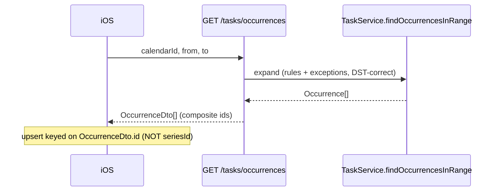

# Occurrence-aware task read over REST (`GET /tasks`)

- **Status**: Implemented (cue-api + cue-ios, coordinated) — see the implementation note below
- **Last updated**: 2026-06-03
- **Owner**: @danil
- **Related ADRs**: [0002 — rrule-not-materialized](../adr/0002-rrule-not-materialized.md)
- **Related specs**: [recurrence-expansion.md](recurrence-expansion.md) · cue-ios calendar render (a matching `cue-ios/docs/specs/…` should accompany the build)

> **Implementation note (2026-06-03).** Shipped in cue-api **and** cue-ios (coordinated; currently uncommitted in both working trees). It **replaced** `GET /tasks` outright — it now returns `OccurrenceDTO[]` — rather than adding the sibling `/tasks/occurrences` endpoint the "Proposed design" below favoured. The breaking path was acceptable precisely because cue-ios was updated in lockstep (`CalendarStore` decodes `[OccurrenceDTO]`; per-occurrence completion/skip key on `originalStart`). It also added **group-default recurrence inheritance** (`TaskGroup.defaultRecurrenceRuleId`, migration `1780800000000`), beyond this spec's original scope. The shipped contract lives in [`../api/openapi.yaml`](../api/openapi.yaml) (`/tasks`, `/tasks/{id}`, `/tasks/{id}/completion`, `/tasks/{id}/skip`) and `src/modules/task/task.controller.ts`; the design below is retained as the decision record. **Known issue (open):** group-inherited recurring tasks are **double-counted** in `findOccurrencesInRange` (returned once as a flat one-off *and* as the expanded series) — masked by the unit-test mock; fix pending.

## Context

The backend now expands recurrence correctly on read — `TaskService.findOccurrencesInRange(...)` returns a merged, DST-correct `Occurrence[]` (one-offs + expanded recurring instances + applied `TaskOccurrenceException`s), per [recurrence-expansion.md](recurrence-expansion.md) and [ADR 0002](../adr/0002-rrule-not-materialized.md). The Telegram assistant already uses it.

The **REST path does not.** `GET /tasks` (`TaskController.list`) still calls the recurrence-blind `TaskService.findInRange`, returning raw `Task[]`. So on that path:

- a **recurring** task is returned only as its single anchor row — never expanded into the per-date instances that fall in the queried window;
- an anchor whose `startAt` predates `from` is **dropped entirely** (a weekly standup created months ago vanishes from this month's fetch).

This is exactly the "recurrence invisibility" problem [recurrence-expansion.md](recurrence-expansion.md) set out to eliminate — still shipping on the REST path. And **cue-ios consumes it**: `CalendarStore.ensureMonthSynced` fetches `GET /tasks?calendarId&from&to`, decodes `[TaskDTO]`, and upserts each via `TaskItem.upsert(from:)`, which is **keyed on `dto.id`** (the task UUID); `asScheduleEvent()` then projects one event per task. So recurring series under-render in the iOS calendar today.

Why this can't be a quiet drop-in change: the iOS upsert keys on the **task id**, and `TaskDTO`/`TaskItem` are `Identifiable` by that id. If `GET /tasks` started returning expanded occurrences, every occurrence of a series would carry the **same** `task.id` → the id-keyed upsert would collapse them to one row (last-write-wins) and duplicate `Identifiable` ids would corrupt the SwiftData/SwiftUI identity model. **Occurrence-awareness therefore requires a new occurrence identity on the wire and a reworked iOS read path — a coordinated cross-repo change**, not a server-only edit.

Interim state (shipped): `GET /tasks` is now documented in [`../api/openapi.yaml`](../api/openapi.yaml) with the limitation made explicit, and `TaskController.list` carries a code comment pointing here. This spec is the path off that limitation.

## Goals

- A REST client can read the **correctly-expanded occurrences** for a `(calendar, window)` — recurring instances included, exceptions applied, DST-correct — reusing the existing `findOccurrencesInRange` engine (no second expansion implementation).
- Each returned occurrence carries a **stable, unique identity** suitable as a client upsert key and as the address for per-occurrence actions (complete / edit-scope).
- The rollout is **non-breaking**: the current raw `GET /tasks` keeps working until cue-ios migrates, so the two repos don't need a lockstep deploy.

## Non-goals

- **The expansion engine** — done ([recurrence-expansion.md](recurrence-expansion.md)); this only *exposes* it over REST.
- **The assistant read path** — already occurrence-aware.
- **A full task-editing REST API** (recurring edit-scope mutations, group assignment over REST). Per-occurrence *completion* is in scope as the minimum to make the rendered occurrences actionable; richer edits are a later task.
- **Client-side expansion in cue-ios** — explicitly rejected (see Alternatives).

## Proposed design

### Shape: an `OccurrenceDto` with a composite id

Expose occurrences via an **additive** read (so the raw endpoint is untouched) — either a sibling route `GET /tasks/occurrences` or an opt-in `GET /tasks?expand=occurrences` (decide in Open questions). It returns:

```jsonc
// OccurrenceDto
{
  "id": "<taskId>:<originalStartISO>", // composite, stable occurrence identity (one-off: just <taskId>)
  "seriesId": "<taskId>",              // the anchor Task id (the editable series/row)
  "originalStart": "2026-06-09T09:00:00.000Z", // null for a timeless todo; the (taskId, originalStart) key
  "calendarId": "<uuid>",
  "title": "Standup",                  // occurrence title (override applied)
  "startAt": "2026-06-09T09:00:00.000Z",
  "endAt": "2026-06-09T09:15:00.000Z", // null for open-ended / todo
  "isAllDay": false,
  "completedAt": null,                  // per-instance for recurring; the row's for one-offs
  "isRecurring": true,
  "isException": false,
  "groupId": null,
  "notes": null
}
```

This is a thin projection of the existing `Occurrence` (`src/modules/recurrence-rule/recurrence.types.ts`) — the controller maps `Occurrence → OccurrenceDto`, deriving `id`/`seriesId` from `task.id` + `originalStart`. The full `Task` entity is **not** leaked; only client-facing fields. The window is bounded (the engine already caps + logs per [recurrence-expansion.md](recurrence-expansion.md)).



### Per-occurrence completion

Completion must target an instance, not the series. The backend already has `TaskService.setOccurrenceCompleted(userId, taskId, originalStart, completed)` (single instance → `TaskOccurrenceException`) and `setCompleted` (one-off/series). Expose a completion endpoint that accepts the occurrence id (splitting `seriesId` + `originalStart`) and routes to the right service method. The existing `PATCH /tasks/:id` stays for one-offs/series-anchor completion.

### cue-ios coordination (the other half — needs its own spec)

- New `OccurrenceDTO` mirroring the shape above; **upsert keyed on `id` (the composite)**, not `seriesId`.
- The SwiftData model represents rendered **occurrences** distinctly from editable **tasks** (e.g. a separate `@Model`, or a value type derived per render) — `TaskItem.upsert(from: TaskDTO)` keyed on task id stays for the editable row; occurrences become their own keyed entity for the calendar grid.
- Completion toggle posts the per-occurrence path with the composite id.
- Edit/delete affordances eventually carry the `this / this-and-following / all` scope (mirrors the assistant; out of scope for the first cut).

## Alternatives considered

### Make `GET /tasks` itself return `Occurrence[]` (breaking)

The "clean" end-state. **Rejected for now**: it breaks the live cue-ios consumer — the id-keyed upsert collapses same-`taskId` occurrences and duplicate `Identifiable` ids corrupt SwiftData identity — and forces a lockstep BE+iOS deploy. The additive read reaches the same end-state without a flag day; `GET /tasks` (raw) can be deprecated for calendar rendering once iOS migrates.

### Client-side expansion in cue-ios

Have iOS expand `recurrenceRuleId` + fetched exceptions locally. **Rejected**: it duplicates the DST/`byWeekday`/`COUNT`/`UNTIL`/exception logic the backend already owns ([ADR 0002](../adr/0002-rrule-not-materialized.md)), guaranteeing drift between the two implementations — the exact "SQL says X, app says Y" failure the backend single-expansion-path decision avoids. Expansion stays server-side, one implementation.

### Do nothing / document only

The shipped interim state. Fine as a stopgap (turns a silent bug into a documented limitation), but recurring tasks remain invisible on the REST/iOS calendar — not acceptable long-term for a calendar app. This spec is the exit.

## Rollout

1. **BE (additive):** add the occurrence read (route/param TBD) + `OccurrenceDto` mapping over `findOccurrencesInRange`; add the per-occurrence completion endpoint; document both in [`../api/openapi.yaml`](../api/openapi.yaml) in the same change. No migration. `GET /tasks` (raw) untouched.
2. **iOS (coordinated):** `OccurrenceDTO`, occurrence-keyed read/upsert, per-occurrence completion; switch the calendar render off raw `GET /tasks`. Tracked by a matching `cue-ios/docs/specs/…`.
3. **Deprecate** raw `GET /tasks` for calendar rendering once iOS has migrated (it may remain for editable-row reads).

## Open questions

- [ ] **Route shape:** sibling `GET /tasks/occurrences` vs. opt-in `GET /tasks?expand=occurrences`. Sibling is cleaner to deprecate-and-replace; the param keeps one path. Lean sibling.
- [ ] **Occurrence id format:** `"<taskId>:<originalStartISO>"` vs. a structured `{ seriesId, originalStart }`. A single string id is the easiest client upsert key; confirm ISO precision/timezone normalization so the same instant always yields the same id.
- [ ] **Per-occurrence completion API:** dedicated `POST /tasks/occurrences/{id}/completion` vs. extending `PATCH` to accept a composite id. Keep it explicit to avoid overloading the row-level patch.
- [ ] **Window cap over REST:** reuse the engine's `MAX_OCCURRENCES_PER_WINDOW`, or paginate? A month view is well within the cap; revisit only if a client requests very wide ranges.
- [ ] **iOS model split:** separate occurrence `@Model` vs. derive occurrences per render from cached series — a cue-ios design decision for its spec.

## References

- Expansion engine + `Occurrence` type: [recurrence-expansion.md](recurrence-expansion.md) · [`recurrence.types.ts`](../../src/modules/recurrence-rule/recurrence.types.ts)
- Recurrence model: [ADR 0002](../adr/0002-rrule-not-materialized.md)
- Current REST entry: [`task.controller.ts`](../../src/modules/task/task.controller.ts) (`list`) · [`../api/openapi.yaml`](../api/openapi.yaml) (`GET /tasks`)
- iOS consumer: `cue-ios` `CalendarStore.ensureMonthSynced`, `TaskItem.upsert(from:)`, `APIModels.TaskDTO`
