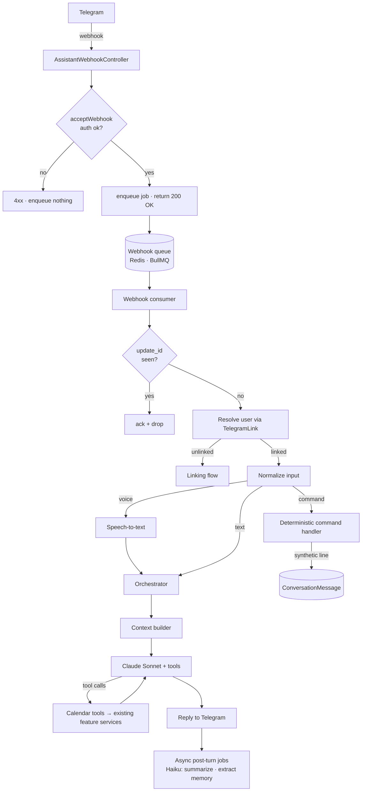
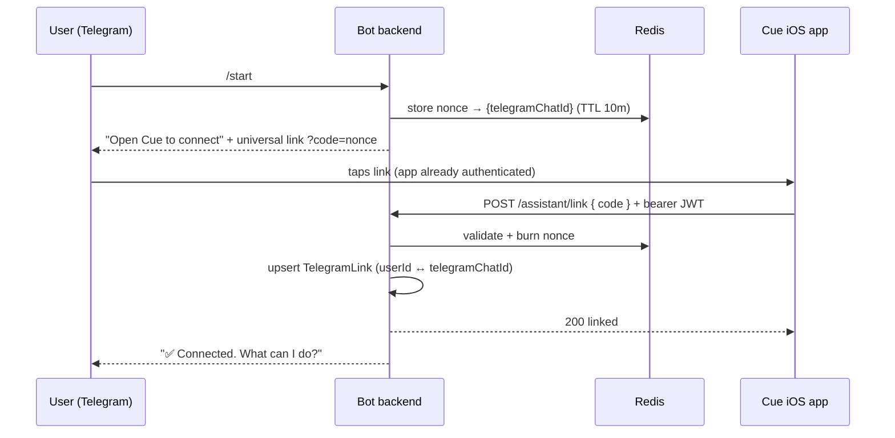

# Telegram AI assistant

- **Status**: Draft (not yet implemented)
- **Last updated**: 2026-05-31
- **Owner**: @danil
- **Related ADRs**: [0003 — assistant-llm-provider-anthropic](../adr/0003-assistant-llm-provider-anthropic.md) · [0004 — assistant-prompt-composition-and-caching](../adr/0004-assistant-prompt-composition-and-caching.md) · [0005 — assistant-conversation-memory-model](../adr/0005-assistant-conversation-memory-model.md) · [0006 — assistant-schedule-context-and-conflicts](../adr/0006-assistant-schedule-context-and-conflicts.md) · [0007 — provider-connector-abstraction](../adr/0007-provider-connector-abstraction.md)

## Context

Cue should feel like an unflappable personal aide in the J.A.R.V.I.S. mold: you send a text or a voice note ("move my 3pm to 4", "what's free Thursday afternoon?", "book a dentist next week") and it reads and edits your calendar in plain language. No visible session boundaries — one perpetual conversation per user, the way you'd text an assistant.

Constraints and prior decisions that shape this:

- **The backend is the source of truth for calendar data.** Events are `Task` rows (start/end time); the bot reads and writes them server-side via the existing feature services. The bot never depends on the phone being awake. This is what makes a 24/7 assistant possible.
- **`TelegramLink` already exists** (1:1 with `User`, holds `telegramChatId`, `telegramUsername`, `linkedAt`). The assistant builds on it; it is not reinvented.
- **`User.timezone` (IANA) already exists** and is the source of truth for "now" and for interpreting relative times ("tomorrow morning").
- **Redis 7 is provisioned** (docker-compose) and not yet consumed — the assistant is its first consumer (idempotency keys, link nonces, optional cache of the latest summary).
- **Cost matters.** LLM tokens are the dominant operating cost. The design leans on prompt caching, a rolling summary, a structured memory profile, and a cheap/expensive two-model split (see [ADR 0004](../adr/0004-assistant-prompt-composition-and-caching.md), [ADR 0005](../adr/0005-assistant-conversation-memory-model.md)).
- **Scale target: public product.** Multi-tenant from day one; the system prompt + tool schemas are identical across users so their cached prefix is shareable, not per-user.

The data model for memory/conversation does not exist yet; the delivery-side `TelegramLink` and `Task` models do.

## Goals

- A user can link their Telegram account to Cue once, by confirming in the app, and thereafter talk to the bot with no further auth steps.
- A user can read and mutate their calendar through natural-language text **and** voice notes, with the same behavior for both.
- The assistant stays aware of conversation context across many turns without resending the whole history each call — bounded, predictable per-turn token cost.
- The assistant remembers durable user habits/preferences ("no meetings before 10", "gym Mon/Wed/Fri") and applies them without being re-told.
- Slash commands execute deterministically (no LLM cost) yet leave the assistant aware of what happened.
- Destructive or ambiguous actions are confirmed before they take effect.
- When a request is ambiguous or under-specified, the assistant asks a brief clarifying question rather than guessing.

## Non-goals

- **Group chats.** v1 is 1:1 DM with the bot only. `TelegramLink` is 1:1 with `User`.
- **Proactive / unprompted messaging** beyond the existing notification-delivery path ([specs/notification-delivery.md](notification-delivery.md)). The assistant responds; it doesn't initiate. (Proactive "you have a gap, want to…" nudges are a v2 idea.)
- **Multi-turn voice conversation / TTS replies.** Voice in (STT) → text reply out. No spoken responses in v1.
- **Semantic recall over the full history** (vector search over months-old turns). Deferred — see Open questions. v1 is rolling-window + summary + structured profile.
- **A second LLM provider / fallback.** Single provider (Anthropic) for v1 — see [ADR 0003](../adr/0003-assistant-llm-provider-anthropic.md).
- **Replacing the REST API.** The bot is an additional client of the same domain services the iOS app uses, not a parallel data path.

## Proposed design



### Voice and persona

The assistant speaks in the **J.A.R.V.I.S. register** (Tony Stark's AI aide in *Iron Man*): composed, impeccably polite, quietly witty, and always a half-step ahead. This persona lives in the system prompt (block 1 of the context window) — defined once, identical for every user, and cached across the whole user base ([ADR 0004](../adr/0004-assistant-prompt-composition-and-caching.md)).

What goes into the system prompt:

- **Tone** — formal but warm; calm and unflappable; understated confidence. Never gushing, never robotic.
- **Brevity** — one or two sentences. Efficiency over chatter; no filler, no parroting the request back.
- **Dry wit** — a light, well-timed touch in ordinary moments; dropped entirely when the user is terse or stressed, or on a failure.
- **Anticipation** — surface the useful next thing unprompted ("…I've kept your morning clear"), without nagging or over-explaining.
- **Form of address** — respectful. J.A.R.V.I.S. says "sir"; Cue is multi-tenant, so address the user by their profile name (or a configured honorific) and default to neutral respect — never assume gender. See [Open questions](#open-questions).
- **Acknowledgements** — crisp ("Done — moved to 4 pm."). Destructive or conflicting actions remain gated by the rules in [Safety / confirmations](#safety--confirmations); voice never overrides them.
- **Honesty under failure** — graceful and plain, not a pile of apologies: "I couldn't reach your calendar just then — shall I try again?"
- **Restraint** — minimal emoji (tasteful, occasional); no purple prose. Clarity and correctness always win over character.

Illustrative replies:

| Situation | Reply |
|---|---|
| Event booked | "Done. Dentist at 3 pm next Tuesday — I've left your morning clear." |
| Conflict (layer 4) | "That overlaps with **Lunch with Ana**. Shall I book it anyway, or find another slot?" |
| Availability check | "Your afternoon's clear after 2. Shall I pencil something in?" |
| Voice not understood | "I'm afraid that didn't come through clearly — care to try again?" |

### Module layout

An `assistant` feature module, following the repo's module conventions. It depends on existing feature services and never touches repositories or entities directly (see the strict data-access pattern in [architecture.md](../architecture.md)).

```
src/modules/assistant/
  assistant.module.ts
  assistant-webhook.controller.ts   ← webhook ingress: acceptWebhook → enqueue → 200; + GET/POST/DELETE /assistant/link
  webhook.consumer.ts                ← pulls queued jobs → handleWebhook → pipeline
  assistant.service.ts               ← orchestrator: pipeline + tool-loop (5-fetch cap)
  context-builder.service.ts         ← assembles the prompt blocks (see Context window)
  tools/                             ← tool JSON schemas + dispatch to feature services
  background/
    summarizer.service.ts            ← recursive rolling summary (Haiku)
    memory-extractor.service.ts      ← structured fact extraction (Haiku)
  commands/                          ← deterministic slash-command handlers
```

The messaging transport and the LLM client are **not** baked into this module. They live behind two **provider-agnostic connector modules** — each a base contract + typed config + factory + concrete implementation, following the pattern in [ADR 0007](../adr/0007-provider-connector-abstraction.md) — that the assistant consumes via their factories so the vendor/provider stays swappable:

- `src/modules/external-vendor/` — inbound/outbound messaging; **Telegram** implementation over webhooks.
- `src/modules/ai/` — LLM access (tool use, prompt caching, `MAIN`/`BACKGROUND` model roles); **Anthropic** implementation.
- `src/modules/stt/` — speech-to-text for voice notes; **OpenAI** implementation.

Implementation is broken into four work items: [external-vendor connector](../tasks/ai-assistant-1-external-vendor-connector.md) · [AI connector](../tasks/ai-assistant-2-ai-connector.md) · [STT connector](../tasks/ai-assistant-4-stt-connector.md) → [application wiring](../tasks/ai-assistant-3-application-wiring.md).

Calendar tools dispatch into the **existing** `TaskService`, `CalendarService`, `NotificationStrategyService`, etc. — events are `Task` rows with start/end times. No new calendar data path is introduced.

### Linking / auth flow



- The nonce lives in **Redis with a short TTL**, single-use — no schema change for the handshake itself.
- Binding is only ever confirmed by an **authenticated app session** (existing Apple Sign-In JWT — [specs/auth-apple-signin.md](auth-apple-signin.md)), so a stranger who guesses a chat can't link to someone else's account.
- After binding, every inbound update is authenticated implicitly by `telegramChatId → TelegramLink → User`.
- **Tappable entry = HTTPS universal link.** When `ASSISTANT_APP_LINK_BASE_URL` is set, the linking prompt embeds `${base}/app/telegram/link?code=<nonce>` (a `cue://` scheme won't linkify in Telegram) **and** keeps the raw code as a paste fallback for desktop-Telegram / simulator. When the base is unset (plain local dev), the prompt offers the raw code only. The universal link resolves via the [AASA file](#aasa--universal-link) the API serves; the iOS app opens it to a "Connect Telegram?" confirmation sheet (no silent submit) — see the matching [cue-ios linking spec](../../../cue-ios/docs/specs/telegram-linking.md).
- **Live status + unlink.** Beyond redeeming, the app reads link state via `GET /assistant/link` (Settings shows "Connected as @handle" or "Not connected") and revokes via `DELETE /assistant/link` (idempotent). The redeem `POST` returns the same status shape so the UI flips to Connected without a second round-trip.

#### AASA / universal link

The API serves `GET /.well-known/apple-app-site-association` (unauthenticated, `Content-Type: application/json`, no redirect/extension) so Apple's CDN can verify the universal link. It scopes the handoff to the linking path only:

```json
{ "applinks": { "details": [ { "appIDs": ["5LKD4S53RU.makarov.cue"], "components": [ { "/": "/app/telegram/link", "?": { "code": "?*" } } ] } ] } }
```

Universal Links only fully validate on a real device against a stable, correctly-served AASA host; ad-hoc ngrok / the simulator fall back to the custom-scheme path. The entitlement, the AASA host, and `ASSISTANT_APP_LINK_BASE_URL` all track the same public domain.

### Inbound pipeline (every Telegram update)

**Ingress is split so we acknowledge fast and never block on processing:**

- **Accept (request path).** The controller calls the vendor connector's `acceptWebhook` (authentication only — secret token / signature). On success it bundles `{ ip, headers, body, vendor }` into a **queue job** and returns **`200 OK` immediately**; on failure it returns `4xx` and enqueues nothing. A durable Redis/BullMQ queue is required: once we `200`, Telegram will **not** redeliver, so an in-memory queue would lose the update on a crash.
- **Consume (worker).** A consumer pulls each job, calls `handleWebhook` (parse + normalize), then runs the steps below. The vendor dedupe id (`update_id`) is the job id, so duplicate deliveries collapse at the queue.

The numbered steps below run **in the consumer**, not the request path:

1. **Dedupe** on Telegram `update_id` (Redis set, short TTL). Telegram retries deliveries; this guarantees we never double-book.
2. **Resolve user**: `telegramChatId → TelegramLink → User`. Unlinked → linking flow, stop.
3. **Normalize input**:
   - text → as-is;
   - voice → download OGG/Opus via Telegram file API → **STT** → transcript (tagged `voice_transcript`);
   - slash command → deterministic handler, **no LLM** (see Commands).
4. **Persist** the user turn as a `ConversationMessage`.
5. **(Optional) Haiku router**: if the message is trivial/non-actionable ("thanks 👍"), reply with a cheap canned acknowledgement and skip the Sonnet call.
6. **Build context**: run the query-aware pre-pass, assemble the prompt with the preloaded week plus any query-aware slices, then call **Claude Sonnet with tools**. Run the tool-use loop — the model may pull more schedule data via `list_events`, **capped at 5 fetches per turn** — until it returns a final reply. See [Schedule context for tool decisions](#schedule-context-for-tool-decisions).
7. **Deliver** the reply to Telegram; persist the assistant turn (+ any tool calls).
8. **Async post-turn jobs** (do not block the reply): re-summarize if the live window exceeded its threshold; extract/update memory facts. Both run on Haiku.

### Context window — composition and order

This is the heart of the cost design. Blocks are ordered **most-stable/most-shared first → most-volatile last**, so the cached prefix is byte-identical as often as possible and shareable across users. Full rationale and the caching mechanics are in [ADR 0004](../adr/0004-assistant-prompt-composition-and-caching.md).

| # | Block | Content | Changes | Cached | ~Tokens |
|---|-------|---------|---------|--------|---------|
| 1 | **System prompt** | Persona (J.A.R.V.I.S.-style voice — see [Voice and persona](#voice-and-persona)), rules, tool-use, clarification (ask-don't-guess) & confirmation policy, output style. **No timestamps.** | ~never | ✅ shared across all users | 0.8–1.5k |
| 2 | **Tool definitions** | `list_events`, `create_event`, `update_event`, `delete_event`, `find_free_slots`, `set_reminder` (JSON schemas) | ~never | ✅ shared across all users | 0.5–1k |
| — | *cache breakpoint #1* | (after tools — near-100% hit, shared) | | | |
| 3 | **User memory / profile** | Durable facts & prefs from `UserMemoryFact`, relevant subset only | rarely (per user) | ✅ per-user | 0.3–0.8k |
| 4 | **Rolling summary** | Compact narrative of everything older than the live window | occasionally | ✅ per-user | 0.3–0.6k |
| — | *cache breakpoint #2* | (after per-user stable blocks) | | | |
| 5 | **Now context + schedule** | Current datetime + `User.timezone`; preloaded **today + next 7 days** (compact); plus any **query-aware** slice for dates the message references | every turn | ❌ volatile | 0.3–0.8k |
| 6 | **Recent window** | Last ~6–10 messages **verbatim** from `ConversationMessage` | every turn | ❌ volatile | 1–2k |
| 7 | **New user message** | text / transcript / `[command result]` line | every turn | ❌ volatile | small |

**Target per-turn input ≈ 3.5–6k tokens, ~70–80% served from cache** (read at ~0.1× input price). The timestamp lives in block 5 (below both breakpoints) on purpose — putting it in the prefix would break every cache hit. The preloaded week and query-aware slices live there too, for the same reason: they change as the calendar changes. How that schedule data is gathered is the next section.

### The three memory mechanisms

Each handles a different kind of memory; together they keep context bounded. Full rationale in [ADR 0005](../adr/0005-assistant-conversation-memory-model.md).

1. **Rolling summary (episodic).** When block 6 exceeds its token threshold, fold the oldest turns into a running summary using Haiku: `previous_summary + oldest_turns → new_summary`. Recursive, so summary length stays bounded no matter how long the thread runs. Never summarizes the structured profile, an event mid-edit, or a pending confirmation.
2. **Structured profile (semantic).** After each turn, Haiku extracts/updates typed facts into `UserMemoryFact`. Only the relevant subset is injected (block 3). This is what makes the assistant feel like it *knows* the user without replaying history. Stored in our Postgres (system of record), not in the provider's memory tool.
3. **Native context editing (tool-result hygiene).** Anthropic's `clear_tool_uses` auto-evicts old `list_events` results once the context grows, replacing each with a placeholder. Keeps multi-step turns ("check Tue… check Wed… now book…") cheap.

### Schedule context for tool decisions

When the model decides to create or move an event it needs to know what's already on the calendar — but we never load the whole calendar (unbounded cost, and it breaks caching — [ADR 0004](../adr/0004-assistant-prompt-composition-and-caching.md)). Four layers supply schedule truth, cheapest first; the last one means **correctness never depends on the model choosing to look**. Full rationale in [ADR 0006](../adr/0006-assistant-schedule-context-and-conflicts.md).

1. **Preloaded week (push).** Every turn, block 5 carries **today + the next 7 days** of events in compact form (start–end + title). This covers the overwhelmingly common near-term case ("move my 3pm", "am I free this afternoon?") with no extra round-trip. It sits in the volatile region of the prompt (below the cache breakpoints) because it changes as the calendar changes.

2. **Query-aware augmentation (smart push).** Before the Sonnet call, a cheap pre-pass scans the user message for date/time references and loads exactly those slices *in addition* to the week. Deterministic Luxon parsing handles explicit references ("next Tuesday", "the 14th", "next week"); a small Haiku extraction is the fallback for fuzzier phrasing. So "book the dentist three Tuesdays from now" arrives with that day's events already in context, even though it's outside the preloaded week.

3. **On-demand fetch (agentic pull), capped at 5.** When the model still needs more — an open-ended ask ("find me a free 30 min next week") or a date the pre-pass missed — it requests it via `list_events` (specifying the date/range). The orchestrator pulls the data and continues the **same** conversation turn with it appended, looping as needed. The loop is **hard-capped at 5 fetches per user message**; on the 5th, further fetch requests are refused with a note so the model proceeds with what it has. This bounds latency and token cost and prevents fetch loops.

4. **Server-side validation, resolved with the user (deterministic floor).** On every `create_event` / `update_event`, the backend checks for overlapping events. On conflict it does **not** round-trip the model: it **holds the write** as a pending action (Redis, short TTL, keyed by the inline-keyboard callback id) and asks the user directly — *"⚠️ That overlaps with **Lunch w/ Ana** (13:00–14:00). Book anyway / Pick another time / Cancel."* The user's tap resolves it deterministically, with **no extra LLM call**. The write tool returns only a terminal "held for confirmation" status to the model (never the conflict for it to re-plan), so the turn closes cleanly.

Layers 1–3 make the model *well-informed*; layer 4 makes the outcome *correct* even when it isn't. Representation: the preloaded week and query slices are sent compactly (times + titles); full event detail is fetched on demand (layer 3) only when the user asks about a specific event.

### Commands

Slash commands execute deterministically — instant and free (no LLM call): `/start /link /today /tomorrow /week /next /add /settings /help`.

After running, a **synthetic summary line** is appended to the conversation as a `ConversationMessage` (role = system/synthetic), e.g.:

> `[user ran /today → 3 events: 09:00 Standup, 13:00 Lunch w/ Ana, 16:00 Pickup]`

So if the user immediately says "move the lunch to 14:00", Sonnet has the referent without us paying to regenerate it. This also lets us nudge power users toward commands for common ops to cut cost, while natural language stays available for everything.

### Safety / confirmations

| Action | Behavior |
|---|---|
| **Read** (`list_events`, `find_free_slots`) | Auto, no confirmation. |
| **Create with complete info, no conflict** | Execute, then confirm in the reply. |
| **Create/update that overlaps existing event(s)** | Server-side conflict check. The backend **holds the write and asks the user** via inline keyboard (⚠️ Overlaps with X — Book anyway / Pick another / Cancel); the model is **not** re-invoked. On confirm, the backend writes deterministically. See [Schedule context for tool decisions](#schedule-context-for-tool-decisions). |
| **Update / delete / anything ambiguous** | Propose + **Telegram inline keyboard** (✅ Confirm / ✏️ Change / ✖️ Cancel). The callback is deterministic — no extra LLM call. |

Inline-button callbacks pair with `update_id` dedupe so retries never double-act.

### Replies and clarifying questions

The assistant replies in **text** by default (persona in [Voice and persona](#voice-and-persona)). Two behaviors keep those replies useful when a request isn't fully actionable:

**Ask, don't guess.** When a message is under-specified — missing a date, time, or duration, or referring to "my meeting" when several match — the model asks **one** concise clarifying question instead of inventing a default or picking arbitrarily. This is part of the system prompt (block 1) tool-use policy and sits *above* tool execution: an incomplete `create_event` becomes a question, not a guessed booking.

**Free-text question vs. inline keyboard** — the boundary:

| The model needs… | Mechanism |
|---|---|
| Open-ended info with no finite choice set ("book a meeting" → *when, and how long?*) | **Free-text** question; the user's reply is the next message. |
| A pick from a small known set (which of 3 "Lunch" events; confirm/change/cancel a proposed write; resolve a conflict) | **Inline keyboard** — deterministic, no extra LLM call ([Safety / confirmations](#safety--confirmations)). |

**Continuity across turns.** A clarifying question and the user's answer are simply the next two messages in the one perpetual conversation. The model reconstructs the half-formed intent from the **verbatim recent window** ([ADR 0005](../adr/0005-assistant-conversation-memory-model.md)), which is never summarized mid-exchange — so "book a dentist" → *"when?"* → "Tuesday 3 pm" resolves naturally with no special session state. (If a clarification must survive a summary or span many turns, a lightweight pending-intent marker can be added later — a future refinement, not needed for v1.)

Clarifying questions still respect the safety gates and the 5-fetch cap; asking is never a way around a confirmation.

### Data model

New entities (follow the entity → repository → DatabaseService → feature-service order; all PKs UUID, all timestamps `timestamptz`):

- **`Conversation`** — 1:1 with `User`. The perpetual thread. Fields: `userId`, `lastActivityAt`, `latestSummaryId` (nullable FK). Cascade from `User`.
- **`ConversationMessage`** — many per `Conversation`. Fields: `conversationId`, `role` (enum: `user` | `assistant` | `tool` | `synthetic`), `contentType` (enum: `text` | `voice_transcript` | `command_result`), `content` (text), `toolPayload` (jsonb, nullable), `telegramMessageId` (bigint-as-string, nullable — dedupe/trace), `tokenCount` (int, nullable), `createdAt`. Cascade from `Conversation`.
- **`ConversationSummary`** — many per `Conversation` (history kept; latest pointed to by `Conversation.latestSummaryId`). Fields: `conversationId`, `summaryText`, `coversUpToMessageId`, `tokenCount`, `createdAt`. Cascade.
- **`UserMemoryFact`** — many per `User`. Fields: `userId`, `type` (enum: `working_hours` | `no_go_window` | `recurring_commitment` | `preference` | `person` | `place` | `other`), `key`, `value` (jsonb), `confidence` (numeric), `source` (enum: `inferred` | `explicit`), `updatedAt`. Cascade from `User`. Editable from the iOS settings screen (so the user can see/correct what the assistant "knows").

Reused as-is: **`TelegramLink`** (binding), **`Task`** (events), **`User.timezone`** (now-context).

Possible small additive change to `TelegramLink`: an `isActive` boolean (the notification-delivery spec already assumes one for "chat blocked" handling) — fold into that migration if it lands first.

Deferred: **`ConversationMessageEmbedding`** (pgvector) for semantic recall — Open questions.

### API

New endpoints (add to [`../api/openapi.yaml`](../api/openapi.yaml) in the implementing PR):

- `POST /assistant/telegram/webhook` — Telegram ingress. Authenticated by the connector's `acceptWebhook` (secret-token header), **not** the JWT guard. Enqueues a job and returns `200` immediately; a consumer processes it off the request path (see [Inbound pipeline](#inbound-pipeline-every-telegram-update)).
- `POST /assistant/link` — app-initiated binding. JWT-guarded. Body `{ code }`. Burns the nonce, upserts `TelegramLink`, and returns the link status `{ linked: true, telegramUsername, linkedAt }`.
- `GET /assistant/link` — JWT-guarded. Returns the user's link status `{ linked, telegramUsername, linkedAt }` (`linked: false` with null fields when unlinked).
- `DELETE /assistant/link` — JWT-guarded. Revokes the link; returns `{ linked: false }`. Idempotent when no link exists.
- `GET /.well-known/apple-app-site-association` — unauthenticated AASA document for iOS universal-link verification (see [AASA / universal link](#aasa--universal-link)).

The webhook is registered with Telegram via `setWebhook` (secret token + HTTPS) at deploy time.

### Error handling

| Failure | Behavior |
|---|---|
| Duplicate `update_id` | Ack 200, drop (idempotency). |
| Webhook auth fails (`acceptWebhook` false) | Reject `4xx`; enqueue nothing. |
| Crash after `200`, before processing | Job is durable in the queue; a worker retries it — no lost update. |
| Queue job throws (parse / orchestration) | Retry with backoff; after max attempts, dead-letter + log. |
| Inbound from unlinked chat | Reply with the linking prompt; do not call the LLM. |
| STT failure | Reply "couldn't hear that, try again or type it"; persist nothing as a user turn. |
| LLM 429 / 5xx | Bounded retry with backoff; on exhaustion, "I'm having trouble right now, try again in a moment." Never silently drop. |
| Tool execution error (e.g. validation) | Return the error to the model as the tool result so it can recover/clarify; never surface a raw stack trace to the user. |
| Model requests > 5 schedule fetches in one turn | Refuse further `list_events` calls with a note; the model proceeds with the data in hand. |
| Held conflict confirmation expires (TTL) | Discard the held write; tell the user it was cancelled and to retry. |
| Cache miss (TTL lapsed) | Transparent — just a costlier turn; logged for hit-rate metrics. |
| Telegram send fails (blocked) | Mark `TelegramLink` inactive (shared with notification-delivery handling); stop. |

## Alternatives considered

### On-device EventKit as source of truth (bot wakes the phone via silent push)

Attractive because it's offline-first and keeps calendar data on the device. Rejected: a 24/7 assistant can't assume the phone is awake/online, silent-push wake-ups are unreliable and rate-limited, and round-tripping every read through the device adds latency and failure modes. A cloud source of truth (which Cue already has) makes the assistant simple and always-available.

### Resend full chat history every turn (no summary, no window)

Simplest to build. Rejected on cost and latency: history grows unbounded, so per-turn token cost grows linearly forever and eventually hits the context limit. The rolling-window + summary keeps per-turn cost flat. (See [ADR 0005](../adr/0005-assistant-conversation-memory-model.md).)

### Provider-managed conversation state (e.g. server-side thread + `previous_response_id`)

Convenient — the provider holds the history. Rejected as a *cost* strategy: prior input tokens are still billed, and it ties conversation state to the vendor (hard to migrate, hard to query/edit from the app). We keep state in our Postgres and control exactly what enters each call. (Anthropic is the chosen provider regardless — [ADR 0003](../adr/0003-assistant-llm-provider-anthropic.md).)

### Drop-in memory layer (Mem0 / Zep / Letta) instead of our own profile table

Attractive: automatic fact extraction, graph/temporal features, less code. Rejected for v1: adds a heavyweight dependency and an external system of record for user data, when a typed `UserMemoryFact` table + a Haiku extraction prompt covers the calendar use case, stays queryable/editable from the app, and keeps data ownership in our DB. Revisit if memory needs outgrow a flat fact table. (Aligns with the project's "vendor/own over new deps" preference.)

### Single powerful model for everything (no Haiku split)

Simplest routing. Rejected: summarization, fact extraction, and triage don't need a frontier model, and they're high-frequency. Routing them to Haiku cuts a large slice of spend with negligible quality loss. (See [ADR 0003](../adr/0003-assistant-llm-provider-anthropic.md).)

## Rollout

Each phase ships something usable; build in order:

1. **Linking + echo.** Webhook ingress, `update_id` dedupe, linking flow, persist `Conversation` / `ConversationMessage`. Bot echoes — proves the loop end-to-end.
2. **Calendar tools + Sonnet turn.** Tool schemas dispatching to existing feature services. Reads first, then writes-with-confirm.
3. **Context builder + caching.** Block ordering, two breakpoints, timestamp-out-of-prefix ([ADR 0004](../adr/0004-assistant-prompt-composition-and-caching.md)).
4. **Rolling summary** (Haiku) + recent-window trimming.
5. **Structured memory** extract + inject; surface facts in the iOS settings screen.
6. **Voice** (STT) — transcribe, reuse the text path.
7. **Commands** + inline-button confirmations.
8. **Native context editing** + Haiku router + a cost/cache-hit dashboard.

Env vars to add to the Zod schema (`src/config/env.config.ts`): `ANTHROPIC_API_KEY`, `ASSISTANT_MODEL_MAIN`, `ASSISTANT_MODEL_BACKGROUND`, `TELEGRAM_BOT_TOKEN`, `TELEGRAM_WEBHOOK_SECRET`, `STT_PROVIDER` + its key, and the Redis vars (currently in `.env.example` but not yet in the schema). New deps: `@anthropic-ai/sdk`, a Telegram client (`node-telegram-bot-api` is already named as the plan in CLAUDE.md), an STT SDK, and BullMQ if async jobs move off in-process handlers.

Migrations: hand-written raw SQL per the repo convention, one per new entity group. Reversible (drop new tables); no backfill (no existing assistant data).

## Open questions

- [x] **STT provider** — *Decided: OpenAI* (`gpt-4o-mini-transcribe`), built as an STT connector per [ADR 0007](../adr/0007-provider-connector-abstraction.md) — see [Task 4](../tasks/ai-assistant-4-stt-connector.md). Voice notes are short server-side **OGG/Opus** → async/batch transcription. The one OpenAI caveat: it doesn't accept OGG, so the impl transcodes (ffmpeg) before upload; **Groq `whisper-large-v3-turbo`** and **Deepgram Nova-3** (both native-OGG) remain swappable alternatives behind the same factory. We transcribe in the **source language** (Claude is multilingual); translate-to-English is an opt-in. (Provider pick is ADR-worthy — may be pinned in a future ADR.)
- [ ] **Keep voice audio, or transcript-only?** Transcript-only is cheapest and lowest privacy scope; keeping audio enables future re-processing. Leaning transcript-only for v1.
- [ ] **Cache TTL** — default 5-minute vs. 1-hour extended cache for users mid-planning-burst. Tune from real hit-rate metrics once live.
- [ ] **Semantic recall** — when (if) to add `ConversationMessageEmbedding` + pgvector for "what did we decide about the offsite weeks ago". Deferred until users actually reference distant history.
- [x] **iOS companion spec** — *Resolved.* The universal-link handler + "Connect Telegram?" confirmation screen are specified in [cue-ios/docs/specs/telegram-linking.md](../../../cue-ios/docs/specs/telegram-linking.md). The backend support it depends on — universal link in the prompt, `GET`/`DELETE /assistant/link`, the extended `POST` response, and the [AASA route](#aasa--universal-link) — is implemented and described in [Linking / auth flow](#linking--auth-flow) above.
- [ ] **Model versions** — pin `ASSISTANT_MODEL_MAIN` / `_BACKGROUND` to specific Claude versions or track "latest" aliases? (See [ADR 0003](../adr/0003-assistant-llm-provider-anthropic.md).)
- [ ] **Quiet hours / rate limiting per user** for inbound bursts and abuse protection at public scale.
- [ ] **Preloaded horizon & representation** — is 7 days the right window, and should the preload be compact free/busy or include light detail? Tune from usage.
- [ ] **Fetch cap** — is 5 on-demand `list_events` fetches per turn the right ceiling?
- [ ] **Held-conflict TTL** — how long to keep an unconfirmed conflicting write before discarding it.
- [ ] **Form of address** — J.A.R.V.I.S. says "sir"; Cue is multi-tenant, so default to the user's profile name and offer an optional honorific in settings rather than assuming.

## References

- Provider/model decision: [ADR 0003](../adr/0003-assistant-llm-provider-anthropic.md)
- Prompt composition & caching: [ADR 0004](../adr/0004-assistant-prompt-composition-and-caching.md)
- Conversation memory model: [ADR 0005](../adr/0005-assistant-conversation-memory-model.md)
- Schedule context & conflict handling: [ADR 0006](../adr/0006-assistant-schedule-context-and-conflicts.md)
- Connector abstraction (transport + LLM): [ADR 0007](../adr/0007-provider-connector-abstraction.md)
- Implementation tasks: [docs/tasks/](../tasks/) — [external vendor](../tasks/ai-assistant-1-external-vendor-connector.md) · [AI](../tasks/ai-assistant-2-ai-connector.md) · [STT](../tasks/ai-assistant-4-stt-connector.md) · [application wiring](../tasks/ai-assistant-3-application-wiring.md)
- Existing binding entity: [`telegram-link.entity.ts`](../../src/modules/database/entities/telegram-link.entity.ts)
- Events are Tasks: [`task.entity.ts`](../../src/modules/database/entities/task.entity.ts)
- Auth dependency: [specs/auth-apple-signin.md](auth-apple-signin.md)
- Notification path (shares `TelegramLink`): [specs/notification-delivery.md](notification-delivery.md)
- HTTP contract: [`../api/openapi.yaml`](../api/openapi.yaml)
